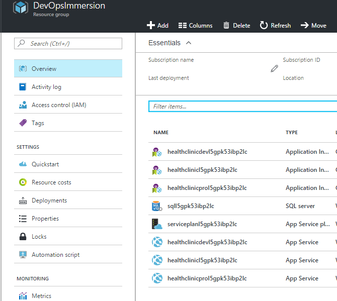

# DevOps-Immersion

##Introduction

Visual Studio Team Services provides a set of cloud-powered
collaboration tools that work with your existing IDE’s, so your team can
work effectively on software projects of all shapes and sizes. To use
these tools, you need to first create a team project. You can do that
either in the cloud with [Team
Services](https://www.visualstudio.com/en-us/docs/setup-admin/team-services/connect-to-visual-studio-team-services),
or by creating one on an [on-premises Team Foundation Server
(TFS)](https://www.visualstudio.com/en-us/docs/setup-admin/tfs/install/get-started).

###About the MyHealthClinic Project

This HOL helps you to implement the complete end to end DevOps for the
fictitious doctor practice specialized in offering healthcare preventive care project, named “HealthClinic.biz”. This
clinic is using different Microsoft and multi-channel apps built with
Visual Studio 2015 to grow their business and modernize the customer
experience. It also contains multiple apps and services including
websites, mobile apps and wearable apps.

The MyHealthClinic project contains 8 demos for different scenarios like
websites, azure apps, mobile apps etc. To start with our DevOps, let us
begin with hosting a public website developed in ASP .NET 5 to azure and
then leverage the services to integrate with our mobile and wearable
apps built with Xamarin.

####What is DevOps?####

The DevOps is the union of people, process and products to enable
continuous value to our end users. We would be using Visual Studio Team
Services to plan, version control, builds and deployments of the
projects.

###Pre-requisites for the lab###

-   Visual Studio 2015 Update 3. If not installed, please find the link to install <https://msdn.microsoft.com/en-in/library/mt613162.aspx>

-   Latest Microsoft Azure SDK. If not installed, please find the link to install <https://azure.microsoft.com/en-us/downloads/>

-   .NET Core SDK Visual Studio Tools. If not installed, please find the link to install <https://www.microsoft.com/net/core#windows>

-   An active Microsoft Azure Subscription for deployments

### Provision the Azure Resources###

1. Create the Azure resources.
    
  Simply click the Deploy to Azure button below and follow the wizard to create the resources. You will need to log in to the Azure Portal.
                                                                     
  

  The resources will be deployed to a Resource Group. You can delete the resource group in order to remove all the created resources at any time.

1. Check the Resource Group in the Azure Portal When the deployment completes, you should see the following resources in the Azure Portal:

    

###Modules###

This lab contains 8 modules including from planning to deployments and
monitoring on Azure. Below is the list of all modules to try out.

<a href="./labs/01.project planning">Module 1: Project Planning</a>
    
   We normally go with the process methodologies to start our project management. In this lab we would be going with the Scrum methodology to plan and track our project. VSTS/TFS would give you 3 processes out of the box. All the creation of tasks, work items, sprint planning etc would be done in this phase followed by assigning tasks to the developers, testers etc. We have a rich and beautiful Kanban boards for us to track the progress. Also we could use that to maintain all of our backlogs and quickly analyze it for future iterations. Customizations are made easy now wrt Kanban boards or Task boards which helps in your daily standups.

<a href="./labs/02.version control">Module 2: Version Control</a>

  This module includes deploying the source code to one of our
repositories in order to version it. VSTS/TFS would give you TFVC and
Git as the source control repositories for us to manage it. In this lab
we would be using TFS Git based VCS to manage and maintain our source
code.

<a href="./labs/03.continuous integration">Module 3: Continuous Integration</a>

  This module includes to have our continuous builds using VSTS/TFS. We
can define our custom workflow for the CI builds, and also schedule our
builds as per our needs.

<a href="./labs/04.continuous deployment">Module 4: Continuous Deployment</a>

  This module includes to have our continuous deployments done to
on-premises data centers or cloud platforms. We would be deploying an
WebApp to Microsoft Azure post our build in this module.

<a href="./labs/05.quality">Module 5: Quality</a>

  In this module we run automation scripts, manage technical debt to
increase the quality and optimize it. We would also do exploratory
testing for the scenarios out of the box.

<a href="./labs/06.monitor">Module 6: Monitor</a>

  Detect, triage and diagnose your issues in your web apps and services
even before your end users get to know. In this lab we would have
integrated the application insights for our ASP .NET web app hosted on
azure where we get to see the usage telemetry of our end users.

<a href="./labs/07.package management">Module 7: Package Management</a>

  This module includes us to discover, install and publish packages among
our team members.

The lab contains detailed step by step procedure to implement the end to
end DevOps.

<a href="./labs/08.cross platform">Module 8: Cross Platform</a>

  These module allows you to explore how VSTS works in a Linux environment with Visual Studio Team Services (VSTS), Eclipse and Team Explorer Everywhere. 

