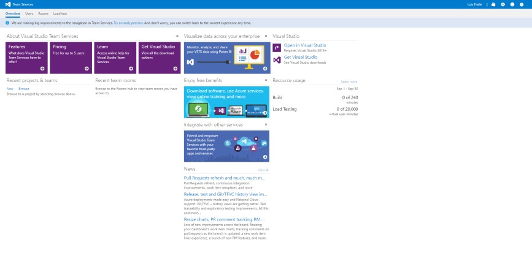
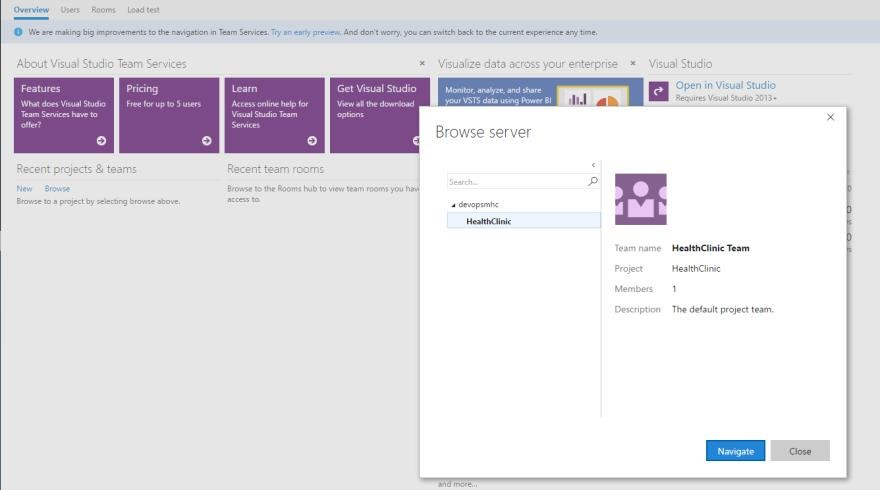

# PROJECTS

1.	Go to your VSTS account home page.

1.	Click on `Browse`.	

    > If you haven't already, sign in to your Visual Studio Team Services account (https://{youraccount}.visualstudio.com).

    

> HealthClinic has three different agile teams working in the same project that share the same VSTS project.

    > For the product owner it´s very important to use the same project due to he needs to manage only one product backlog.

1.	Choose the HealthClinic project to connect to.	

    
