# WORK

1.	Go to your VSTS account home page.

    > Before we can plan a Sprint or start working, you should start creating your Product Backlog.

    > Let’s start creating the Product Backlog for the Cordova Team.

1.	Click on `Browse`.

1.	Expand the `HealthClinic` Project.

    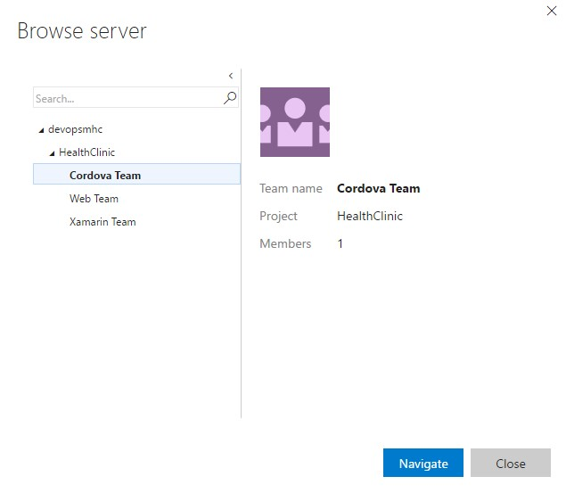

1.	Select `Cordova Team`.

1.	Click Navigate.

1.	On the `New Work Item` panel write the title for your first Product Backlog Item. (i.e.: `Create new appointment`)

    > This is the main screen for the Cordova Team, later in this lab we will customize it, but first let’s start adding some Product Backlog Items.

    > From this screen we will create the first Product Backlog Item.

    > We can also create Bugs, Tasks, and several other Work Item types.

    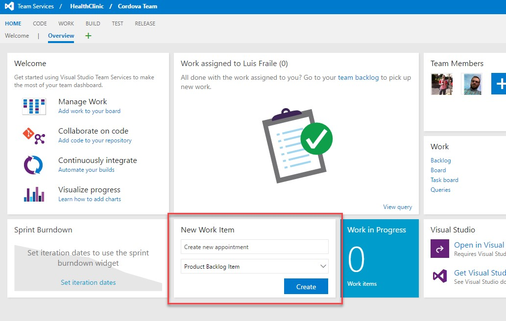

1.	Select `Product Backlog Item`.

1.	Click `Create`.	

1.	Select the Area `HealthClinic\Cordova Team\Android`.

    > A Product Backlog Item is a Work Item with a set of fields defined.

    > These fields allow us to introduce more important data about the Product Backlog Item, like the area, description, acceptance criteria and more.

    > We will add information like description, the area affected by the Product Backlog Item, and, more important, the Acceptance Criteria so we know when this is fully completed. 

    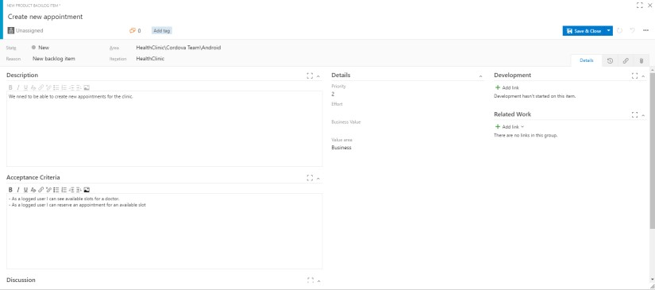

1.	Introduce the desired `Title`, `Description` and `Acceptance Criteria`.
    
    > For example,
    > - Title: Create new appointments.
    > - Description: As user I want to create new appointments.
    > - Acceptance Criteria: Any user can create a new appointments. After creating a new appointment it should appear in the user appointment list.

1.	Click `Save & Close`.

1.	Create several new Product Backlog Items repeating this steps. 	

1.	Click on the Work tab.

    > Your product backlog corresponds to your project plan, the roadmap for what your team plans to deliver. 

    > From here we can also quick create new Product Backlog Items.

    > As we said before, the product owner manages only one backlog organized by areas to assign the user stories. 

    > It is also important to keep the backlog in order by priority so we can plan according to business importance.

    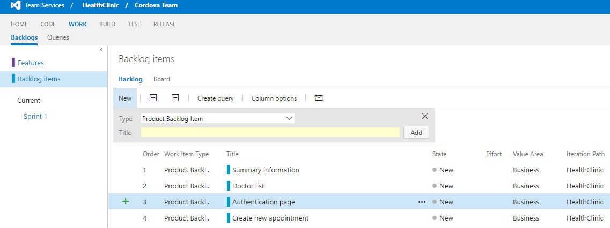

1.	Click on Backlog items.

1.	In the field `Title` introduce the title for a new Product Backlog item and click Add

1.	Double click the new item created, and modify the fields as desired.

    > After ordering the PBIs, it is important to have a rough estimation for, at least, the ones you will start working on.

    > During the Sprint Planning meeting you will refine these estimations.

    > Usually PBIs are estimated in Story Points, which is a measure of magnitude, and tasks are estimated in hours.

    > However, VSTS allow you to use the measure you want for the estimation, as long as it is coherent across the project, so the charts show accurate information.

    > These estimations are important as it will show us in dashboards and panels for our planning.

    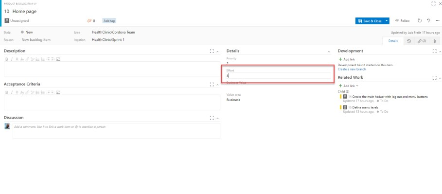

1.	Select one of the Product Backlog Items and Drag & Drop before or below any of the PBIs to reorder according to their priority.	

1.	Double click the first PBI on the list

1.	Enter the estimated value in the Effort field.

1.	Click `Save & Close`

1.	Repeat for the rest of the selected PBIs	

1.	Either in the list or board view.

    > Next step is deciding the dates for next sprint as well as the Sprint Backlog this is part of the Sprint Planning meeting.

    > It is as easy as Drag & Drop from the backlog view.

1.	Select the desired Product Backlog Items and Drag and Drop to Sprint 1.	

    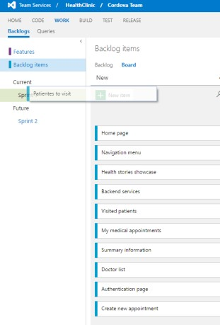

    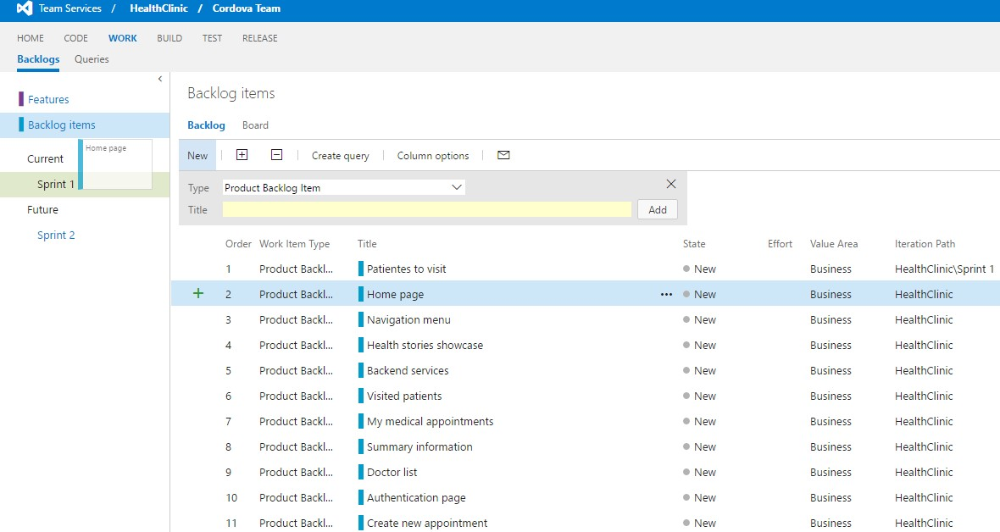

1.	Click on the panel `board`.

    > The Kanban board turns your backlog into an interactive signboard, providing a visual flow of work. 

    > As work progresses from idea to completion, you update the items on the board. Each column represents a work stage, and each card represents a product backlog item (blue cards) or a bug (red cards) at that stage of work.

    > The Kanban board allows you to set Work in Progress (WIP) limits for each state. 

    > One of the primary reasons for using Kanban and limiting work in progress is that it helps identify bottlenecks in your development process and minimize lead time for new features. Let’s say that the devices team is not delivering finished work as quickly as desired, and that it is suspected that the underlying issue may have to do with taking on too many tasks at once at the beginning of each sprint (and the associated context-switching tax). If we are more careful about the number of tasks that we commit to, perhaps we can better focus our efforts.

1.	Drag and drop the items selected for the Sprint 1 from column New to column Committed.

    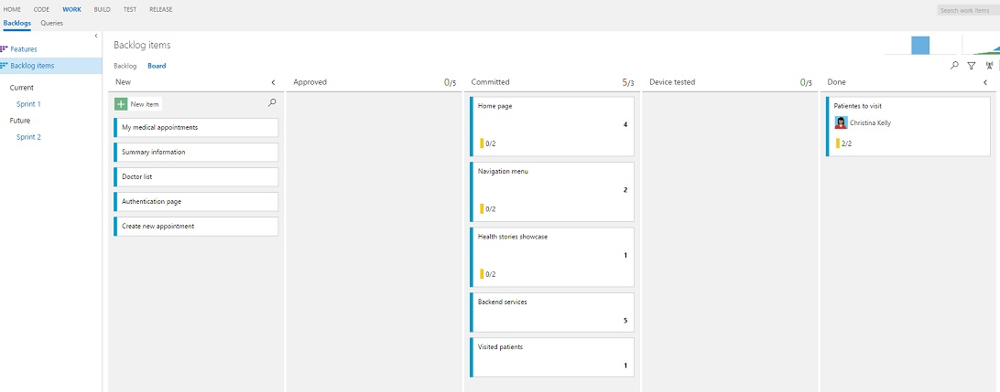	

1.	Click the Configuration button (it has a gear icon) to open the Configure settings dialog.	

    > Let’s lower the Work in Progress limit for the Committed state to see what the Kanban board looks like when too much work has been committed to at once. Right now, the limit is 5 work items.

    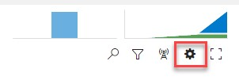

1.	Select the Columns tab.

    > We can also make modifications on styles for the cards based on fields and establish Definitions of Done for each column among a lot of other options.

1.	Click the Committed column. Set the WIP Limit to `3`.

    

1.	Enter the Definition of Done for that column: `This PBIs has been reviewed by Product Owner and Development team and they are ok to start with`	

1.	Click on `Styles`.

1.	Click `+ Styling Rule`.

    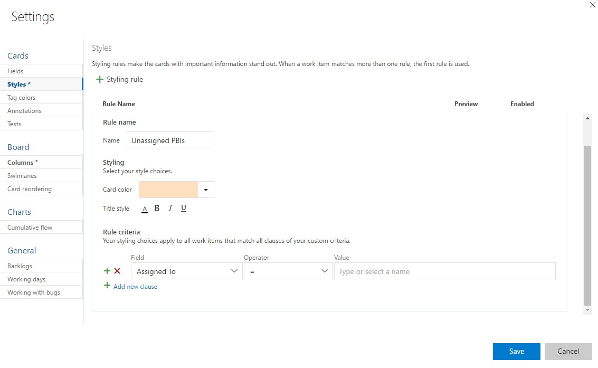

1.	As name `Unassigned PBIs`.

1.	On Rule Criteria:

    - Field: Assigned To
    - Operator: =
    - Leave Value blank

1.	Click `Save`.	

    > We will create a Style to differentiate the unassigned PBIs

    > On the Kanban board, column headers will provide an indication when a Work in Progress limit is exceeded. In this case, the Committed column shows us that we have exceeded the limit.

    > Also the cards pending to be assigned to developers will show the new style.

    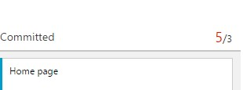

    

1.	Click on `Configure` button.

    > Let’s say that the devices team has decided that they want to add in a column that represents work that has been tested on a physical device. This is the only team that would desire to keep track of such a state, and they can easily add this to their Kanban board.

1.	Navigate to the `columns` tab.

    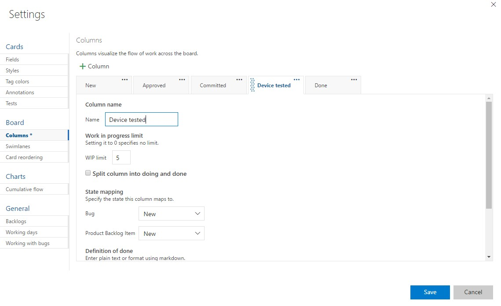

1.	click the + `column` button.

1.	Reorder the new column to be next to `Done`.

1.	Name it `Device Tested`.

1.	Click `Save`.	

1.	Click on Sprint 1.

    > Once you have your sprint plan in place, you'll execute that plan for the duration of the sprint. 

    > In your daily Scrum meetings, your team can view progress made to backlog items and tasks from the sprint task board.

    > Your task board provides a visualization of flow and status of each sprint task. With it, you can focus on the status of backlog items as well as work assigned to each team member. It also summarizes the total amount of remaining work to complete for a task or within a column.

1.	Click on Board.

    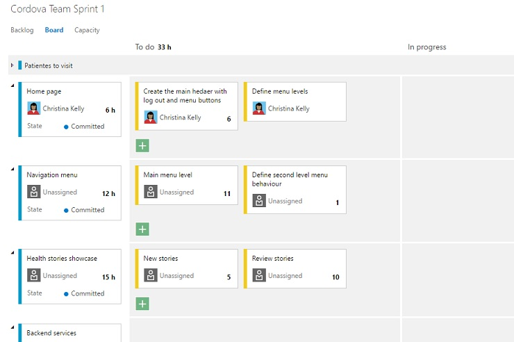

1.	Click on the upper right graphic where the dates of the sprint are shown.	

    > We have Burndown chart available for the sprint.

    > Here it will show only the ideal trend at the beginning of the Sprint, as we advance during the sprint, it will show the advance compared to the ideal trend, so we can take decisions accordingly to the estimated plan if we have deviations.

    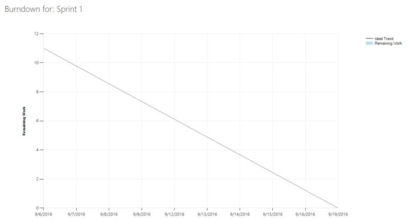

1.  Press `Escape` to close the graphic.

    > When you estimate the tasks, you can also use the `Capacity` tool to check the capacity of the team against the planning.  

    > Ensure you have all tasks assigned and with an estimation for the `Capacity` tool to work.

1. Click  `Capacity`
1. Click the + button to add the rest of the users to the list.  

    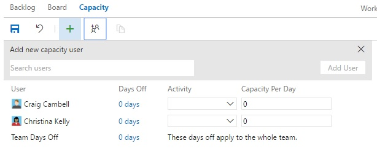

    > The capacity view allows us to specify the number of hours per day that each team member will be working on this project, days off per team member, and overall team days off. These capacity settings apply to the current iteration. You can optionally use the activity column to describe the disciplines that each team member specializes in. When tasks are broken down by activity as well, it can provide another view across your team’s capacity to determine if, for example, you have enough people working on documentation to meet the demands for this iteration.  For now, leave the capacity settings unmodified.

1.  Introduce the capacity per day in hours for the users

    

    > When you introduce the hours available per day for the team you will see how it changes the `Work Details` panel on the right to adapt to the modifications.

1. Click on the column `Days Off` / `0 Days` on any user.

1. Introduce start and end date in an interval inside the dates for the Sprint so he has more work than hours available.

    > When you add days off to a Team Member the `Work Details` planning graph will adapt it self, and show red if there is more work assigned to any team member than the work hours we have available for the sprint.

    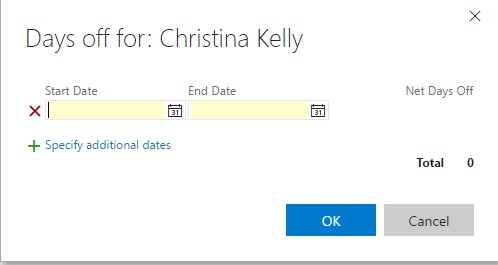

    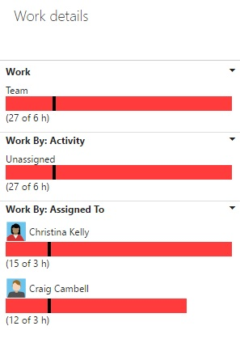

1. Click `Save` to save the changes.

1. Click on `Settings` Icon gear icon.	

    > On Scrum tasks and PBIs are assigned to individuals during the daily scrum meetings.

    > We can customize the panels to show the person assigned to the Work Item, so we can change directly in the panel.

    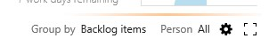

1.	Select the Task tab.

    > Information rich cards not only provide at-a-glance info of interest to you and your team, they also provide a way for you to update a field without opening the work item. 

    > And, with style rules, you can highlight those work items with select colors based on the criteria you set.

    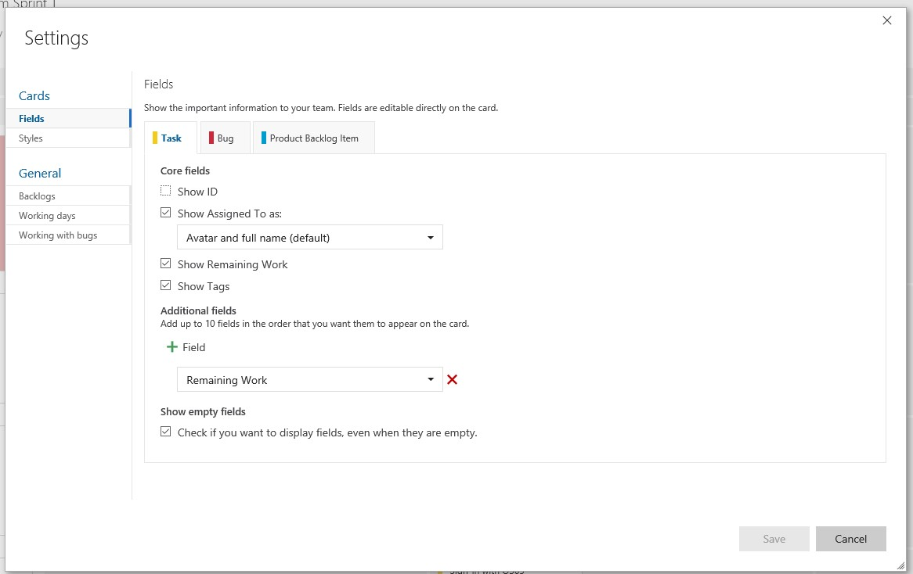

1.	Ensure the `Show assigned To as:` is selected and Avatar and full name is also selected.

1.	Do the same for the Bug and Product Backlog Item tabs.

1.	You can select additional fields like for example the area or iteration path.

1.	Save changes.	

    1.	On the first PBI card, select on `Unassigned`.

    > During the daily scrum individuals will select which task will work on.

    > It is decided based on the capabilities of the individuals, needs of the project, priority and any other criteria important for the team.

    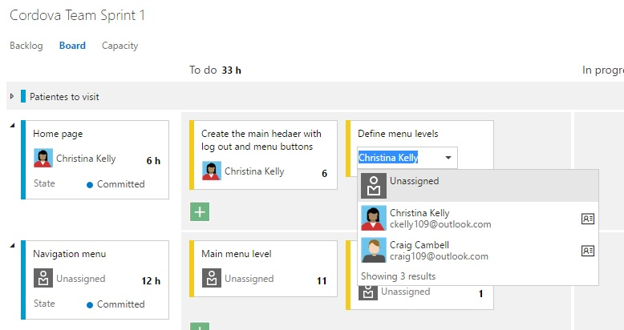

1.	Assign it to any of the Team Members.

1.	Do the same for the rest of the tasks.	

1.	Select the first task you will start working on.

    > Also we will update the panel about the state of the tasks and PBIs.

    > With this panel update we have a daily updated high level overview of the state of the sprint.

    > This includes the update of the Kanban board for the PBIs board, as we keep updated the state of the PBIs.

    > For the PBIs we have more state available to describe the exact situation of the current state of that PBI.

1.	Drag & drop to the in progress state.

    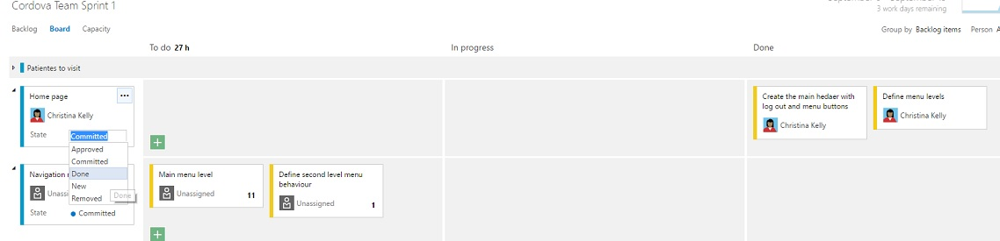

1.	Then Drag & drop the same task to the complete state once it is done.

1.	Complete all the tasks of the first PBI.

1.	Select the `New` state of the PBI, select the `Done` state.	

