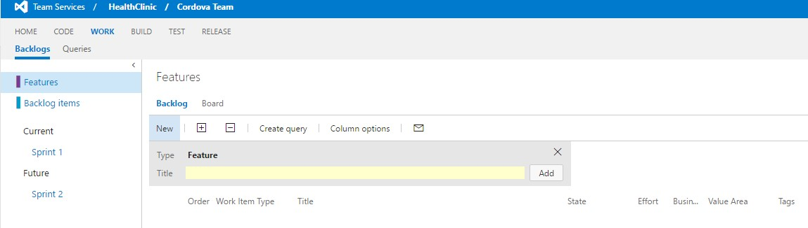
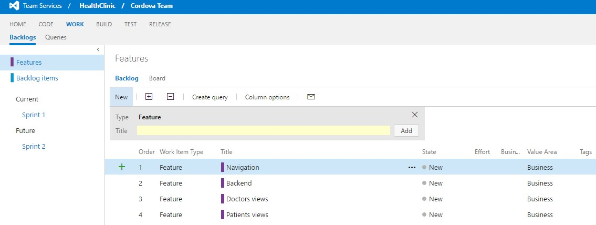
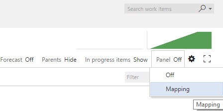
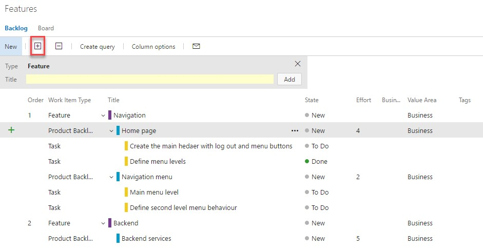
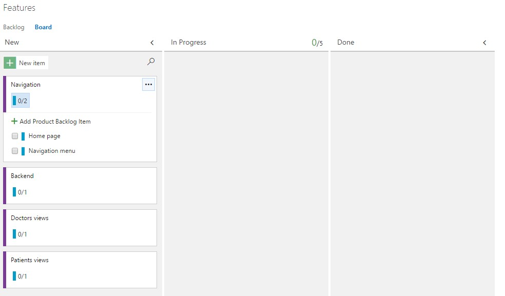

# PORTFOLIO MANAGEMENT

1.	From Backlog or Sprint view click on `Features`.

    > As you advance in the product development, stories can go bigger, making them difficult to handle.

    > We will use the Feature Work Item Type for this purpose.

    > With Features we will group Product Backlog Items to handle an information unit at a bigger level.

    

1.	Introduce a new title for the new feature.

    > First we create the features we are going to need to group the existing, or new, Product Backlog Items.

    > In this listing we will create the new Features we need.

    > They are nevertheless Work Items, so we can add more information as needed for any of them.

    

1.	Click `Add`.

1.	Introduce several new features.	

1.	Click on `Backlog items`.

    > After creating the features, we will map Product Backlog Items to the features.

    > This step will link the Product Backlog Items and Features, so we can know which Product Backlog Items are related and must be handled accordingly.

1.	Click on `Panel Off` and enable `Mapping`.	

    

1.	With the mapping panel enabled drag and drop the Product Backlog Items to the Feature you want to link to.	

    

1.	Click on Features again.

    > To have a full view of the work escalation and decomposition to tasks.

    > It is important to keep track of all artifacts involved in product development so we are able to plan and keep track of what has been done, and what needs to be done yet. 

1.	Expand all the levels clicking twice on the `+` icon.

    

1.	Review the full structure from Feature to tasks.	

1.	Click on `Board`.

    > As we have a Kanban board for checking the states of the Product Backlog Items, we also have a Kanban Board to see the transition and check visually the current state of any particular feature.

    > This is also fully customizable as we saw in Sprint Backlog view, and the Backlog view.

    

1.	Click on the first card where the blue badge with the Product Backlog Items composition number.

1.	Check any User Story to mark it as completed.

1.	Drag and Drop any Feature to other state and check how it changes its current state.

