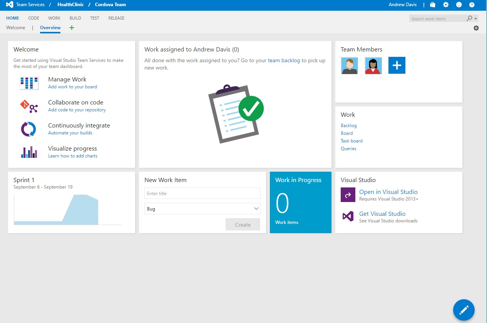
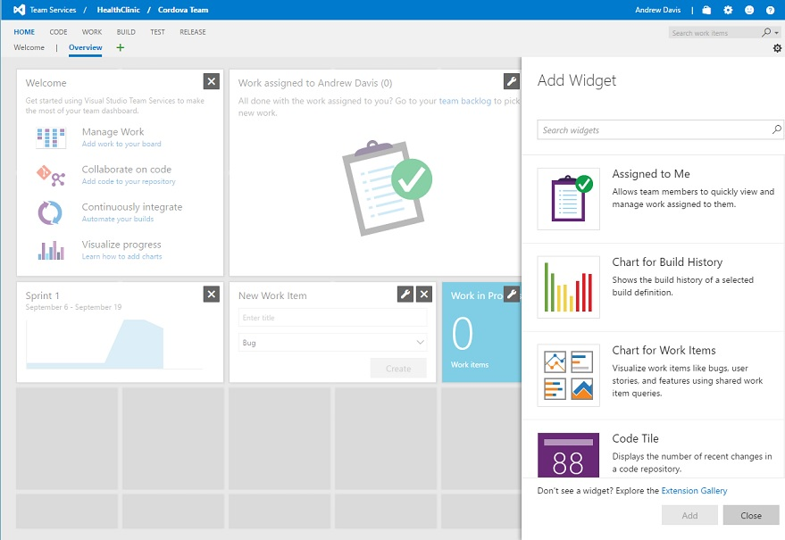
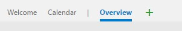

# DASHBOARDS

1.	Select `Home`.	

    > Dashboards allow teams to visualize status and monitor progress across the project.

    > At a glance, you can make informed decisions without having to drill down into other parts of your team project site.

    > The Overview page provides access to a default team dashboard which you can customize by adding, removing, or rearranging the tiles. 

    > Each tile corresponds to a widget that provides access to one or more features or functions.

    

1.	Click `Edit dashboard` icon to modify a dashboard.

    > The HealthClinic dashboard as customized to show the most important for each team and of course, they only show the information related to the selected team.

1.	Click `add a widget icon` (+) to add a widget to the dashboard.	

    

1.	Move any of the existing widget or add another one.	

    > The widget catalog describes all the available widgets, many of which are scoped to the selected team context.

    > When you're in dashboard edit mode, you can remove, rearrange, and configure widgets, as well as add new widgets. Once you leave edit mode, the widget tiles remain locked, reducing the chances of accidentally moving a widget.

    

1.	From the dashboards tab, click the plus icon and enter a dashboard name.	

    > You can also add a new dashboard tab, other than the default to logically categorize the information – for instance, to represent data for various modules or by lifecycle phases

    > If you don't see the plus icon, then you're not a team admin for the currently selected team.

    > You can also get additional widgets from extensions in the marketplace.

    

