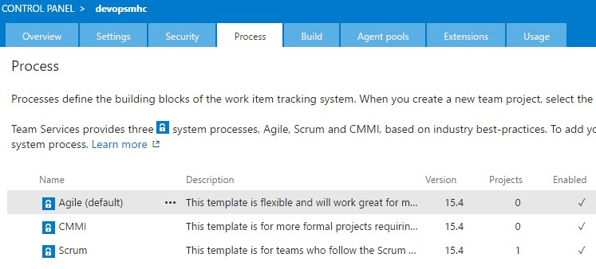
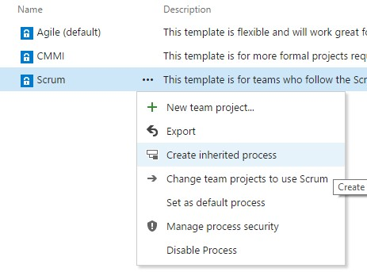
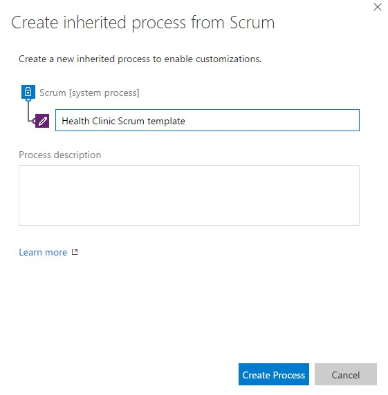
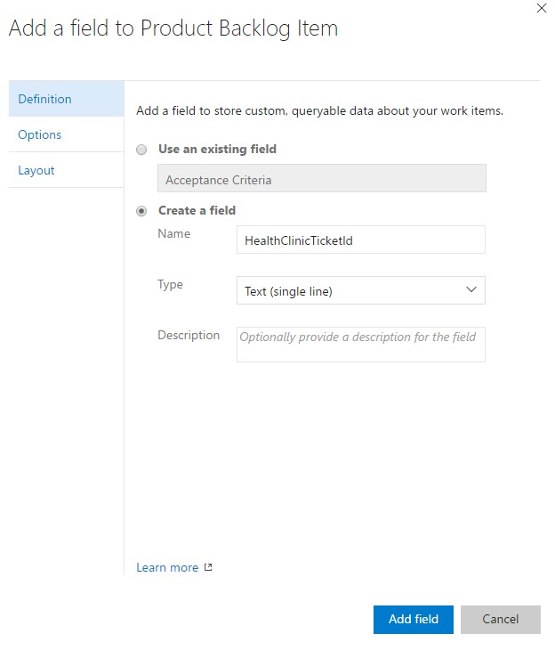
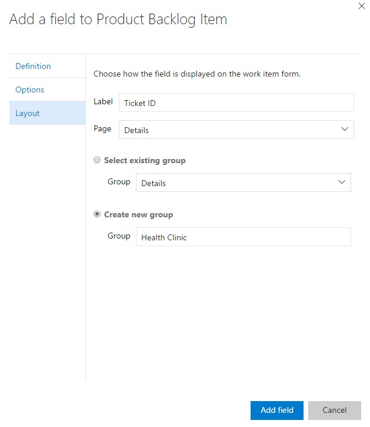
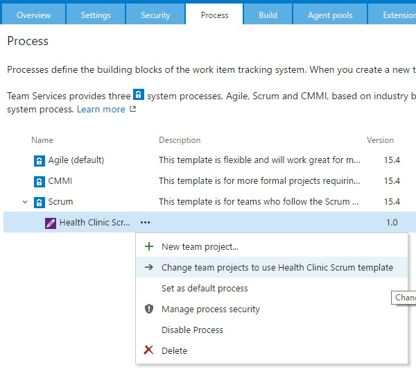
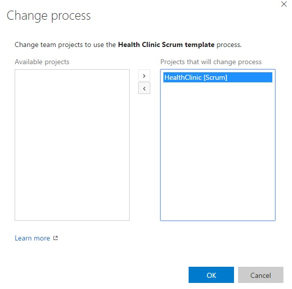
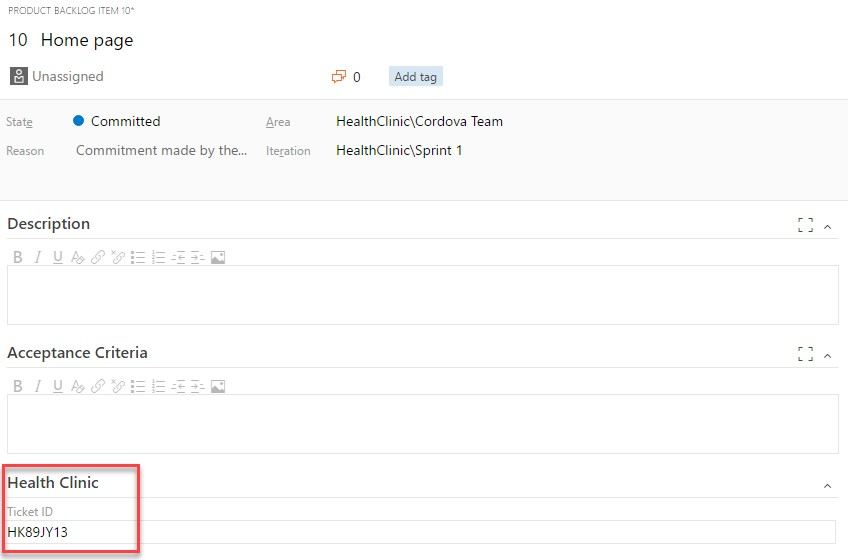

# CUSTOMIZATION

1.	Go to your VSTS account home page.

1.	Navigate to the administration page by choosing the Settings Icon i.e. gear icon in the top right.	

    > Sometimes you will need to add more fields for a particular Work Item Type definition, to represent information important for your team.

    > We can customize the Process Template for our project, adding new fields definitions for any Work Item type.

    > This is done in the main administration.

    

1.	Navigate to `Process` tab.

    > In the process tab you will see all of your Process Templates, and you will also manage them and create new ones.

    

1.	Click on the ellipsis near the Scrum template.

    > Currently we are using the default Scrum template, but default templates can’t be modified, so we need to create an inherited template from the Scrum template, so we can add new fields.

1.	Click `Create inherited process`.	

    

1.	Introduce the name `Health Clinic Scrum template`.

    

1.	Click `Create Process`.

1.	On the next screen select `Customize Health Clinic Scrum Template`.	

1.	Navigate to `Work Item Types` tab.

    > Now we have different options to modify this scrum template.

    > We will add directly a new field for the PBI Work Item template.

    

1.	Select `Product Backlog Item`.

1.	Select `Layout`.

1.	Select `New`.

1.	Select `Field`.

1.	On the definition screen introduce `HealthClinicTicketId`.

    > We are creating a text field for an internal id of the ticketing system inside Health Clinic.

    > Later, with the extensibility options in VSTS, we can even automate the fill-in of this field.

    

1.	On type leave selected `Text (single line)` as it is.	

1.	Click on `Layout`.

    > Until now we have only created the field definition, we have to add it to the layout of the Work Item.

    > We will create a new group to show our custom information, so all of our customized fields appear together. 

1.	On label introduce `Ticked ID`.

    

1.	Select `Create new group`.

1.	Introduce `Health Clinic` as group name.

1.	Click `add field`.	

1.	Click on `Process` tab.

    > At this moment we only created the template, we must assign this template to our VSTS Project so we can use this new field.

    > We can change the process template from a VSTS Project, with their inherited templates or default templates.

    > This is done in the main process screen.

1.	Click on the ellipsis near to our new template.

1.	Select `Change Team Projects to use the Health Clinic Scrum template`.

    	

1.	Select the `Heatlh Clinic` Project.

    > Now we are selecting our project to use the new template.

1.	Click on `>` button.

    	

1.	Click `Ok`.

1.	Click `Close` on next screen.	

1.	Go to your VSTS account home page.

    > Let’s review how the new field appears on our Product Backlog Item Template.

1.	Click on `Browse`.

1.	Expand the `Health Clinic` Project.

    	

1.	Select `Cordova Team`.

1.	Click Navigate.	

1.	Click on `Work`.

1.	Open the first PBI.

    > We are going to our backlog, to open an existing PBIs to see the new field.

    > Also new PBIs we create, will have this field.

1.	Look after `Acceptance Criteria` for the `Heath Clinic` group.

1.	Fill in information for the ticket id.

    	

1.	Click on `Save and close`.

    > Once saved the Work Item VSTS will also save the new custom information we have added to the PBI, and its also available for queries and the rest of the VSTS system.

1.	Repeat this steps for the rest of the PBIs you want to have a Ticket Id.	

