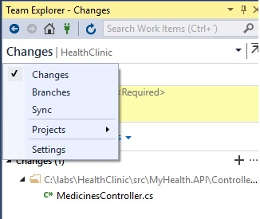
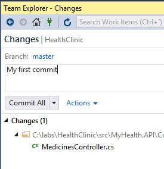
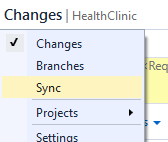
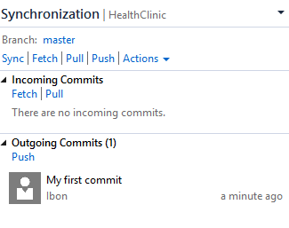
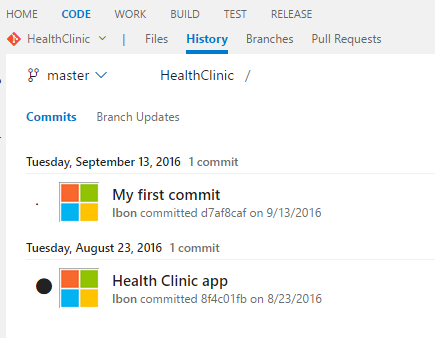
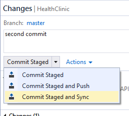

# SAVE WORK WITH COMMITS 

When you reach a point where you want to save your work, you'll need to record the changes in Git. Git saves your work by first staging your changes and then recording the staged changes with commit.

Commits are always made against your local Git repository, so you don't have to worry about the commit being perfect or ready to share with others. You can make more commits as you continue to work, sharing the code when you are ready to do so.

## What's in a commit

Git commits consist of the following:

- The file(s) changed in the commit. Git keeps the contents of all file changes in your repo in the commits — this keeps it fast and allows intelligent merging.

- A reference to the parent commit(s). Git manages your code history using these references.

- A message describing a commit. You give this message to Git when you create the commit. It's a good idea to keep this message descriptive, but to the point.

## Commit

1. Open Visual Studio.	

1. Open the Team Explorer.  

1. Click on `Home`.

   

1. Open the `01_Demos_ASPNET5` solution.

     

1. Expand the MyHealth.API project.

1. Expand the controller folder.

1. Modify any of the existing controllers.

    

    > As you write your code, your changes are automatically tracked by Visual Studio.   

1. Open up the Changes view in Team Explorer.

    > When you are ready to make a commit to your local Git repository.

    

1. Enter a commit message describing your changes and select Commit All to create a new commit with all of your changes.

    

    

## Sync

1. Open the Team Explorer.

    > As other team members update the code in the repo, you'll need to sync their changes with your own code.

1. Open the Sync View.

    

    

1. Fetch the commits to view changes that your team has made.

    > Fetching changes does not merge the commits into your local repository. You will need to pull the changes to merge them into your local repository.

1. Sync the changes to push your commits and pull changes from others.

    > Now, Your changes are in the VSTS repository.

1.	Go to your VSTS project.

1.	Click Code.	

    

1.	Click History.	

    

## Stage

1. Switch to Visual Studio.

    > Staging changes allows you to selectively add certain files to a commit while passing over the changes made in other files. Ignore temp files, logs, and other files that might change but you do not want to stage in a commit.

1. Expand the MyHealth.API project.

1. Expand the controller folder.

1. Modify any of the existing controllers.

    > Modify two or more different controllers.

1. Open up the Changes view in Team Explorer.

1. Right-clicking a file in the Change view and selecting Stage.

    > Create a commit from individual file changes by  Staging a change creates a Staged Changes section in Team Explorer. 

    > Only changes in the Staged Changes section are added to the next commit.

    

    > Ignore files by right-clicking and selecting Ignore this local item. 

    > This adds an entry to the file .gitignore in your local repo. If the ignored file was added to your repo in an earlier commit, ignoring the file will not remove it from your repo.

1.  Click on Commit Staged and Sync to update your remote repository.

    
