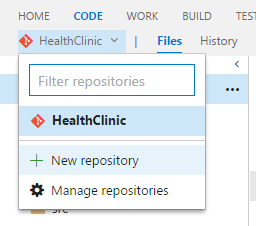
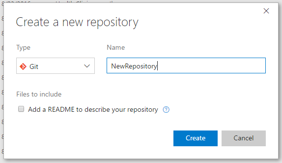
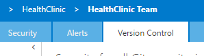
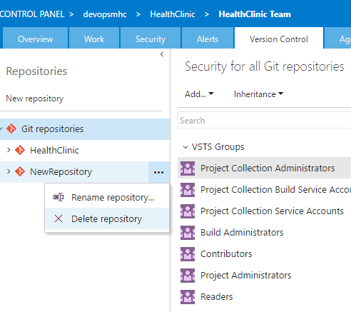

# MANAGE REPOSITORIES

Create Git repos in team projects to manage your project's source code. Each Git repo has its own set of permissions and branches to isolate itself from other work in your project.

## Create a new repo from the web portal

1. Sign in to your Visual Studio Team Services account 

    > https://{youraccount}.visualstudio.com

1. From your account overview page, select your team project. To find your team project, use Browse.

     

1. In the team project area in the web interface, select Code.

1. Select the drop-down next to the current repo name.

    

1. Choose New Repository...

    > Each Git repo has its own set of permissions and branches to isolate itself from other work in your project.

1. In the Create a new repository window, verify that Git is the repo type and enter a name for your new repo. 

    

1. Select Create.

    > A new empty Git repo is now created in your team project. 

    > You can select clone in your favorite IDE to connect the repo to your local development environment, or connect to your new repo using the command line instructions provided.

    

1. Open up the Connect view in Team Explorer.

    > Visual Studio will show all the existing repos in the Team Service project so you can choose whatever you want to clone.

    

    

## Delete a Git repo from your team project

Remove unused repos from your team project to organize your project's source code.

1. Select the settings icon in the web portal to bring up the team project administration page.

    

1. Select the Version Control tab.

    

1. Select the Git repository to remove from the list shown and select the ... next to the name. 

    

    > Consider renaming the repo or locking the default branch of the repo instead of removing it. The code and Git commit history of the repo will be lost when it is deleted.

1. Choose Delete Repository.

1. Confirm the removal of the repository by selecting Delete.

## Rename a Git repository in your team project

1. Select the settings icon in the web portal to bring up the team project administration page.

    

1. Select the Version Control tab.

    

1. Rename the repo from the Version Control tab.

    
