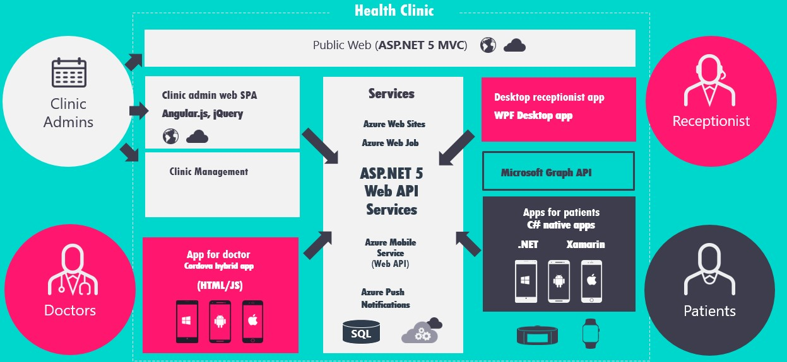

# OVERVIEW

This DevOps Immersion experience is based on a fictional company named My Health Clinic, regular doctor practice specialized in offering healthcare preventive care,  which is creating a new application HealthClinic.biz. This clinic uses Microsoft technologies to grow their business and modernize their customer experience. They innovate and offer multiple apps and services that empower their patient’s well-being with easy access to manage their healthcare data and stay healthy.

## Public website

My HealthClinic offers a modern public-facing  website with information about tools, services, and integration with insurance companies. 
Technologies used: ASP.NET MVC, ES6, SASS, Gulp, bower, Azure WebApp..

## Native mobile apps

They also provide specialized apps for Doctors, and can manage medical appointments and treatments, history.
Technologies used: C# cross-platform and Xamarin. iOS and Android support.

## Hybrid mobile apps 

To manage patients, visits, medical history, and treatments.
Technologies used: Cordova, HTML/JavaScript, Visual Studio Tools for Apache Cordova. Cordova was selected just for demonstration purpose.

## Azure Services

HealthClinic uses a cloud-first strategy where Microsoft Azure is a key ingredient of this approach.
All the backend services are hosted on Azure and use several services as Azure App Service, Azure Mobile App, SQL Databases, Azure Push Notifications or Single-Sign-On with Azure Active Directory. 
The development team also uses Microsoft Azure for their dev-test environments using Azure ARM templates to provision new enviroments.

## Development Team

As HealthClinic organization grows, they will want to make sure that they configure the Agile tools to support that growth. To enable each feature team the autonomy it needs to manage their backlog and plan their sprints, they need their own set of team tools.
HealthClinic has three different agile teams working in the same project, with the same goals, but they need a tooling that allows them to work in an agile environment with autonomy.

The My Health Company teams uses Scrum as their framework for the software development process.

