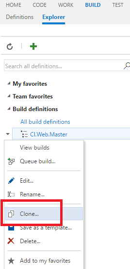
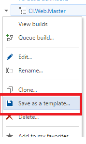
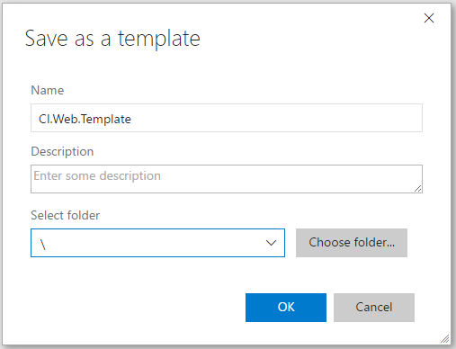
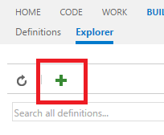

# REPLICATE A DEFINITION

If your definition has a pattern that you want to replicate in other definitions, clone it or create a template.

## Clone a definition

After you clone a definition, the copy appears in your list of builds.

1. From your VSTS account overview page, select your team project. 

1. Click Build tab.

1. Select your build definition.

1. Right-click.

    

1. Click Clone...

## Create a template

After you create a template, your team members can use it to follow the pattern in new definitions.

1. Select your build definition.

1. Right-click.

    

1. Click Save as template...

1. Add the name for you new template.

    

1. Click Ok.

1. Add a new build definion.

    

1. Click Custom.

    

    > Now you can create new build definitions based on the existing template.

