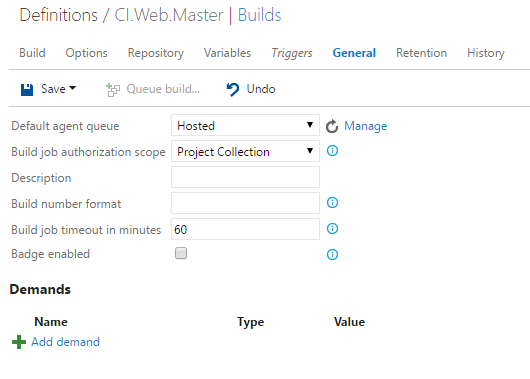
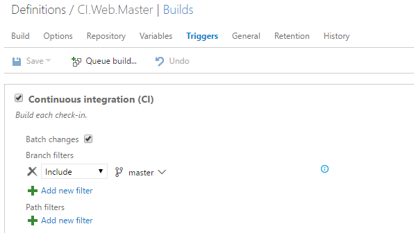
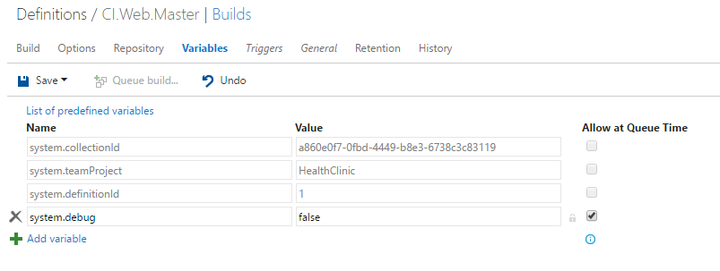
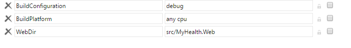
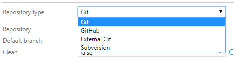

# DEFINE YOUR PROCESS

## General 

1. Click Build tab.

1. Select your build definition.

1. Click Edit.

    

1. Click on the General tab.

    

    > **Default agent queue:** Select the queue that's attached to the pool that contains the agents you want to run this definition.

    > To build your code or deploy your software you need at least one agent, and as you add more code and people, you'll eventually need more.
    > - Windows
    >   - Hosted pool
    >   - On-premises
    >   - Azure Virtual Machine
    > - OSX
    > - Linux

    > ** Tip:** If your code is in Visual Studio Team Services (Team Services) and you run your builds on Windows, in many cases the simplest option is to use the Hosted Pool.

    > **Build job authorization scope:** Specify the authorization scope for a build job. 
    > - Project Collection if the build needs access to multiple team projects.
    > - Current Project if you want to restrict this build to have access only the resources in the current team project.

    > **Description:** If you specify a description here, it is shown near the name of the build definition when you select it in the Build area of your team project.

    > **Build number format:** If you leave it blank, your completed build is given a unique integer as its name. But you can give completed builds much more useful names that are meaningful to your team. You can use a combination of tokens, variables, and underscore characters.

    

    > ** Demands:** Use demands to make sure that the capabilities your build needs are present on the build agents that run it. Demands are asserted automatically by build steps or manually by you.
    > - Build step demands: Some build steps won't run unless one or more demands are met by the build agent. For example, the Visual Studio Build step demands that msbuild and visualstudio are installed on the build agent. If your build includes steps that have demands, they are listed first.
    > - Manually entered demands: You might need to use on-premises build agents with special capabilities. For example, your build process requires SpecialSoftware.

## Triggers

1. Click on the Triggers tab.

    > On the Triggers tab you specify the events that will trigger the build. You can use the same build definition for both CI and scheduled builds.

    

    > **Continuous integration (CI):** Select this trigger if you want the build to run whenever someone checks in code.

    > **Batch changes:** Select this check box if you have a lot of team members uploading changes often and you want to reduce the number of builds you are running. If you select this option, when a build is running, the system waits until the build is completed and then queues another build of all changes that have not yet been built. If you are using batched changes, you can also specify a maximum number of concurrent builds per branch.

    > **Git filters:** You can specify the branches where you want to trigger builds. You can use wildcard characters.

    > **Path filters:** You can also specify path filters to reduce the set of files that you want to trigger a build.

1. Click Scheduled.

    > Select the days and times when you want to run the build.

    

    ## Variables 

1. Click on the Variables tab.

    > Variables give you a convenient way to get key bits of data into various parts of your build process. Use:
    > - As arguments to build steps. 
    > - Apply a version control label during the build process
    > - Customize the build number
    > - Environment variable in Windows batch scripts
    > - Environment variable in PowerShell scripts
    > - Environment variable in Shell scripts

1. Add a new user-defined variables

    

    > For example, we can add the variables BuildConfiguration and BuildPlatform.
    > - BuildConfiguration: debug
    > - BuildPlatform: any cpu
    > - WebDir: src/MyHealth.Web

    

    > **Allow at queue time:** Select this check box if you want to enable your team to modify the value when they manually queue a build.

    > **Secret Variables:** We recommend that you make the variable Secret if it contains a password, keys, or some other kind of data that you need to avoid exposing.

1. Click on the Build tab.

    > Now, modify the build steps to use the new variables.

1. Click on the Visual Studio task.
1. Update the task to use the new variables.

    

1. Click on the gulp task and use the WebDir variable in the working directory property.

    

## Repository 

1. Click on the Repository tab.

    > At the beginning of the build process, the build agent downloads the files from your remote repository into a local sources directory. After you select the repository, you can specify options for how the files are downloaded.

    

    > - Repository: Select a repository in your team project.
    > - Default branch: Select the branch that you want to be the default when you manually queue this build.
    > - Clean: If you set it to true, this command is run: git clean -fdx, git reset -hard HEAD. Set this to false if you want to define an incremental build to improve performance.

    > **Tip:** In this case, if you are building Visual Studio projects, on the Build tab, you can also uncheck the Clean check box of the Visual Studio Build or MSBuild step.

    > - Label sources: Select either On successful build or On every build if you want to label your source code files to enable your team to easily identify which version of each file is included in the completed build.
    > - Checkout submodules: Select this check box if your build needs them.

1. Expand the repository drop-down list.

    > You can build code in a different repos: Git, GitHub, Subversion and External Git...

    

## Retention policy 

1. Click on the Retention tab.

    > In most cases you don't need completed builds longer than a certain number of days. Your retention policies automatically delete old completed builds to minimize clutter. You modify these policies on the Retention tab of your build definition.

    

