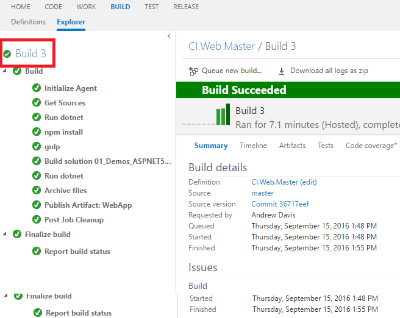
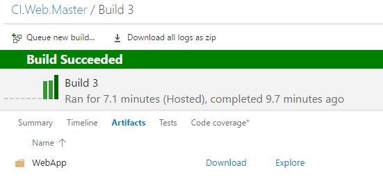
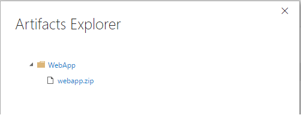

# ARTIFACTS

An artifact is a deployable component of your application. Visual Studio Team Services has the ability to explicitly manage the content of artifacts during a build. 

1. Click Build tab.

1. Select your build definition.

1. Click Edit.

    

1. Click on the Build tab.

1. Click Add build step.

    

1. Add a `Command Line` task.

1. Add a `Archive Files` task.

1. Add a `Publish Artifact` task.

1. Select the `Command Line` task.

    > Tool: Specify the tool you want to run.
    > If you are using an on-premises agent, in most cases you should configure the machine so that the tool is on the PATH enviornment variable. But if you know the location of the tool, you can specify a fully qualified path.

    > Arguments: Specify arguments to pass to the tool.

1. Select the `Archive Files` task.

    > Root folder (or file) to archive: The folder (or file) you wish to archive. 

    The default file path is relative from the root folder of the repo (same as if you had specified $(Build.SourcesDirectory)).

1. Select the `Publish Artifact` task.

    > Path to Publish: Path to the folder or file you want to publish. The path must be a fully qualified path or a valid path relative to the root directory of your repo.
    > A common way to use this build step is to specify $(Build.ArtifactStagingDirectory) as the Target Folder of the Copy Files step, and then also specify that variable for this argument.

    > Artifact Name: Specify the name of the artifact. For example: drop

    > Artifact Type: Choose server to store the artifact on your Team Foundation Server. This is the best and simplest option in most cases.
    > Choose file share to copy the artifact to a file share. Some common reasons to do this:
    > - The size of your drop is large and consumes too much time and bandwidth to copy.
    > - You need to run some custom scripts or other tools against the artifact.
    > - If you use a file share, specify the UNC file path to the folder. You can control how the folder is created for each build using variables. For example \\my\share\$(Build.DefinitionName)\$(Build.BuildNumber).

    > **Note:** You cannot use a file share if you are using the hosted pool.

1. Select the `Command Line` task and update its properties to publish the web project.
    - Tool: dotnet
    - Arguments: publish -c $(BuildConfiguration) $(WebDir)/project.json

    > **dotnet publish** compiles the application, reads through its dependencies specified in the project.json file and publishes the resulting set of files to a directory.

1. Select the `Archive Files` task and update its properties to zip the project output.
    - Root Folder: $(Build.SourcesDirectory)\$(WebDir)\bin\$(BuildConfiguration)\netcoreapp1.0\publish
    - Prefix root folder name to archive paths: Uncheck this option.
    - Archive File to create: $(Build.SourcesDirectory)\$(WebDir)\bin\webapp.zip

1. Select the `Publish Artifact` task and update its properties to publish the web project.
    - Path to publish: $(Build.SourcesDirectory)\$(WebDir)\bin\webapp.zip
    - Artifact Name: WebApp
    - Artifact Type: Server

1. Click Save.

1. Click Queue Build...

    

1. Click Ok.

    

1. In the left-side, click on the build root.

    

1. Click on the artifacts tab.

    

1. Click on explore.

    

    > The webapp artifact contains the application files ready to be deployed!

