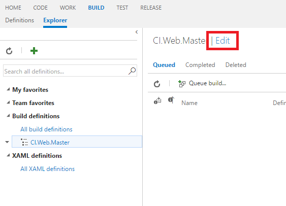
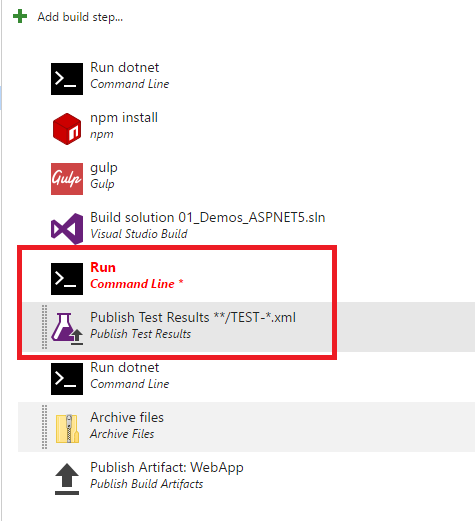
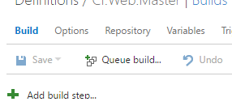
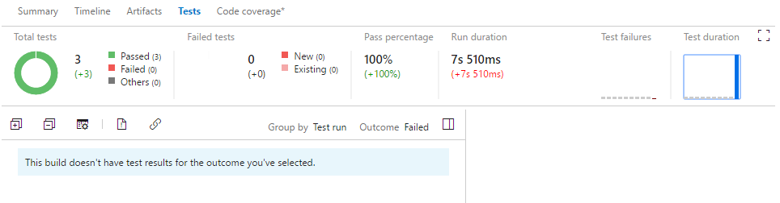
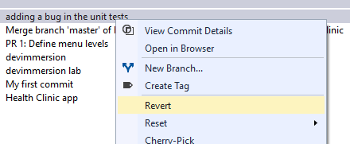
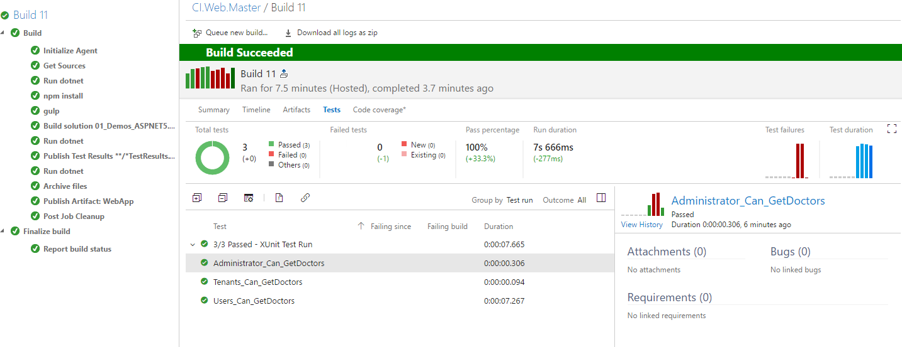

# RUNNING TESTS

Make sure your app still works after every commit and build using VSTS. Find problems earlier by running tests automatically with each build. When your build is done, review your test results to start resolving the problems that you find.

Your build definition includes a test task that runs unit tests. For example, if you're building a Visual Studio solution in Team Services, your build definition includes a Visual Studio Test task. After your build starts, this task automatically runs all the unit tests in your solution - on the same build machine. 

HealthClinic uses ASP.NET core so you need to use the dotnet tool to run the tests.

Connect to VSTS web portal

1. Click Build tab.

1. Select your build definition.

1. Click Edit.

    

1. Click on the Build tab.

1. Click Add build step.

    

1. Add a `Command Line` task.

1. Add a `Publish Test Result` task.

    

1. Select the `Command Line` task.

    > Tool: Specify the tool you want to run.
    > If you are using an on-premises agent, in most cases you should configure the machine so that the tool is on the PATH enviornment variable. But if you know the location of the tool, you can specify a fully qualified path.

    > Arguments: Specify arguments to pass to the tool.

1. Select the `Command Line` task .
    - Tool: dotnet
    - Arguments: test -xml TestResults.xml - the test command is defined in the unit test project.
    - Working Folder: test/MyHealth.API.IntegrationTests

    > The dotnet test command is used to execute unit tests in a given project. Unit tests are class library projects that have dependencies on the unit test framework (for example, NUnit or xUnit) and the dotnet test runner for that unit testing framework. These are packaged as NuGet packages and > are restored as ordinary dependencies for the project.

    > Test projects also need to specify a test runner property in project.json using the "testRunner" node. This value should contain the name of the unit test framework.

    

1. Select the `Publish Test Result` task.
    - Test Result Format: XUnit
    - Test Results Files: **/*TestResults.xml
    - Always run: true - to be sure that the results are published when the unit tests fail.

1. Click Save.

1. Click Queue Build...

    

1. Click Ok.

    

1. In the left-side, click on the build root.

    

1. Click on the test tab or on the Detailed report hyperlink.

    > it shows the summary for your test run results, including a comparison between the current build and the last build.

    

    > You'll find changes in new, failed, and passed tests, how long these tests took to run, how long these tests have been failing, and more.

    

1. Switch to Visual Studio.

1. Expand the `MyHealth.API.IntegrationTests` project.

1. Click on `GetDoctors.cs` and modify the assert of the unit test `Administrator_Can_GetDoctors`.

    

1. Commit and Sync the changes.

    

1. Switch to the VSTS portal.

1. Click on the build tab to view the queued builds.

    

1. Double-click on the existing build.

    

1. After finishing, click on the test tab.

    >   Review the summary for your test run results, including a comparison between the current build and the last build.

    

    

1. You can also organize your test results using the group and outcome lists.

    > You'll find changes in new, failed, and passed tests, how long these tests took to run, how long these tests have been failing, and more.

    

    

1. To start debugging a failed test, open it and review the resulting error and stack trace.

    

    # Revert changes 

1. Switch to Visual Studio.

1. Open up the Changes view in Team Explorer.

1. Select Actions and choose View History from the drop-down.

    

1. In the history window that appears, right-click the commit to reset the repo to and select Reset from the context menu.

    

1. Choose Revert.

    > Use **revert** to undo the changes made in your commits pushed to shared branches.  
    > The revert command creates a new commit that undoes the changes on a previous commit. No history is rewritten in a revert, making it safe to use when working with others.

    > Use **reset** to bring a branch in your local repository back to the contents of a previous commit. The most common use of the reset command is to simply discard all changed files since the last commit and return the files to the state they were in at the most recent commit.

1. Open up the Sync Changes view in Team Explorer.

    

1. Sync your changes to update the remote repository.

    > A new build will be queued.

    

    
