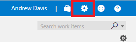
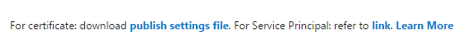
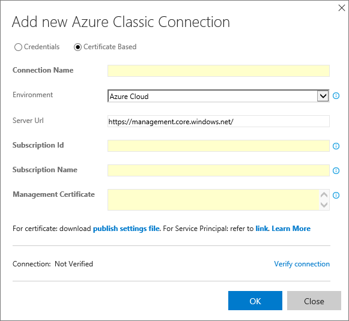

# CONNECT TO MICROSOFT AZURE

Carry out the following steps to establish a connection to Microsoft Azure from Visual Studio Team Services.

1.  Sign in to your Visual Studio Team Services account 

    > https://{youraccount}.visualstudio.com

1.	From your account overview page, select your team project. To find your team project, use Browse.

     

1.	Choose the Manage project icon at the right of the title bar to open the administrative control panel.

     

1.	In the Add new Azure Classic Connection dialog, select the Certificate Based option and enter a user-friendly name for the connection name such as "Azure Classic".

     

1.	Click on publish settings file.

     

1.	Open the downloaded file in a text editor such as Notepad. You will need some values from this file in the following steps.

1.	Click on Certificate based.

     

1.	Copy the following values from the Azure publish settings file you downloaded earlier into the Azure connection dialog fields:

    > ID: Subscription ID

    > Name: Subscription Name
    
    > ManagementCertificate: Management Certificate

1.	Verify the connection.

     

1.	Choose OK to save the settings and close the dialog.

     
