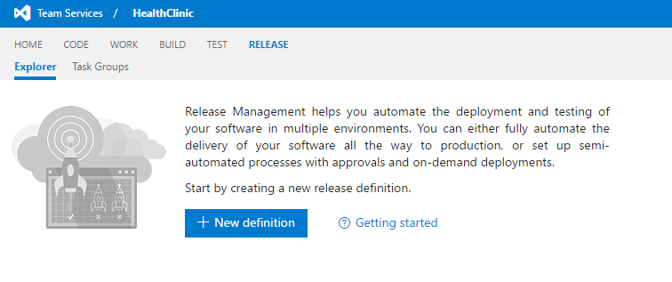
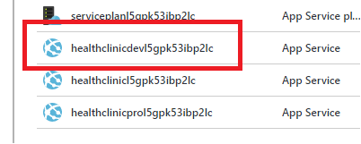
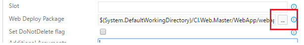
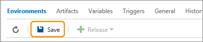

# CREATE A NEW RELEASE DEFINITION

1.  Sign in to your Visual Studio Team Services account 

1.	From your account overview page, select your team project. To find your team project, use Browse.

1.	Click Release.

     

1.	Click New Definition.

1.	In the Create new release definition dialog, select the `Azure WebSite Deployment` template and choose Next.

     

1.	In the next page, select the build definition you created earlier and choose Create. 

    > This creates a new release definition with one default environment.

     

     

1.	Remove the `Run Test` task. We don´t need in the example.

1.	Select task `Deploy Website to Azure` task and update its properties.

    > - Azure Subscription: Select your Azure subscription.

    > - Web App Location: `YOUR_RESOURCE_GROUP_LOCATION` 

    > - Web App Name: `YOUR_DEV_WEBAPP_NAME` (Check the name in the existing resource group).

     

     

1.	Select the artifact to deploy.

     

     

1.	Type a name for the new release definition and, optionally, change the name of the environment from Default Environment to Dev.
    
     

1.	Save the release definition.

     

1.	Create a new release and select the latest build to deploy it to the single environment in the definition.

     

     

1.	Go to the release definition log to view the process.

     

     

1.	Open your browser and go to the web app.

    > You can go to the Azure Portal and get the existing Web App Service URI.

     

     

1.	Click on Private area.

     

1.	Sign in using this credentials: User P2ssw0rd@1

     

