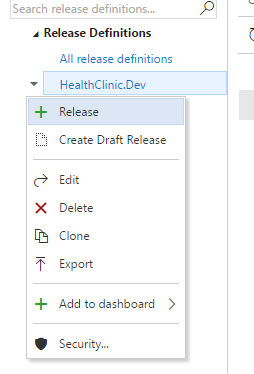
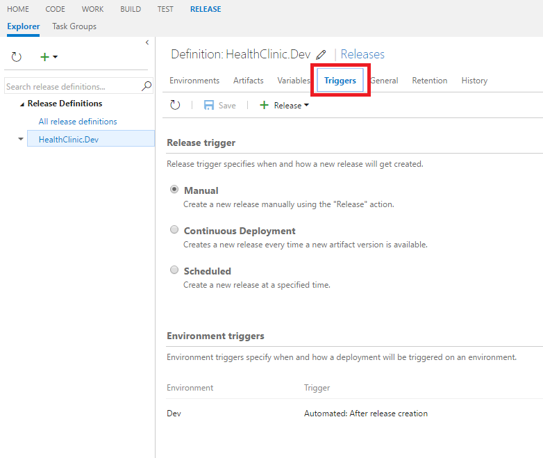
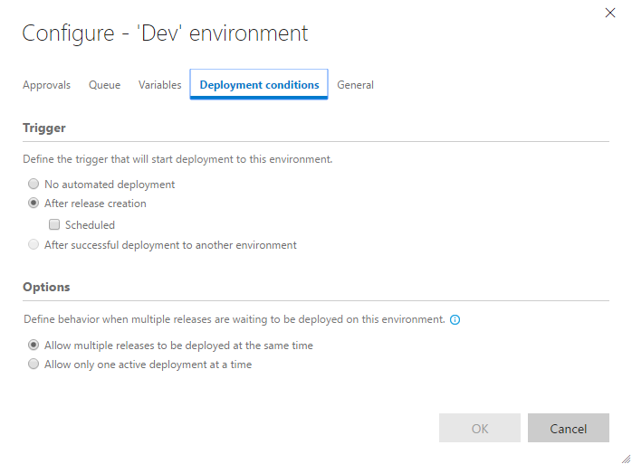
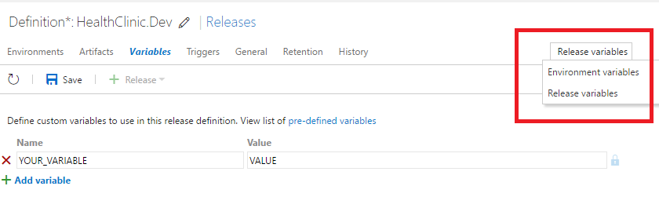
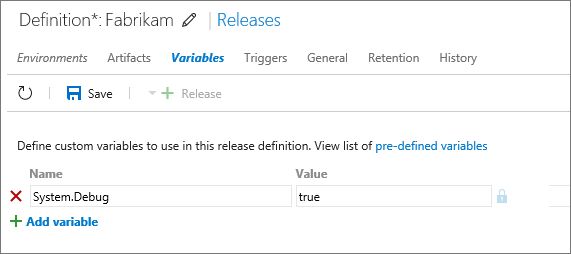

# MANAGE RELEASES

# Create a release from the Release hub

You will need to create a release manually if you have not specified a continuous deployment or continuous integration trigger in your release definition. 

1.	Select your release definition.

    

1.	Right-click and click Release.

    

1.	In the Create new release for... dialog, select the version of the linked build artifacts you want to include in this release. 

    > Optionally, enter a description for this release.

    

1.	Click overview to view your current release and see its details.

    

    

# Edit a release definition

1.	Select your release definition.

1.	Right-click and click Edit.

    

# Triggers

1.	Click Triggers.

    > A Release definition can be configured to automatically create a new release when it detects new artifacts are available - typically as a result of a new build of the application.

    

    > - **Manual:** No releases are initiated automatically when a new build of the source artifacts occurs. All releases for this release definition must be created manually by choosing the Release icon in a release definition or from a build summary. 

    > - **Continuous Deployment:** A new release is created automatically when Release Management detects new built artifacts are available. When you select this option, a drop-down list enables you to select which of the artifact sources linked to this release defininition will trigger a new release.

    > - **Scheduled:** A new release is created based on a schedule you specify. When you select this option, a set of controls enables you to select the days of the week and the time of day that Release Management will automatically create a new release.

    > **NOTE:** However, even though a release is automatically created, it might not be deployed automatically to an environment. To enable automatic deployment, you must also configure environment deployment triggers in each environment for which you want automated deployments to occur. The lower section of the Triggers tab lists the environments configured for this release definition.

    

1.	Click on Continuous Deployment to create a new release automatically.

    

1.	Click on the Edit icon.

    >  The deployment conditions dialog for the environment shows the currently configured environment deployment triggers and deployment queuing policies. Users with permission to edit release definitions can edit the deployment conditions here, including environment deployment triggers and deployment queuing policies. 

    

1.	Save the release definition and go to the Build tab.

1.	Queue a new build.

    

    > After finishing the build a new release definition will be created automatically.

    

# Artifacts

1.	Click Artifacts.

    > An artifact is a deployable component of your application. Team Services has the ability to explicitly manage the content of artifacts during a build. 

    

    > When authoring a release definition, you link the appropriate artifact sources to your release definition. For example, you might link a release definition to a Team Build build definition, or to a Jenkins project.

    > When creating a release, you specify the exact version of these artifact sources; for example, the number of a build coming from Team Build, or the version of a build coming from a Jenkins project.

    > After a release is created, you cannot change these versions. A release is fundamentally defined by the versioned artifacts that make up the release. As you deploy the release to various environments, you will be deploying and validating the same artifacts in all environments.

1.	Click Link an existing source.

    > A single release definition can be linked to multiple artifact sources. In this case, when you create a release, you specify individual versions for each of these sources.

    

    > You can link multiple artifact sources to the same release definition. A common example for this is when you deploy micro services, each one coming from a different build definition. Another example is where you manage the application code in one repository and the configuration files in a different repository.

    > **NOTE**: At present, Release Management can trigger creation of new releases from only one of the artifact sources. When a new release is created, the latest versions of all the other sources are deployed.

# Variables

1.	Click Variables.

    > You can use the default variables, and define custom variables, that enable you to:

    > - Share values across all of the environments with release definition variables. Choose a release definition variable when you need to use the same value across all the environments and tasks in the release definition, and you want to be able to change the value in a single place.
    > - Share values across all of the tasks within one specific environment with environment variables. Use an environment-level variable for values that vary from environment to environment (and are the same for all the tasks in an environment).
    > - Run your deployments in debug mode to show additional information that can help you resolve issues and failures.

    

    > Using variables at both release definition and environment scope helps you to:

    > - Avoid duplication of values, making it easier to update all occurrences as one operation.
    > - Store sensitive values in a way that they cannot be seen or changed by users of the release definitions.

    

1.	Click Enviroment variables.

    > You can view and edit the variables defined for individual environments in the release definition in this tab by selecting Environment variables from the list at the right of the toolbar.

    

1.	Click Enviroments and select the existing enviroment to configure its variables.

    

1.	Remove the existing variables and create two additional variables.

    > - Location:   `YOUR_RESOURCE_GROUP_LOCATION` 
    
    > - WebApp: `YOUR_DEV_WEBAPP_NAME` (Check the name in the existing resource group).

    

    

1.	Modify the existing step to use the defined variables.

    

# Run a release in debug mode

You can show additional information as a release executes by running the entire release, or just the tasks in an individual release environment, in debug mode. This can help you resolve issues and failures.

1.	Click Variables.

1.	To initiate debug mode for an entire release, add a variable named System.Debug with the value true.

    

1.	To initiate debug mode for a single environment, open the Configure environment dialog from the shortcut menu of the environment and add a variable named System.Debug with the value true to the Variables tab.

    

1.	Add a variable named System.Debug with the value true.

1.	Save the release definition and queue a new release to check the log.

# Clone, export, and import a release definition

1.	Select your release definition.

    

1.	Open the shortcut menu.

    

    > **Clone** to create a complete copy of the selected definition with "- Copy" appended to the name.

    > **Export** to create a JSON file containing a full representation of the selected release definition that you can save to your local computer.