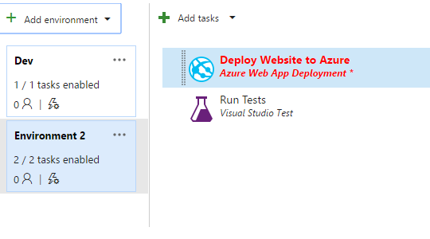
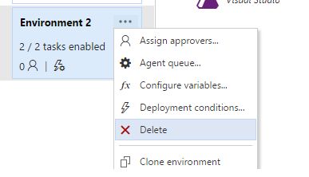
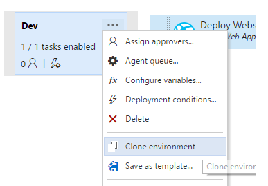
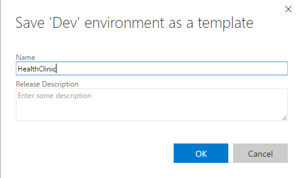
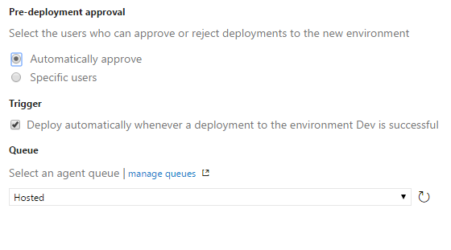
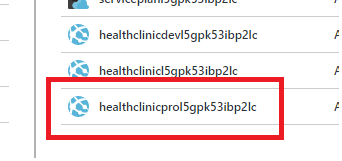
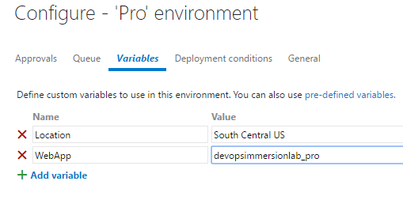
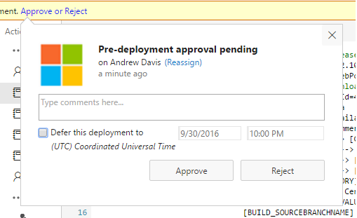

# ENVIRONMENTS

A release definition is a collection of environments. An environment is a logical entity that represents where you want to deploy a release. Physically, the deployment in an environment may happen to a collection of servers, a cloud, multiple clouds, or an app store. The deployment steps in an environment are described using tasks.

# Add environments

1.	Select your release definition.

    

1.	Right-click and click Edit.

    

1.	Click on Add enviroment and choose Create new environment.

    

1.	Select the Azure Web Site deployment template.

    

1.	Choose Next and select the pre-deployment approval, trigger, and queue settings for the new environment.

    > You can use the default values in this scenario.

    

    

1.	Select the new enviroment and delete it.

    

# Clone environments

A release definition often contains several environments such as development, testing, QA, and production. Typically, all of these environments are fundamentally similar - and the techniques used to set up and deploy to each one are the same with the exception of minor differences in configuration for each environment and task (such as target URLs, service paths, and server names).

After you have added an environment to a release definition and configured it by adding tasks and setting the properties for each one, you can clone it to create another environment within the same definition. The cloned environment has the same tasks, task properties, and configuration settings.

1.	Select the existing enviroment and choose Clone environment on the shortcut menu that opens from the environment's ellipses (...).

    

1.	Choose Next and select the pre-deployment approval, trigger, and queue settings for the new environment.

    > You can use the default values in this scenario.

    

1.	Choose Create and then edit the new environment name as required.

    

    > After you have created and configured your environments, you could add tasks to them as we saw in the previous steps.

1.	Select the new enviroment and delete it.

    
    
# Environment templates

When you start a new release definition, or when you add an environment to an existing release definition, you can choose from a list of templates for each environment.

These templates pre-populate the environment with the appropriate tasks and settings, which can considerably reduce the time and effort required to create a release definition. Alternatively, you can choose to start with an empty release definition that contains only a single default empty environment, or an empty environment that contains no tasks.

You can also create your own custom environment templates from an environment you have populated and configured. 

1.	Select the existing enviroment and choose Save as template on the shortcut menu that opens from the environment's ellipses (...).

    

1.	Enter a name and description, and choose OK.

    > Name: HealthClinic

    

1.	The custom templates you create appear in the Custom tab of the Create new release definition dialog.

1.	Create a new enviroment based on the template.

    

    

1.	Configure the variables of the new enviroment to deploy to another Web App.

    

    > - Location:  `YOUR_RESOURCE_GROUP_LOCATION` 

    > - WebApp: `YOUR_PRO_WEBAPP_NAME` (Check the name in the existing resource group).

    

    

1.	Save the release definition and queue a new release.

1.	Go to the release definition log to view the process.

     

     

1.	Open your browser and go to the new web app.

    > Dev Web App URI: `YOUR_DEV_WEBAPP_URI` (Check the name in the existing resource group).
    
    

    > Pro Web App URI: `YOUR_PRO_WEBAPP_URI` (Check the name in the existing resource group).

    

     

# Approvals and approvers

You can define approvers for each environment in a release definition. When a release is created from a release definition that contains approvers, the deployment stops at each point where approval is required until the specified approver grants approval or rejects the release (or re-assigns the approval to another user). For more details, see Approve a release.

1.	Select the "Pro" environment.

1.	Use the ellipses (...) to show the environment pop-up menu and choose Assign approvers.

    

    > In the Approvals tab of the Configure dialog you specify details for pre-deployment and post-deployment approvers. When the Automatic checkbox is set for an approval step, the deployment is automatically approved.

    
    
    > When you select the Specific Users option, you can specify and edit one or more approvers for an approval step. You can type part of the name and choose from the drop-down list of matching user names defined for the project.

    

    > You can add multiple approvers for both pre-deployment and post-deployment settings. When you add multiple approvers, you can also control how they can approve the deployment.

    

1.	Add an pre-deployment approver.

1.	Save the release definition and queue a new release.

1.	Go to the release definition log to view the process.

    

1.	Click "Approve or reject".
    
    

1.	Click Approve.

    > The release will continue deploying in the "Pro" enviroment.