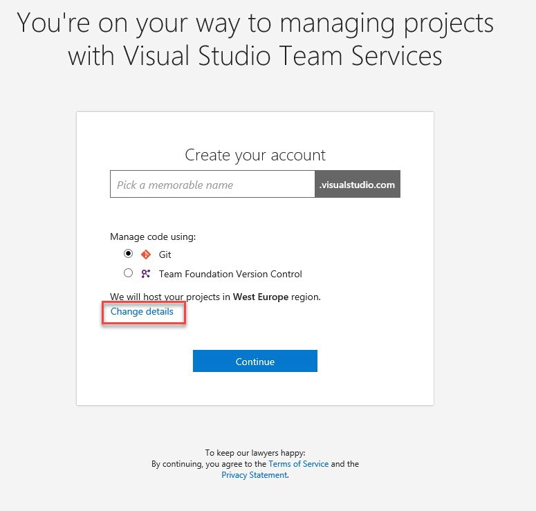

# SIGN UP FOR VISUAL STUDIO TEAM SERVICES

1.	Open your browser and navigate to https://www.visualstudio.com/ 

    

1.	Sign up with a personal Microsoft account, like @outlook.com or @hotmail.com.	

    > If you're a Visual Studio subscriber and get Visual Studio Team Services as a benefit, use the Microsoft account associated with your subscription.

    

    

1.	Name your Visual Studio Team Services account. 

1.	Choose Git and click "**Change Details**".	

    

1.	Name your first project as **HealthClinic**.

1.	Choose Scrum as work template.

1.	Confirm your account's location.

    

1.	Click Continue.	

    > When creating the projects, the template you are going to choose it is important, as it will define how Work Items will work for planning your work.

    > You have three options:
    > -	**Scrum**: it is oriented to teams which are practicing Scrum and are fully comfortable with the Scrum terminology.
    > -	**Agile**: it can fit any agile process, even Scrum, but it uses more genereic terminology to fit other Agile processes.
    > -	**CMMI**: it fits with process described in the CMMI methodology, as well as its terminology. This is perfect if you are going through CMMI certification.

    

    > After Visual Studio Team Services creates your account and team project, add code, work items, or users.

 
