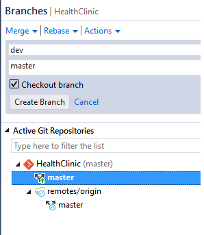
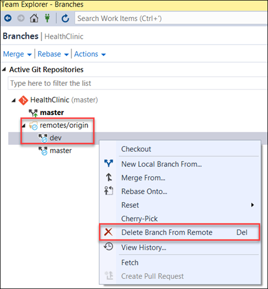

# MANAGE BRANCHES FROM VISUAL STUDIO

Manage the work in your team's Team Services Git repo from the Branches view on the web.

Customize the view to track the branches you care most about so you can stay on top of changes made by your team.

## Overview

Git branches aren't much more than a small reference that keeps an exact history of commits, so they are very cheap to create. 
Committing changes to a branch will not affect other branches, and you can share branches with others without having to merge the changes into the main project. Create new branches to isolate changes for a feature or a bug fix from your master branch and other work.

Since the branches are lightweight, switching between branches is quick and easy. Git does not create multiple copies of your source when working with branches — it uses the history information stored in commits to recreate the files on a branch when you start working on it. Your Git workflow should create and use branches for managing features and bugfixes. The rest of the Git workflow, such as sharing code and reviewing code with pull requests all work through branches. Isolating work in branches makes it very simple to change what you are working on by simply changing your current branch.

## Create a new branch in your local repositoy

1. Open up Team Explorer.

1. Go to the Branches view.

1. Right-click the parent branch (usually master) to base your changes.

    

1. Choose New Local Branch From....

1. Supply a branch name in the required field.

    

1. Click Create Branch.

    > Visual Studio will automatically checkout to the newly created branch.

    

## Checkout a branch 

1. Open up Team Explorer.

    > Git keeps track of which branch you are working on and makes sure that when you checkout a branch your files match the most recent commit on the branch. 
    > Branches let you work with multiple versions of the source code in the same local Git repository at the same time. 

    > Tell Git which branch you want to work on with checkout, and Git takes care of setting the right file versions for that branch.

1. Go to the Branches view.

1. Locate the branch you want to checkout. 

1. Right-click the branch name.

1. Select Checkout.

    

## Publish your local branch

1. Locate the branch you want to publish. 

    

1. Right-click the branch name.

1. Select Publish.

    

1.  Sign in to your Visual Studio Team Services account 

    > https://{youraccount}.visualstudio.com

1. From your account overview page, select your team project.

1. Select Code.

    

    > The new branch is alredy published.

## Delete a local branch

>**NOTE:** Deleting a branch in your local repo doesn't remove the branch on the remote.

1. Open up Team Explorer.

1. Go to the Branches view.

1. Locate the branch you want to delete. 

    > Make sure that you aren't checked out to that branch - you can't delete the branch you are currently working in.

1. Right-click the branch name.

   

1. Select Delete. 

    > If you have unpublished changes, Visual Studio will ask and make sure you want to delete the branch so you don't possibly lose work.

## Delete a remote branch

1. Open up Team Explorer.

1. Go to the Branches view.

1. Locate the branch you want to delete. 

    > locate the tree for the remote in Team Explorer's Branches view (such as remotes/origin)

1. Right-click the branch name and select Delete Branch from Remote.

  

