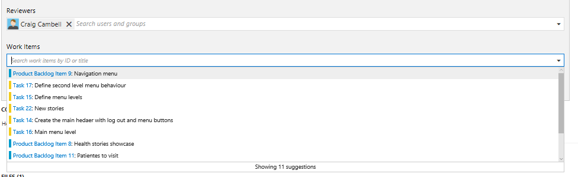
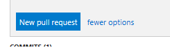

# PULL REQUEST

Pull requests let your team give feedback on changes in feature branches before merging the code into the master branch. 

Reviewers can step through the proposed changes, leave comments, and vote to approve or reject the code.

## Create a new pull request from Team Explorer in Visual Studio

1. Open Visual Studio.	

1. Open the Team Explorer.  

1. Go to the Branches view.

1. Checkout the `dev` branch.

    > Create a new branch dev if you don´t have it.

    

1. Go to the Home view.

   

1. Open the `01_Demos_ASPNET5` solution.

    

1. Expand the MyHealth.API project.

1. Expand the controller folder.

1. Modify any of the existing controllers.

    

    > As you write your code, your changes are automatically tracked by Visual Studio.   

1. Go to the Changes view.

1. Sync the changes to push your commits and pull changes from others.

    > Now, your changes are updated in remote dev branch.

    

1. Go to the Team Explorer Home view.

    

1. Select the Pull Requests button.

    > You will promote changes from dev to Mmster branch. 

1. Select the New Pull Request link to open up a browser window to create a new pull request on the web.

    

    > Link work items and describe the changes in the branch to make it easier for others to see what problem you are trying to solve. 

    > Change the pull request title, add a detailed description, link work items, and make comments to explain your changes.

   

    > **NOTE:** Don´t create the pull request.

## Create a new pull request from the Code view on the web

1. Open the Branches view while viewing your repo on the web.

1. Locate `dev` branch on the branches page. 

1. Create a new pull request selecting the ... icon next to the branch name and then selecting New pull request from the menu. 

    

    > Link work items and describe the changes in the branch to make it easier for others to see what problem you are trying to solve. 

    > Change the pull request title, add a detailed description, link work items, and make comments to explain your changes.

   

## Add and remove reviewers

1. Enter the name of the user or group to add to the reviewer list for the pull request. 

    > If the user isn't a member of your Team Project, you'll need to add them.

    > As you enter a name or email address, a list of matching users or groups will appear. 

   

1. Select the user or group from the list to add them as a reviewer.

    > Remove a reviewer from a pull request by selecting the remove icon that appears to the right of their name when you hover over them.

# Link work items

1. Enter the ID of the work item or search for work items with titles that match your text. Select the work item from the list that appears.

    

    > Pull requests automatically link to work items when the source branch or any of its commits are linked to a work item.

1. Click New Pull Request.

    

