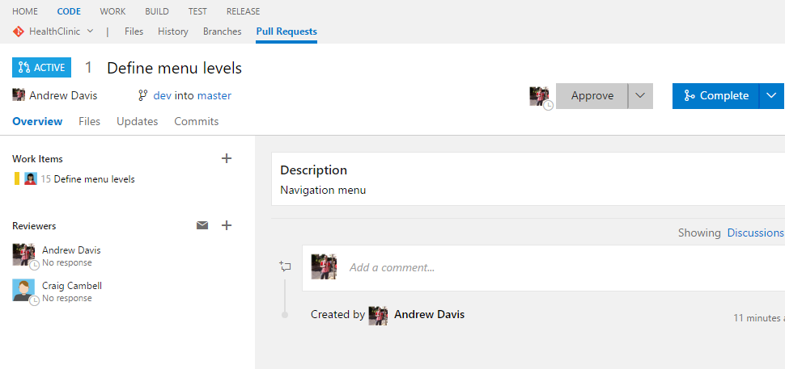
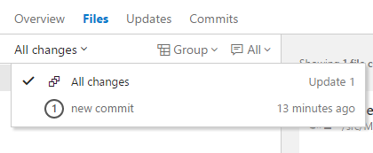
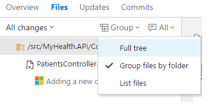
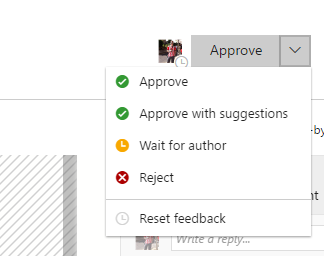
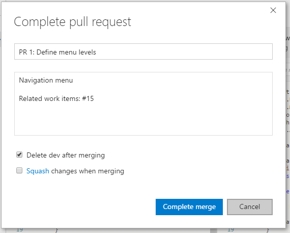
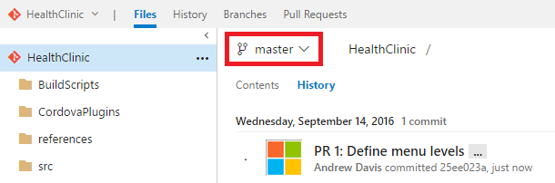

# MANAGE PULL REQUESTS

    Manage your pull requests you own or are assigned to with the Pull Requests tab in the Code view on the web.

1. Open the Pull Request view while viewing your repo on the web.

    > Select Active to show all active pull requests for the current repo. 

    > Select Completed or Abandoned to bring up a history of closed pull requests.

 

## Review a pull request

1. Select any of the existing pull request assigned to you.

    > The Overview tab shows the current state of the pull request at a glance. 

  

    > Review the title, description, and discussion to get an understanding of the proposed changes and see issues brought up by other reviewers.

## Browse code changes

1. Select the Files tab to view the differences between the most changes between the source and target branch of the pull request.

  

1. Review previous versions of the code pushed to the source branch of the pull request from the All changes drop-down. 

    > A new version is added to the list in the drop-down and on the Updates tab every time the branch is updated in Team Services.

  

    > The diff view updates as you select different changes, showing the differences between the files in the currently selected and previous version in the pull request. 
    > Catch up with a pull request after being away from it for awhile by stepping through changes made since your last review.

## Leave comments

1. Locate the file where you want to add a new comment.

    > Add comments to the pull request to make suggestions, reply to previous comments, and point out problems with the proposed changes.   

1. Right-click.

1. Click Add comment.

    > Reply directly to the author or other reviewers by using @username and reference work items using #workitem in your comments.

    

    

    > We can change to Tree view to get the proper structure of the source code or just list files and we can view all the comments or only active comments or hide comments.

   

   

    > We can see inline diff or side-by-side diff

1. Browse a list of changes by push from the author using the Updates tab. 

    > You can select and view changes made in commits on the branch in the Commits tab.

    

1. Go back to Files Tab.
1. Click on the comments to check the details of the files modified and comments given by reviewer. 

    > New comments start in Active status and can be updated using the drop-down in the comment to:
    > - Active: Comment is still under review.
    > - Resolved: The issue brought up in this comment has been fixed.
    > - Pending: The issue in this comment will be addressed, but isn't fixed yet.
    > - Won't Fix: Note the suggestion in the comment, but don't make changes in this pull request to address it.
    > - Closed: Discussion for this comment is closed.

    

## Vote on the changes

1. Click Approve in the upper right of the pull request view.

    > The default option is Approve, but you can select other options from the drop-down:
    > - Approve with suggestions : Agree with the pull request, but provide optional suggestions to improve the code.
    > - Waiting for the author : Do not approve the changes, and ask the author to review your comments. The author should let you know when you should re-review the code after they have addressed your concerns.
    > - Rejected : The changes aren't acceptable. If you are voting this way, you should leave a comment in the pull request detailing why the changes were rejected.

    

## Complete the pull request

1. Click Complete in the upper right of the pull request view.

    

1. Enter the message used for the merge commit and update the pull request description as needed in the dialog that follows. 

    

    > You can choose to squash merge your pull request and delete the source branch once the merge is complete.

    > **Squash merging** is a merge option that allows you to condense the Git history of topic branches when you complete a pull request. Instead of each commit on the topic branch being added to the history of the default branch, a squash merge takes all the file changes and adds them to a single new commit on the default branch. Squash merging keeps your default branch histories clean and easy to follow without demanding any workflow changes on your team. 

1. Click Complete merge.

    

1. Open the File view.

    

1. Select the master branch.

1. Click History.

    > The master branch is updated!

