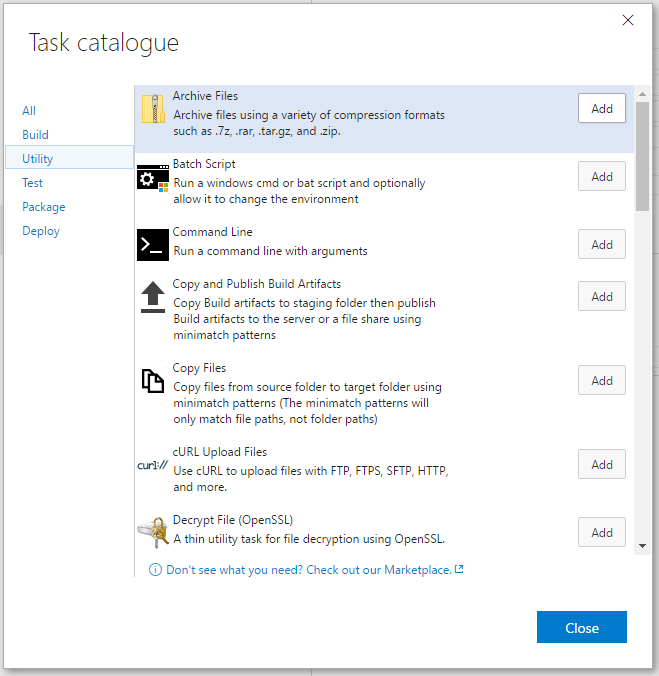
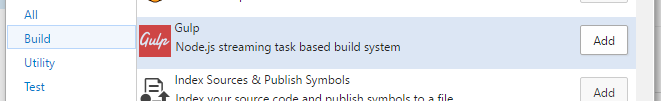
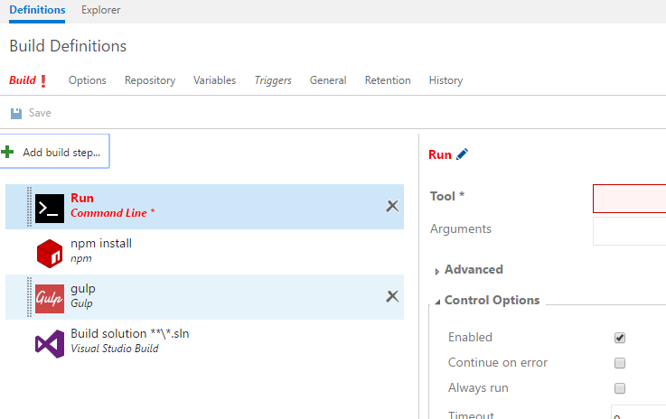
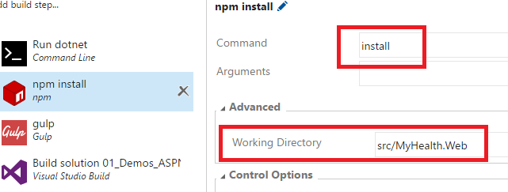
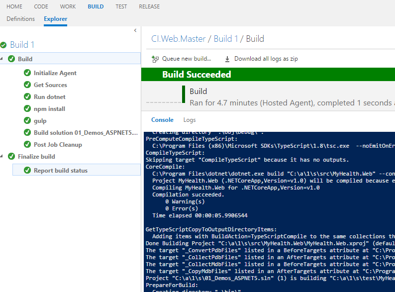
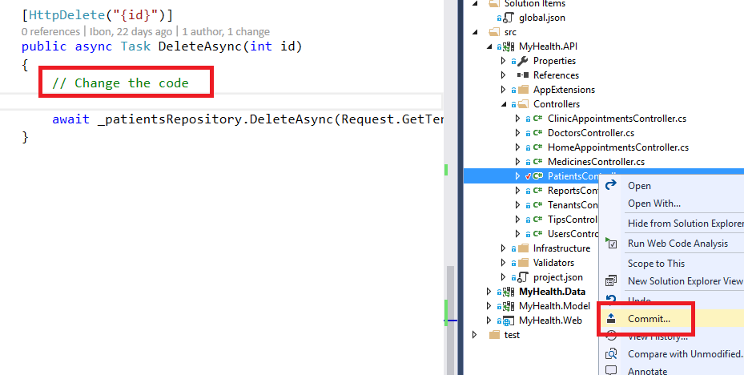
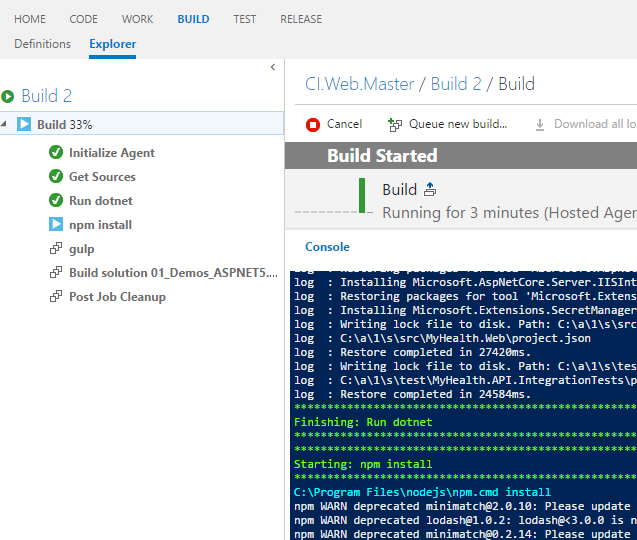

# BUILD ASP.NET CORE

ASP.NET Core is a lean and composable framework for building web and cloud applications. Here we'll show you how to automatically build the HealthClinic ASP.NET Core application.

1. From your VSTS account overview page, select your team project. 

    > To find your team project, use Browse.

1. Click Build tab.

    

1. Click New Build definition.

    

1. Select the Empty template to start a new build definition from scratch.

    > If a template is relevant to your scenario, select it to automatically add some steps and apply typical settings.
    > If there's no template for your scenario, select Empty and then add the build steps you need.

1. Specify the code you want to build.

1. Select the continuous integration (CI) trigger.

    

1. Click Create.

    

    

## Add build steps

1. Click Add build step.

    

1. Add a `Command Line` task to restore the project dependencies.

    > Run a command line with arguments.

1. Add a `npm` task.

    > Install npm packages.

    

1. Add a `gulp` task.

    > Node.js streaming task based build system.

    

1. Add a `Visual Studio` task.

    > Build with MSBuild and set the Visual Studio version property.

1. Click Close.

    

1. Select the `Command Line` task and update its properties:
    - Tool: dotnet
    - Arguments: restore

    > **dotnet** is a general driver for running the .NET core command-line commands.

    > The **dotnet restore** command uses NuGet to restore dependencies as well as project-specific tools that are specified in the project.json file. By default, the restoration of dependencies and tools are done in parallel.

    

1. Select the `npm` task and update its properties:
    - Commands: install
    - Advanced>Working Directory: src/MyHealth.Web
    
    > This command installs all the  packages described by the package.json file, and any packages that it depends on.
    > Install the dependencies in the local **node_modules** folder.

    

1. Select the `gulp` task and update its properties:
    - Gulp File Path: src/MyHealth.Web/gulpfile.js
    - Advanced
        
      Working Directory: src/MyHealth.Web

    > **Gulp** is a task runner that solves the problem of repetition.It's often used to do front-end tasks like using preprocessors like Sass or LESS, optimizing assets like CSS, JavaScript, and images, Reloading the browser automatically whenever a file is saved...

1. Select the `Visual Studio` task and update its properties:
    - Solution: 01_Demos_ASPNET5.sln

1. Click Save.

    

1. Add the name for your new build definition.

    

    > It´s very important to use a naming policy to be very easy to find an existing build and understand its goal.

    > For example, in the screenshot you can view the name CI.Web.Master.
        > - CI = Continuous integration build.
        > - Web = builds a WebApp. Remember that HealthClinic has different kind of apps.
        > - Master = git branch used.

1. Click on the Explorer tab.

    > You can queue builds automatically or manually. Now, you will run it manually.

1. Select the new build definition.

1. Right-Click.

    

1. Click Queue Build...

    

1. Click Ok.

    

    > A new build is running! 

1. Open Visual Studio.	

1. Go to the Team Explorer Branches view.

1. Verify that the master branch is checkout or checkout it.

    

1. Go to the Team Explorer Home view.

1. Open the `01_Demos_ASPNET5` solution.

     

1. Expand the MyHealth.API project.

1. Expand the controller folder.

    

1. Modify any of the existing controllers and commit the changes.

    

1. Commit All and Sync.

    

1. Switch to the Team Services web portal.

1. Open the Build view and click Explorer.

    

1. Select your build definition.

    > A new build is queued automatically.

1. Choose the queued build definition and Right-Click.

1. Click Open.

    

