# MANAGING TECHNICAL DEBT

Technical debt is the set of problems in a development effort that make forward progress on customer value inefficient.  Technical debt saps productivity by making code hard to understand, fragile, difficult to validate, and creates unplanned work that blocks progress. 

Technical debt is insidious.  It starts small and grows over time through rushed changes, lack of context and lack of discipline. Organizations often find that more than 50% of their capacity is sapped by technical debt.

Debt comes in many forms, including problems found through code analysis, duplicate code, code complexity, not enough tests, overlapping and flaky tests, and “architectural spaghetti.”

SonarQube is an open source platform that is the de facto solution for understanding and managing technical debt.

Microsoft has collaborated with SonarSource to make available a set of integration components that allow you to configure a VSTS Build to connect to a SonarQube server and send the following data, which is gathered during a build under the governance of quality profiles and gates defined on the SonarQube server.

- Results of .Net and JavaScript code analysis.
- Code clone analysis.
- Code coverage data from tests.
- Metrics for .Net and JavaScript.

In addition, SonarSource have produced a set of .Net rules, branded SonarLint, written using the Roslyn-based code analysis framework, and published them in two forms: a nuget package and a VSIX. With this set of rules, the analysis that is done as part of build can also be done live inside Visual Studio 2015, exploiting the new Visual Studio 2015 code analysis experience.

Visual Studio Online two build tasks to execute a SonarQube analysis:
- SonarQube for MSBuild – Begin Analysis
- SonarQube for MSBuild – End Analysis

As the name suggests, the first of these tasks is used to define a step that start the SonarQube analysis, before any MSBuild build steps. The Begin Analysis task contacts the SonarQube server to retrieve the quality profile, and dynamically produces rulesets to be applied during the static analysis. It also sets things up so that the following MSBuild steps produce some data to prepare the analysis.

The End Analysis task should be used to create a step that is executed after the `Visual Studio Test` task step if you want SonarQube to show code coverage data. In any case, it should be run after the `Visual Studio Build` step. The End Analysis task finalizes the analysis (computation of the clones, metrics, and analysis for languages other than .Net), and sends the analysis results to the SonarQube server.

## Hosting SonarQube on Azure

At the center of a SonarQube installation is the server which we will build in this lab.  The data for SonarQube is stored in a database. SonarQube supports many different database systems but for this post we are going to use Microsoft SQL Server running in a VM in Azure.

1.  Create a Microsoft SQL Server 2016 Virtual Machine in Azure.  

    > Simply click the Deploy to Azure button below and follow the wizard to create the Virtual Machine. You will need to log in to the Azure Portal.
                                                                     
    > **NOTE**: The template creates a Microsoft SQL Server 2016 Express VM hosted on Windows Server 2012. This template must be available in your Azure subscription.

    <a href="https://portal.azure.com/#create/Microsoft.Template/uri/https://portal.azure.com/#create/Microsoft.Template/uri/https%3A%2F%2Fraw.githubusercontent.com%2Fhsachinraj%2FDevOps-Immersion-Labs%2Fmaster%2Flabs%2F05.quality%2Ftemplates%2Fsonar.template.json" target="_blank">
    
    </a>

    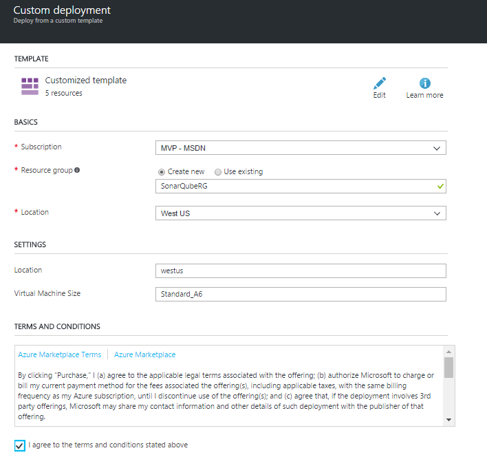

1.  After creating the VM, connect to the Machine and configure SQL and install SonarQube.  

    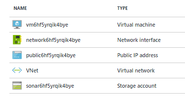

### Configure SQL Server

1.  Once you are connected to the Virtual Machine disable the Internet Explorer Enhanced Security Configuration.

    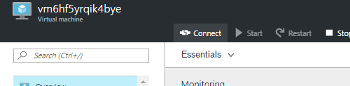

    > UserName: sonaruser
    > Password: P2ssw0rd@Dev

    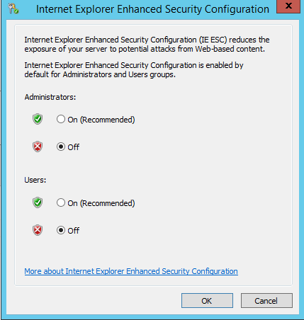

1.  Start Microsoft SQL Server Management Studio to create the target database for SonarQube. 

    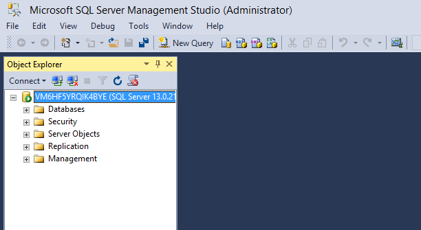

1.  Right click on Databases and select New Database.

1.  Give the database a name and select Options so we can change the Collation. 

    > Use **sonarqube** for the database name.

    > For the database to work with SonarQube the Collation must be Latin1_General_100_CS_AS. While we are here we can change the Recovery model to Simple to improve performance.

    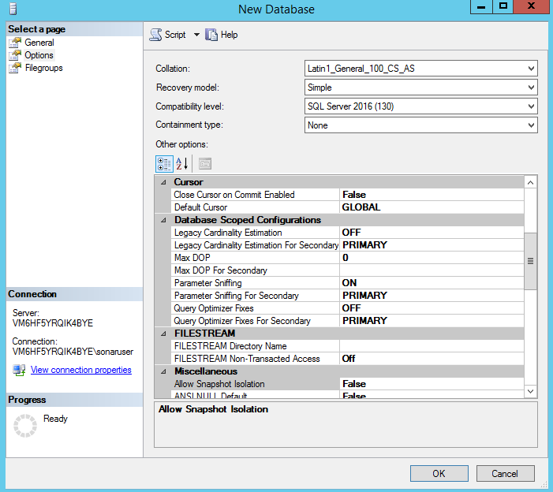

1.  For all of the security changes to take effect we need to restart the SQL Server. To do this right click on the server node in the tree to the left and select Restart. 

### Install Java

1.  SonarQube relies on Java so we have to install Java on our machine. Download the latest version from [here] (http://www.oracle.com/technetwork/java/javase/downloads/jdk8-downloads-2133151.html)

1.  Run the installer and accept all the default values. 

    > Be sure and make a note of the Destination Folder so we can set the JAVA_HOME and update the path environment variables.  

    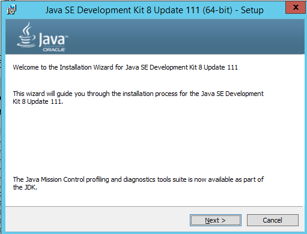

1.  Once the installation is complete open Windows Explorer and right click the PC node and select Properties. This will open the System dialog.  
    
1.  Click the Advanced system settings link.  

1.  Click the Environment Variables button.

1.  In the System variables section click New. 

1.  In the New System Variable dialogue replace the Variable name with JAVA_HOME and Variable Value with C:\Program Files\Java\jdk{Your Version}  with the version number of the JDK you have installed.  

    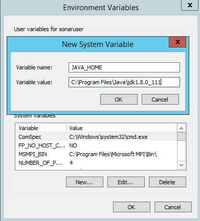

1.  In the same System variables section double click the Path environment variable.  To the end of the value add ";%JAVA_HOME%" without the quotes. 

    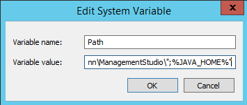

1.  Click OK until all dialogs are closed.

### Install SonarQube

1.  Download the files from [here](http://www.sonarqube.org/downloads/)  

1.  Once you have the files downloaded be sure and unblock the file and extract all the files to where you want to install SonarQube.

    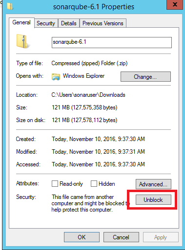

1.  In the conf folder of the SonarQube installation open the sonar.properties file in a text editor.  

1.  Find the section for Microsoft SQLServer and uncomment out the sonar.jdbc.url line.  

1.  Update "/sonar" to match the name of the database you created.  We also need to add two lines for the username and password to connect to SQL Server.

    > sonar.jdbc.username=sonaruser
    > sonar.jdbc.password=P2ssw0rd@Dev
    > sonar.jdbc.url=jdbc:sqlserver://localhost;databaseName=sonarqube

    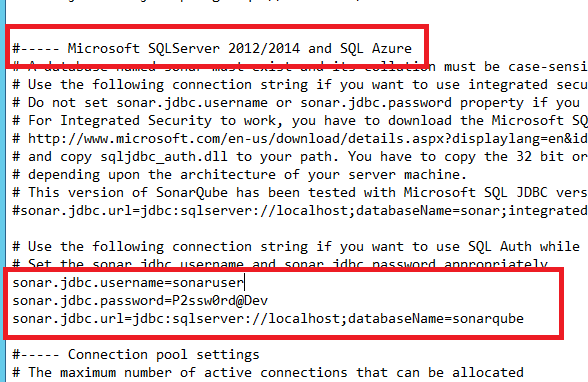

1.  Now, open a command prompt as administrator to install SonarQube as a service.  

1.  With the command prompt open CD to the bin\windows-x86-64 folder of the SonarQube installation folder.  Run the InstallNTService.bat file.  

    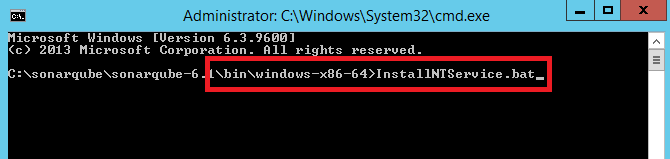

1.  Because SonarQube depends on SQL Server setup a dependency on SQL Server for our SonarQube Service. In the command prompt execute the following command 

    ```bash
    sc config SonarQube depend=MSSQLSERVER
    ``` 

1.  Update the login account used for the service. To do that open the services application.

1.  Now, open the properties page for the SonarQube service. Click the Log On tab and select the This account radio button. 

1.  Enter the account used to log into your VM and click OK. 

    > UserName: sonaruser
    > Password: P2ssw0rd@Dev

    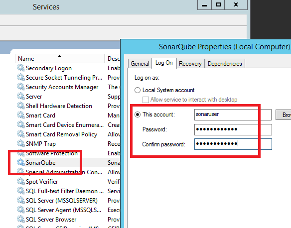

1.  Start the service by clicking the Start the service link.

1.  Open ports on the Windows firewall to access the SonarQube server from outside the machine.Return to the command prompt and run the following commands to add the firewall rules.

    ```bash
    netsh advfirewall firewall add rule name="Sonar" dir=in action=allow protocol=TCP localport=9000
    ```
1.  Open your browser to access your SonarQube server using the fully qualified name of your Azure VM. 

    > http://{your_dns_name}.{location}.cloudapp.azure.com:9000 

    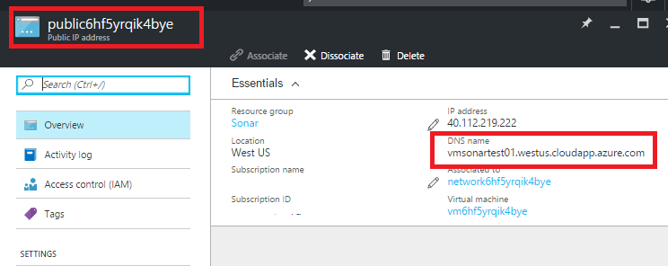

    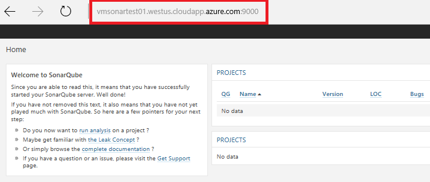

### Install Plugins

1.  Login with the SonarQube default admin user.

    > Username: admin
    > Password: admin

1.  Go to the Update Center (Administration > System > Update Center)

1.  You can check the installed plugins.

    > 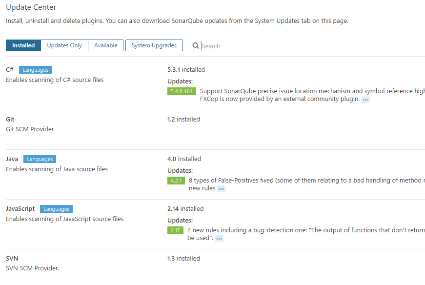

### Configure Visual Studio Team Services build

1.  Sign in to your Visual Studio Team Services account 

    > https://{youraccount}.visualstudio.com

1.	From your account overview page, select your team project. To find your team project, use Browse.

       

1. Select Build & Release > Explorer.

    

1. Click New Build definition.

1. Select the Visual Studio template.

    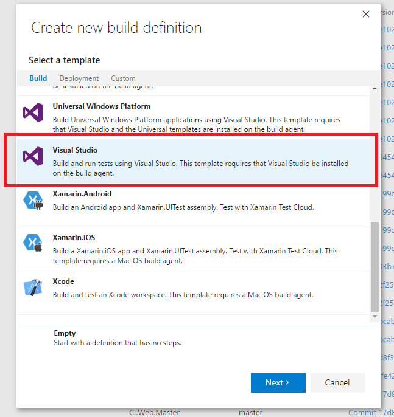

1. Specify the code you want to build.

1. Select the continuous integration (CI) trigger.

    

1. Click Create.

    

1. Configure the Visual Studio task to build the Azure Mobile App solution.

    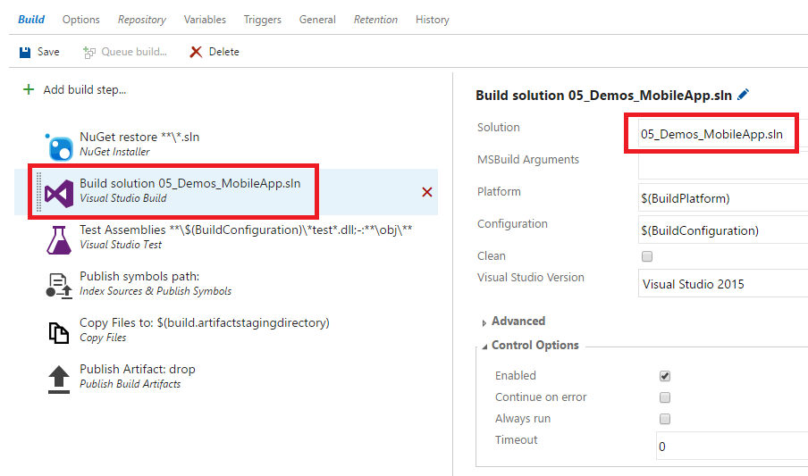

1. Add the SonarQube tasks.

    > 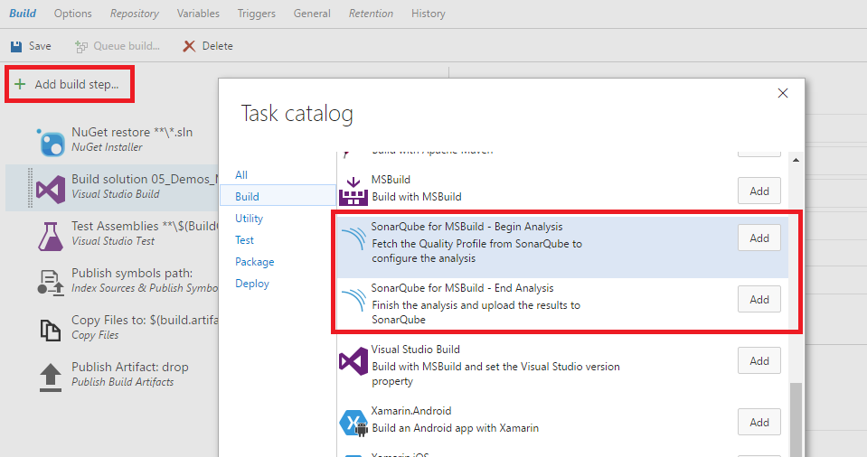

    > As the name suggests, the first of these tasks is used to define a step that start the SonarQube analysis, before any MSBuild build steps. The Begin Analysis task contacts the SonarQube server to retrieve the quality profile, and dynamically produces rulesets to be applied during the static analysis. It also sets things up so that the following MSBuild steps produce some data to prepare the analysis.

    > The End Analysis task should be used to create a step that is executed after the “Visual Studio Test” task step if you want SonarQube to show code coverage data. In any case, it should be run after the “Visual Studio Build” step. The End Analysis task finalizes the analysis (computation of the clones, metrics, and analysis for languages other than .Net), and sends the analysis results to the SonarQube server.

### Configuring the SonarQube build tasks

1. Note that the End Analysis step does not require any parameters.

    > 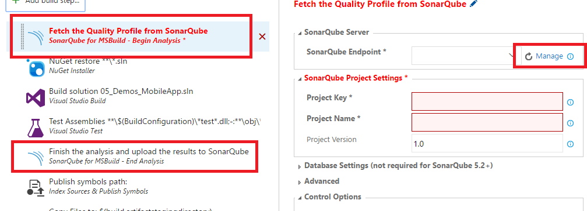

    > Let’s have a look at the settings that I need to configure in the “Begin Analysis” step.

### Configure SonarQube Server Settings

1. Choose the Manage link at the right-hand end to open the Services tab of the Administration pages for your account.

1. Add a new Generic service endpoint.

1. Enter the values for your SonarQube server:

    - A friendly name identifying your service endpoint, which will appear in the endpoint combo-box.
    - The URL of your SonarQube server; http://{your_dns_name}.{location}.cloudapp.azure.com:9000 
    - The user name and password (or security token) for the user executing the analysis. 
        - Username: admin
        - Password: admin

    > 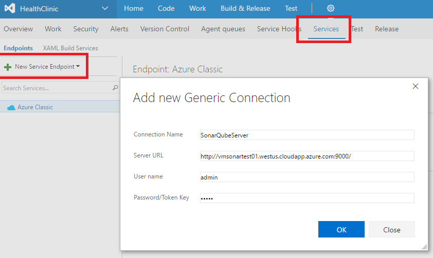

1. Go back to the build definition page and choose the "Refresh" icon so that the endpoint appears in the combo-box, and select it.

    > 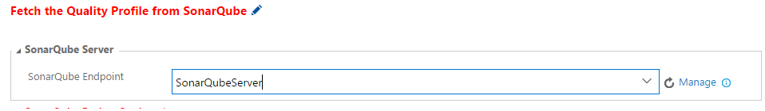

### SonarQube Project Properties

1. The next group of settings are the SonarQube project key (which uniquely identifies your SonarQube project on the SonarQube server), the SonarQube project name, and the SonarQube analysis version. 

    > 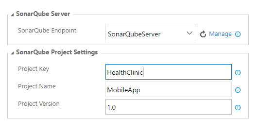

###  Database Settings

1. The third group of settings are the SonarQube database parameters. These are required only until SonarSource ships SonarQube 5.2 (starting with that release, SonarQube will have a 3-tier architecture, and you won’t need to provide the database details).

1. Save the build definition

### Performing the analysis

1. Performing the analysis is  very simple. Queue the build, or you change the Triggers tab of your build definition to enable a build and analysis as part of your continuous integration – and that’s it!

    > 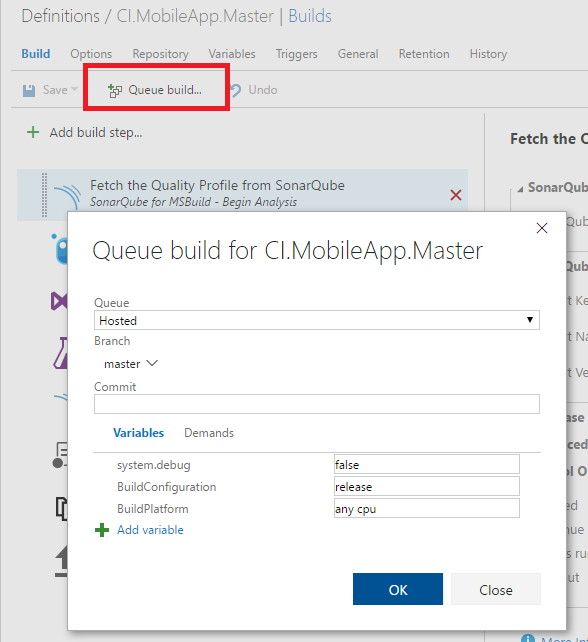

    > 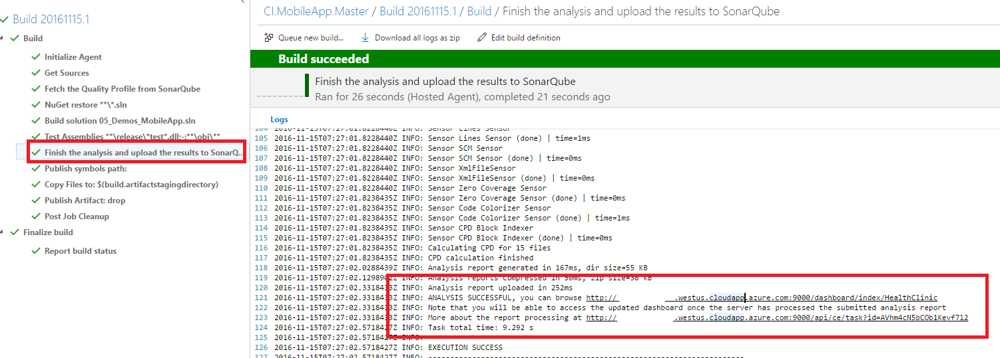

    > 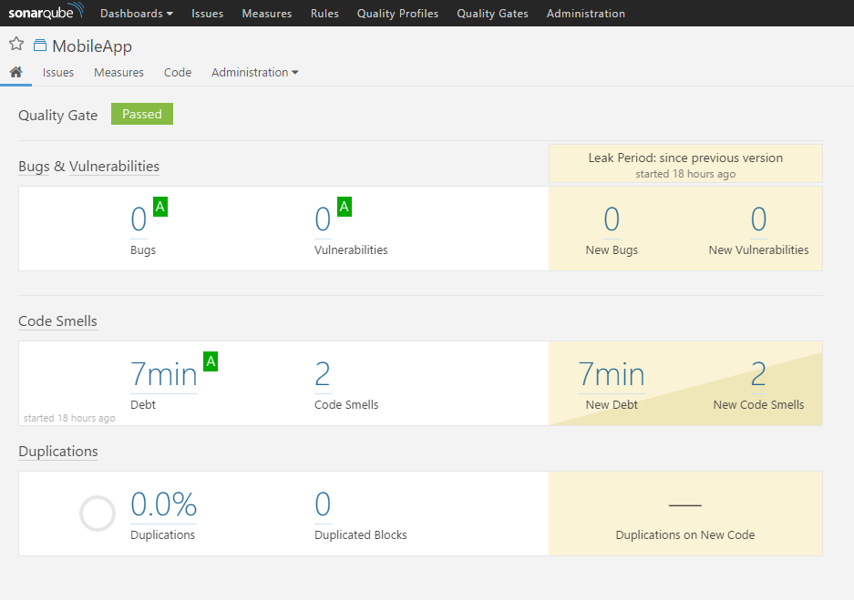

    > 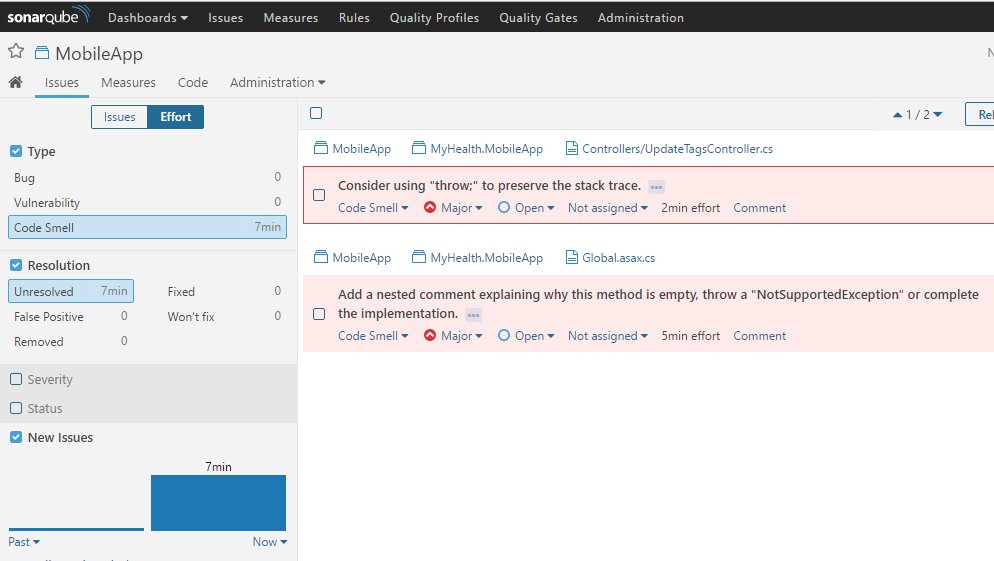


