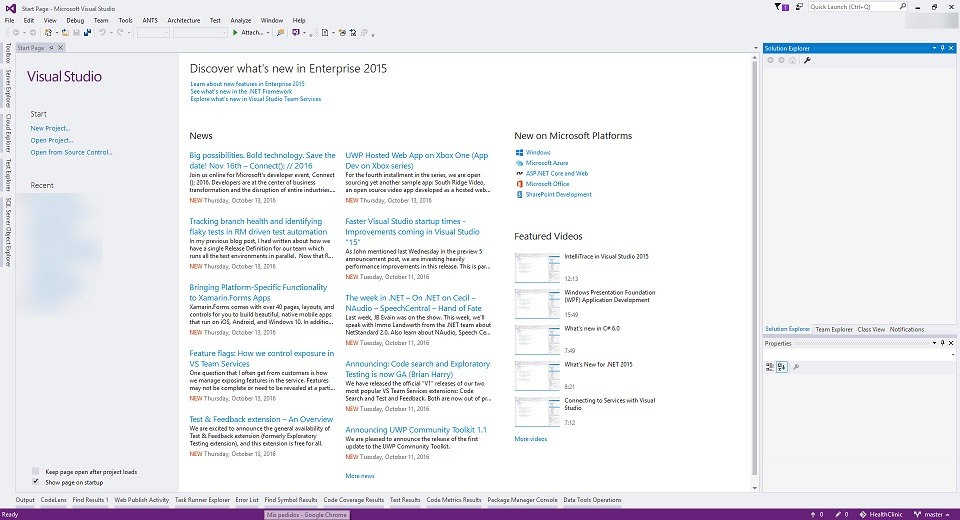
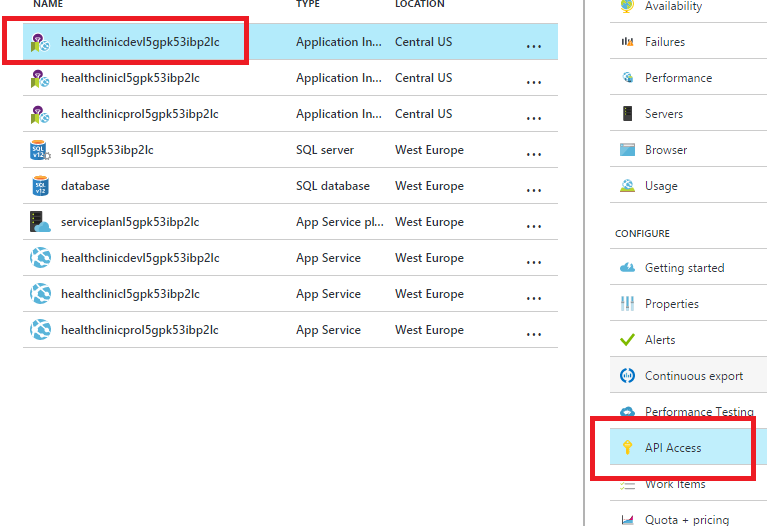

# CONFIGURE APPLICATION INSIGHTS

> In this lab we have the existing **01_Demos_ASPNET5** .NET Core application, when creating all the infrastructure for the labs, we will need the newly created **Instrumentation key** to be configured in this project so Application Insights can work. 

1. Open Visual Studio 2015.
    
    

1. Open **01_Demos_ASPNET5** solution, and under **MyHealth.Web** project, locate the *appsettings.json* file.  

    

    

1. Locate this line:  ```"InstrumentationKey": "YOUR_INSTRUMENTATION_KEY"```.  

1. Substitute the text `YOUR_INSTRUMENTATION_KEY` with the key of the existing Application Insights service.

    

    

1. Application Insights comes in the form of a Nuget package. Review the *project.json* file of the web project and look for the Application Insights package added.

    

1. Open file *Startup.cs*.

    

    

    > In this file we give the startup options for the website, we need to configure Application Insights to read the configuration.  
    > Unlike the setup for other Application Insights SDKs, adding the SDK doesn’t automatically configure a range of modules to collect different kinds of telemetry. We’re going to add the modules for Telemetry and Exception so we need to do a couple of modifications to the *Startup.cs*.

1. Locate the method **ConfigureServices** and check the line `services.AddApplicationInsightsTelemetry(Configuration);`. 

    

    > This will load the configuration for Application Insights from the configuration file for the site.

1. Now locate the method **Configure** and check these lines:
    * `app.UseApplicationInsightsRequestTelemetry();`
    * `app.UseApplicationInsightsExceptionTelemetry();`

    
   
    > With these two lines we are configuring the application to send Telemetry information as well as Exception information to the configured Application Insights.

1. Locate the file **_Layout.cshtml** inside the *Views / Shared* folder in the web application and open it.

    

        

    > We need to configure also the client-side reporting of Application Insights telemetry, which will allow us to have telemetry data of what is happening at the client side of our web application.  
    > This **_Layout.cshtml** page in ASP.NET is the base page for all the rest of the pages for the application, so adding this code here will add the code in the rest of the pages of the application at runtime.

1. Look at the first line `@inject Microsoft.ApplicationInsights.Extensibility.TelemetryConfiguration TelemetryConfiguration`. 

    

    > This injects the configuration part of Application Insights to be available for the client-side scripting.

1. Now look at the line  `@Html.ApplicationInsightsJavaScript(TelemetryConfiguration)`.

    

    > This will add the needed Javascript code in the page so Application Insights client-side telemetry sends information about client-side execution.
