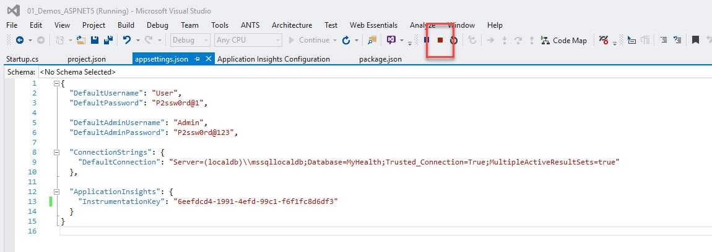

# SEE TELEMETRY

> Now that we have configured the application to send telemetry data to Application Insights, let's review how to send the date and see the telemetry from visual Studio and the Azure Portal.

1. Launch the application from Visual Studio and navigate through the application.

    

1. Stop the application from Visual Studio.

    

    > Even when debugging the application locally it will start sending information to Application Insights. Now we will review the information captured by Application Insights.

1. Right click on the project **MyHealth.Web** in the **Solution Explorer** and select *Application Insights / Search Debug Session Telemetry*

    

    > This view shows telemetry generated in the server side of your app. Experiment with the filters, and click any event to see more detail.

    

1. Right click again on the project **MyHealth.Web** in the **Solution Explorer** and select *Application Insights / Open Application Insights Portal*

    

    > The portal opens on a view of the telemetry from your app.

    

1. Click on **Server response time**

    

    > This opens the azure *blade* with all the information about the server response time of all the calls which have ocurred to the application, and its times. So we can detect for example bottlenecks in our application in particular pages.

    

1. Click **Page View Load Time**

    

    > We have a lot of other metrics avaliable, like **Page view load time** which measures times from client side informing how long the pages take to load in the client side.

    

    > Click again, in this new *blade* in **Page View Load Time** in the upper part, you can continue drilling down through all the information in Application Insights. 

    
