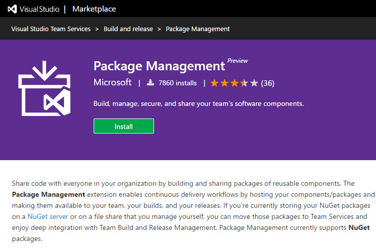
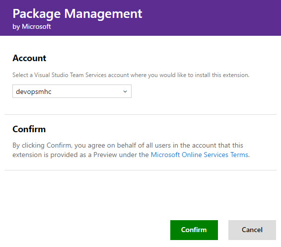

# NUGET AND vsts PACKAGE MANAGEMENT  

## NUGET PACKAGES  
Packages via Nuget allow us to effectively reuse code inside the projects and other teams. Instead of just sharing the code, loosing control on evolution, usage and modifications, we will share code via our own Nuget packages.

## VSTS PACKAGE MANAGEMENT  
This VSTS extension eases the process of creating, building, publishing and consumig our internal Nuget feeds, everything inside the VSTS tools.

## INSTALL PACKAGE MANAGER EXTENSION  

1. To start using Package Management from Visual Studio Team Services we must first install the Package Management extension from the Visual Studio Market place, you can find the extension [here](https://marketplace.visualstudio.com/items?itemName=ms.feed) 

    

1. Click **Install** to install the extension and select your VSTS account to install to and click **confirm**. After installation click on **Proceed to the account**.

    

    > This has installed the extension on your account, now you will have available in your subscription the **Package** menu option inside the Team Projects.
    > Package feeds are our own NuGet package feeds we can use for our own dependencies, or even share dependencies with other teams. Nuget.org is a public feed where we can publish packages for other developers.
