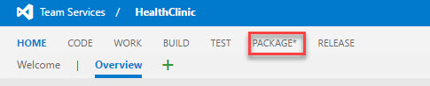
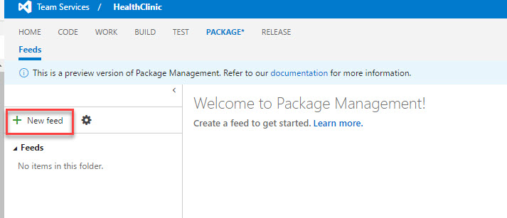
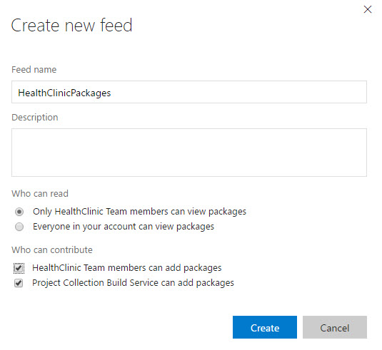

# CREATE A FEED

1. Sign in to your Visual Studio Team Services account 

    > https://{youraccount}.visualstudio.com

1. From your account overview page, select your team project. To find your team project, use Browse.

1. Now you should see a new menu option __Package*__. Click on it.

    

1. Once in the package manager we will start creating a feed. Click on **+ New feed**

    

1. In this screen you will give a name to the feed and also select who can access it. At this moment we will make it public only for the HealthClinic team members as well as give permisions to all members to add packages. Click on **Create**

    

1. Click on **Connect to feed**. Take note of the **Package source URL**

    

    > We need the Url for the feed so we are able to connect our developers to the feed as well as configure projects to use it during automated builds.