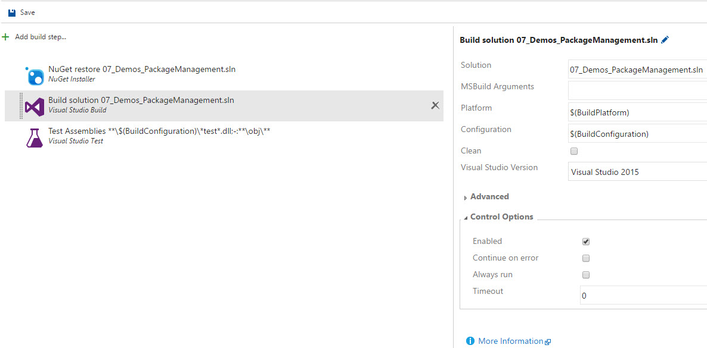
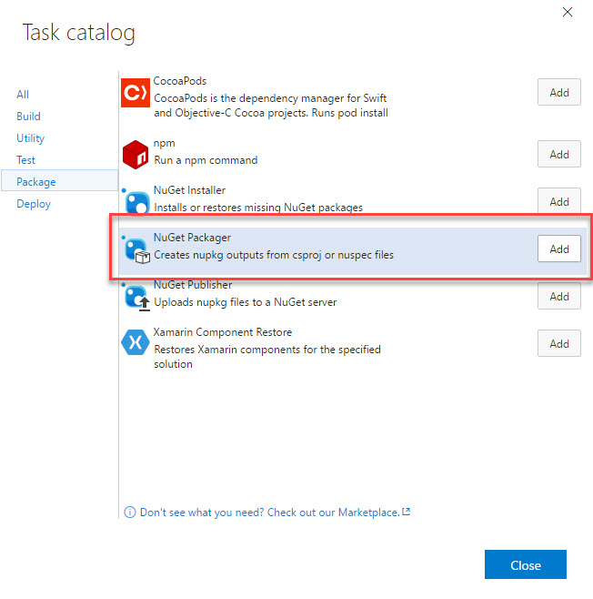
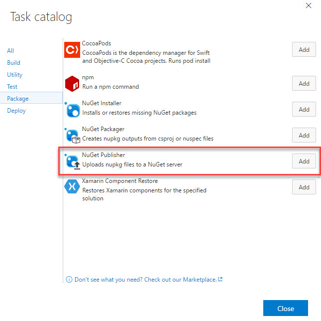
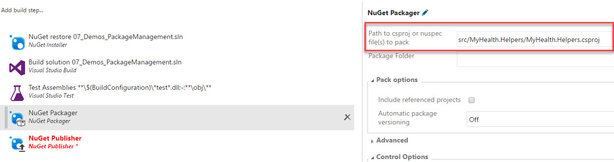
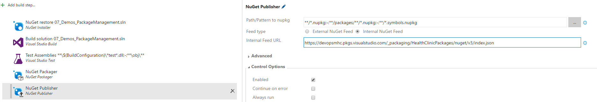
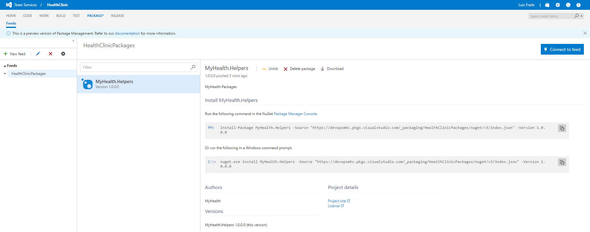

# PUBLISH PACKAGE

We will start from a previously created and configured package. The first step when creating a package, which in this case is just a simple class library with some custom helpers, is defining its **nuspec** file. 

This file defines the properties on how the package will appear in the listings.  

In the **07\_Demos\_PackageManagement** solution we created a class library with a **nuspec** file definition. Instructions on how to create and use the file can be found in NuGet.org documentation [here](https://docs.nuget.org/ndocs/create-packages/creating-a-package).  

It is also important to take care of package versioning, so developers know which version of the package is the latest, previous versions, and the one they are using as well as the differences between them.  

We will publish packages to the feed with an automated build. So we will start creating a new Build definition (check Continous integration lab for more details).  

1. We will start from the Visual Studio build template. In this case we will remove the **Publish symbols**, **Copy files** and **Publish Artifact** steps. And configure the **Nuget Restore** and **Build** steps to build our NuGet Package solution.  

    

1. Next, we will add the generate **NuGet Packager** task.  

    

1. And the **Nuget Publisher** task.    

    

1. Now let's configure the **Nuget Packager** task. For this, we will select the **csproj** file of the project containing the NuGet Package, this must be the same name as the *nuspec* file, but with the *csproj* extension.  
    
    
    
    > It is very important to point at this time to the *csproj* file, and the *nuspec* file convention of having the same name as the *csproj* file, so the package is correctly generated.

1. In the **Nuget publisher** task, we will need only to point to the feed we want to publish the target. Select **Feed type** internal and introduce the URL for our internal feed (the URL your noted earlier). Once finished **Save** and **Queue** this build definition.  
    
      
    
    > Look also at the **Path/Pattern to nupkg** the default filter will only include the package we just built, it will exclude other packaged which are references to this one with the *-:\*\*/packages/\*\*/\*.nupkg* filter and also exclude the symbols package with this filter  _-:\*\*/\*.symbols.nupkg_ which are currently not suported.

1. Once finished the build, lets click on **Package** and check the package is already publishd to the feed and ready to be used.  

    
