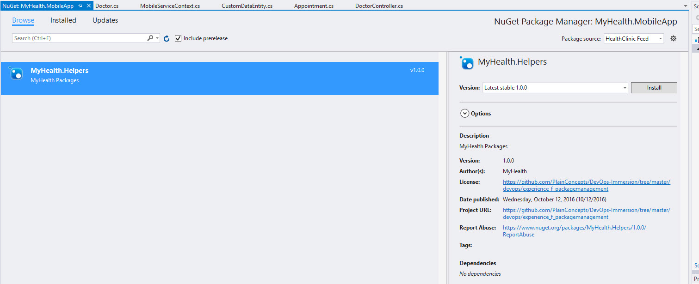

# CONFIGURE VISUAL STUDIO

1. Open Visual Studio, and goto **Tools**,**NuGet Package Manager**, **Package Manager Settings**. 

    
 
    > We need to configure Visual Studio to have this package manager available for developers. 

1. Open **Package Sources**.  

    

    > In this screen we will manage our own package feeds so they are availables when adding NuGet packages to a project.

1. Click **+** icon. A new Package source line has been added with default values. Change the **Name** to the desired name (i.e.: "HealthClinic Feed") and in the **URL** the value of the URL for the feed we noted before. Click **Ok**  

    

    > We just added to our Visual Studio the new feed. All members of the team must do the same in their own Visual Studio.

1. Create an empty project, or open and existing project, right click on it, select **Manage Nuget Packages**, go to **Browse** and in the **package source** selector, select the recently added feed. You should see the recently added package.  

    

    > All the team members, with the feed configured in Visual Studio, will be able to access this feed and install the package into their projects, so we can better reuse the code of our common libraries across the projects.
