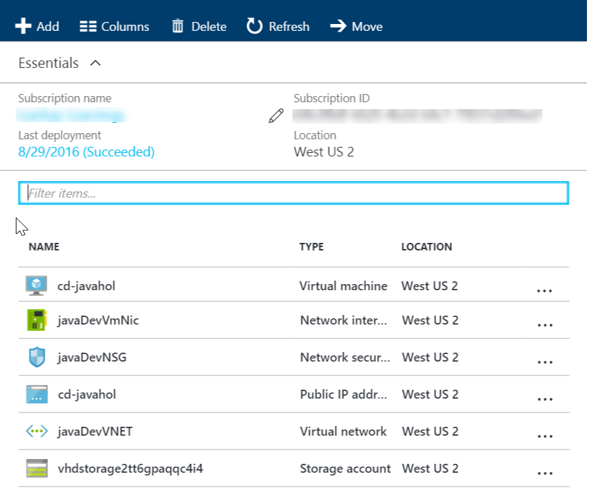
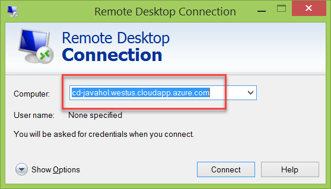

# JAVA DEVELOPMENT ON LINUX WITH VISUAL STUDIO TEAM SERVICES

Overview and Acquiring the VM
-----------------------------------------

[Microsoft Visual Studio Team Services](https://www.visualstudio.com/products/visual-studio-team-services-vs) makes your software lifecycle better and faster letting you code in Eclipse, IntelliJ, or your favorite Java IDE. You get free unlimited private Git repositories, agile planning and work item tracking tools, and support for builds and continuous integration using Ant, Maven, or Gradle.

This story allow you to explore how VSTS works in a Linux environment with Visual Studio Team Services (VSTS), Eclipse and Team Explorer Everywhere. 

The story uses a pre-built virtual machine image that is preconfigured with all the software you require to run through the labs. 

The virtual machine contains the following pre-configured software:

- Ubuntu Linux 14.04 LTS
- Eclipse Java EE IDE for Web Developers Mars Release 4.5.0
- Microsoft Team Explorer Everywhere Plug-in for Eclipse 14.0.3.201603291051
- Visual Studio Code 0.10.6
- Microsoft VSTS Cross Platform Build and Release Agent 1.999.0
- Firefox 48
- Oracle Java 1.7.0_05
- Oracle MySQL 5.6.28
- Apache Tomcat 7.0.52
- Apache Maven 3.0.5
- Git 2.9.3
- Gradle 2.7
- NPM 3.3.12
- Node.js 5.5.0
- Sample users and data required to support hands-on-labs which accompany this download.

Acquiring the VSTS for Java Linux VM 2016
-----------------------------------------

Follow the instructions to create the VM in Azure.

Instead of manually creating the resources in Azure, you are going to use Azure Resource Management (ARM) templates.


**Tasks**

1. Provision the Storage Account
2. Use AzCopy to copy the image to your storage account
3. Provision the VM and dependent resources

### Task 1: Provision the Storage Account
    
1. Create a new storage account.
    
    Simply click the Deploy to Azure button below and follow the wizard to create a storage account. You will need to log in to the Azure Portal.
                                                                     
	<a href="https://portal.azure.com/#create/Microsoft.Template/uri/https%3A%2F%2Fraw.githubusercontent.com%2Fnwcadence%2Fjava-dev-vsts%2Fmaster%2FJavaDevVSTS-Storage.json" target="_blank">
		
	</a>
	<a href="http://armviz.io/#/?load=https%3A%2F%2Fraw.githubusercontent.com%2Fnwcadence%2Fjava-dev-vsts%2Fmaster%2FJavaDevVSTS-Storage.json" target="_blank">
		
	</a>

    The storage account will be deployed to a Resource Group. You can delete the resource group in order to remove all the created resources at any time.

1. Specify settings for the deployment
    
    You will need to select a subscription and region to deploy the Resource Group to.

1. Check the Resource Group in the Azure Portal
    when the deployment completes, you should see a resource group with a single storage account resource.


### Task 2: Use AzCopy to Create a Copy of the Lab VM Image

1. Download and install AzCopy

	Download and install the latest version of AzCopy from here: http://aka.ms/downloadazcopy

1. Obtain your storage account access key.

	In the Azure portal, go to your storage account settings tab
	click **Access Keys**
	copy the primary storage key

1. Open winodws command prompt as administrator and  run the following AzCopy command substituting your own values for the storage account name and key.

	```
	"%PROGRAMFILES(x86)%\Microsoft SDKs\Azure\AzCopy\AzCopy.exe" /Source:https://vstsjl2016vhd.blob.core.windows.net/vhd /Pattern:"vstsjlvhd082416.vhd" /Dest:YOUR_STORAGE_ACCOUNT_URI /DestKey:YOUR_STORAGE_ACCOUNT_KEY
	```

	`YOUR_STORAGE_ACCOUNT_URI` - should be in the format of https://YOUR_STORAGE_ACCOUNT_NAME.blob.core.windows.net/vhd

	It will take approximately 10 minutes to copy the image to your storage account.


### Task 3: Provision the VM and Dependent Resources

1. Create the VM and dependent resources.
    
    Simply click the Deploy to Azure button below and follow the wizard to create the resources. You will need to log in to the Azure Portal.
                                                                     
	<a href="https://portal.azure.com/#create/Microsoft.Template/uri/https%3A%2F%2Fraw.githubusercontent.com%2Fnwcadence%2Fjava-dev-vsts%2Fmaster%2FJavaDevVSTS-VM.json" target="_blank">
		
	</a>
	<a href="http://armviz.io/#/?load=https%3A%2F%2Fraw.githubusercontent.com%2Fnwcadence%2Fjava-dev-vsts%2Fmaster%2FJavaDevVSTS-VM.json" target="_blank">
		
	</a>

    The resources will be deployed to a Resource Group. You can delete the resource group in order to remove all the created resources at any time.

1. Specify settings for the deployment
    
    You should select the same subscription and Resource Group where you deployed your storage account to.

	Provide a public DNS name

	Provide the URI to the vhd which should look like this:
	
    https://YOUR_STORAGE_ACCOUNT_NAME.blob.core.windows.net/vhd/vstsjlvhd082416.vhd

1. Check the Resource Group in the Azure Portal
    When the deployment completes, you should see the following resources in the Azure Portal:

    

### Log in and Modify the Admin Password

Now you can remote desktop to the Virtual Machine (using the DNS name that you configured in the second ARM deployment), log in and start the labs. When you remote into the machine, you will need to enter a username and password for xrdp:

> The name of your machine will be `<dnsName.region>`.cloudapp.azure.com. You can see this if you click on the Virtual Machine in your resource group to see the VM properties. For example, if you specified `cd-javahol` in region `westus` then the machine can be accessed by remoting to `cd-javahol.westus.cloudapp.azure.com` as shown in below screenshot.

> 


Login using the following values:

- Username: `vmadmin`
- Password: `P2ssw0rd`

> **SECURITY NOTE**: You will need to change the password for your user once you log in so that no-one else can access your machine!

Follow these steps to change the password for the `vmadmin` user:

1. Open a terminal (double click the terminal icon on the desktop or click it in the app tray)
1. Type `passwd` and hit enter.
1. Enter the current password (`P2ssw0rd`)
1. Enter a new password
1. Confirm the new password

Once you get your team environment set up, you'll start working on an Intranet site for a fictitious company, MyShuttle.biz, where you'll update the site, deploy it and test it all with the VM you're using and Visual Studio Team Services.

Let's start working by creating new [team project in VSTS](./01.Setting up a new project on VSTS.md).
