# WORK WITH TEAM EXPLORER EVERYWHERE

Now that you’ve gotten your environment configured, you can now do some
work. The sample code provided is for a fictions company MyShuttle.biz.
You’ve been given the code for an Intranet site written in Java that
accesses data stored in MySQL and runs on top of the Tomcat web server.

In this exercise, we will explore Team Explorer Everywhere for Eclipse,
a plug-in that provides you with access to features related to Visual
Studio Team Services/ Team Foundation Server from within the Eclipse
IDE. You will notice that many of the experiences in working with
VSTS/TFS in Eclipse are similar to working inside Visual Studio, such as
source control, work item tracking, or build automation.

1.  Open Eclipse from the Launcher by clicking on the **Eclipse** icon.

1.  Select **Team Explorer Everywhere**.

    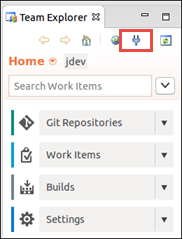

1.  In the **Add Existing Team Project** dialog, click the **Servers** button.

    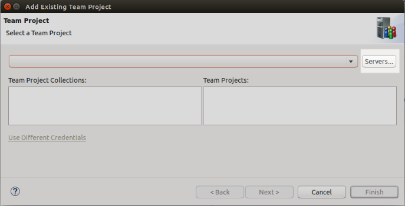

1.  In the **Add/Remove Team Foundation Server** dialog, click the
    **Add** button on the right. 
    
1.  Enter the name of your Visual Studio Team Services account plus **.visualstudio.com**. For example, if
    your account name is *javadev*, you would enter *javadev.visualstudio.com* (without any http or https). 
    
1.  Once you’ve entered your account name, click **OK**. In the **Sign in to …** dialog that appears, enter your Microsoft Account e-mail
    address and password and click **Sign In**.

    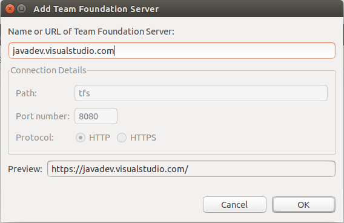

1.  Eclipse will open a Secure Storage dialog. Enter a password and confirm it in the dialog and click **OK**.

    > Eclipse stores the connection information in an encrypted form in a storage file that is stored with a predefined password. Make sure you
    can remember this password. Eclipse will offer to allow you to save password hints for password recovery. Click Yes or No depending upon
    your needs.

    

1.  Now click **Close** in the **Add/Remove Team Foundation Server** dialog.

1.  In the **Add Existing Team Project** dialog, select your **jdev** Team Project from the list and click **Finish**.

1.  Upon successful connection, you will see Team Explorer window showing source control, work items, build and settings menu.

    

1.  If you click the **Work Items** tile, you can access the **Work
    Items** hub in Team Explorer.

    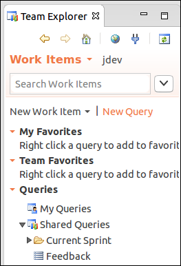

    > As you saw earlier, work items let you track things related to project
    development. Earlier you created a couple to track your progress in this
    walkthrough. Now you’re going to add a few more. Only this time, you’re
    going to add work items for MyShuttle.biz.

# Working with Queries

1.  Click the **New Query** link.

    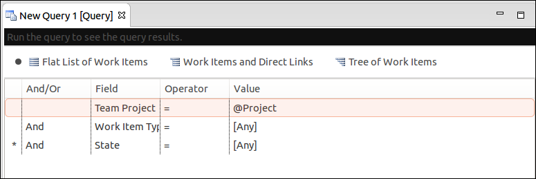

   > Queries make it easy to find and work with sets of work items based on
    criteria you define. The new query you’ve just created, when run, will
    return all of the work items in the current Team Project (@Project is
    known as a macro and gets replaced automatically by the query engine),
    regardless of type or state. So far you’ve worked with a few work item
    types: Features, Product Backlog Items, and Tasks.

1.  Expand the combo-box next to work item type and scroll through the list.

    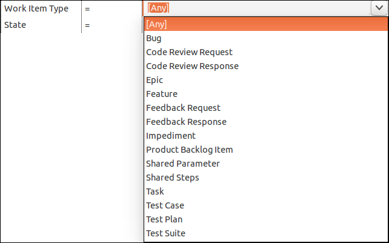

    > As you can see there are a number of different types. The list displayed
    varies based on the process template you choose when you create a Team
    Project. Remember for this project you used the Scrum template.

1.  Collapse the combo-box leaving **\[Any\]** as the value. Click the **Run Query** button the toolbar to execute.

    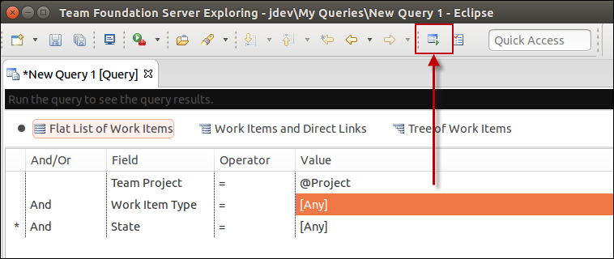

    > A new tab opens showing the results of the query.

    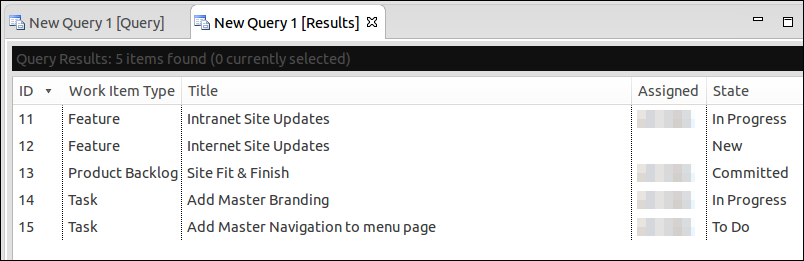

    > As you can see a number of different type of work items are returned.
    The columns shown can be controlled both on the query definition and in
    the results pane by using the **Column Options** dialog.

1.  Click the **Column Options** button on the toolbar.

    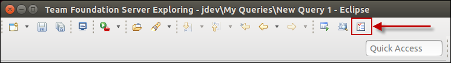

    > The Column Options dialog opens up. There are two tabs. The first
    controls what fields a query returns, the ordering of the columns (left
    to right), and the default width of the column.

    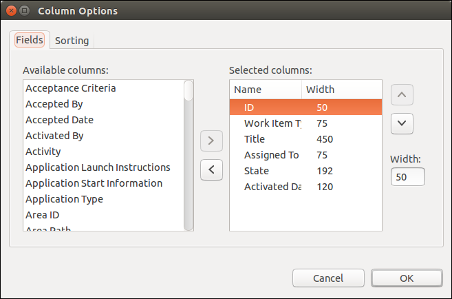

    > The second controls the sort order of the data returned.

    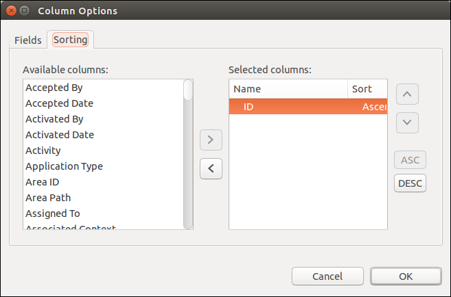

1.  Go ahead and click **Cancel** after you’re looked around.

1.  Now close the query result and new query tabs. Click **No** when prompted to save your new query.

1.  Go back the **Team Explorer** window.

1.  Expand the **Current Sprint** folder.

    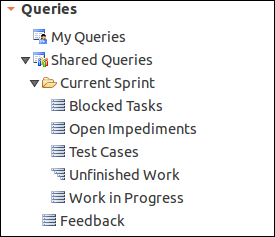

1.  You’ll note that there are a number of pre-created queries.

1.  Double-click on the **Unfinished Work** query. This runs the query and opens a results window.

    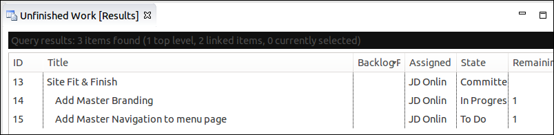

1.  Double-click on **Add Master Branding** work item. This opens the Task you created earlier. It uses the built-in web browser to
    render the Task (you may be prompted to log in when you open your first work item).

    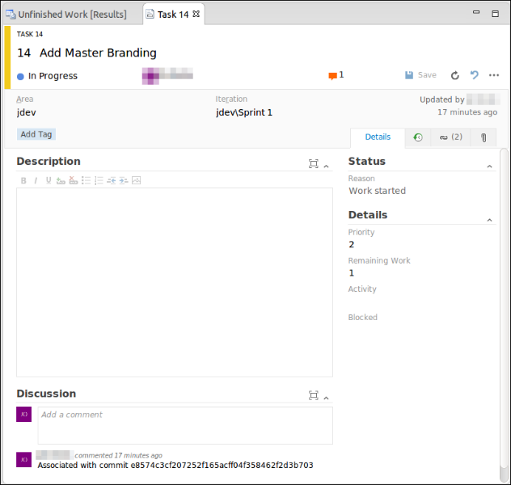

1.  In the Discussion section, add a note like **Working on site changes**.

    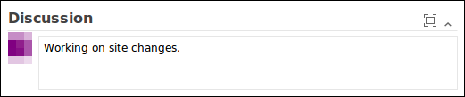

1.  Click the **Save** button to save your changes and then close the
    tab for the Task.

    > You can create a Product Backlog Item and child tasks in
    Eclipse too.

1.  Back in the Team Explorer, click the **New Work Item** link and pick
    **Product Backlog Item**.  
    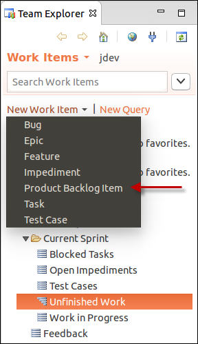

1.  Once the new PBI opens, in the **Title**, enter **Fare Information Retrieval**.

1.  Assign the work item to yourself.

1.  Set the Iteration to **Sprint 1**

1.  Add a description like **Configure results form to show formatted data for fares.** Also feel free to add extra items like Acceptance Criteria, Effort and Business Value if you’d like.

    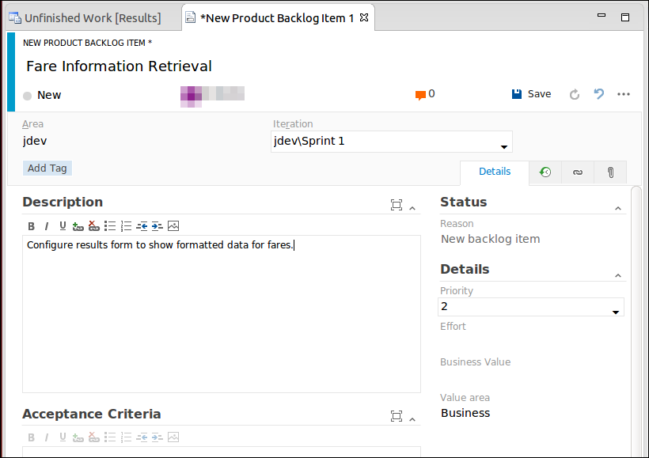

1.  Save the work item.

1.  Then like before add the following child Task items, assigning each to yourself:  
        > Add formatting for fare data  
        > Test new site

1.  Save and close each task after you create it.

1.  Change the PBI to **Committed** and save it.

    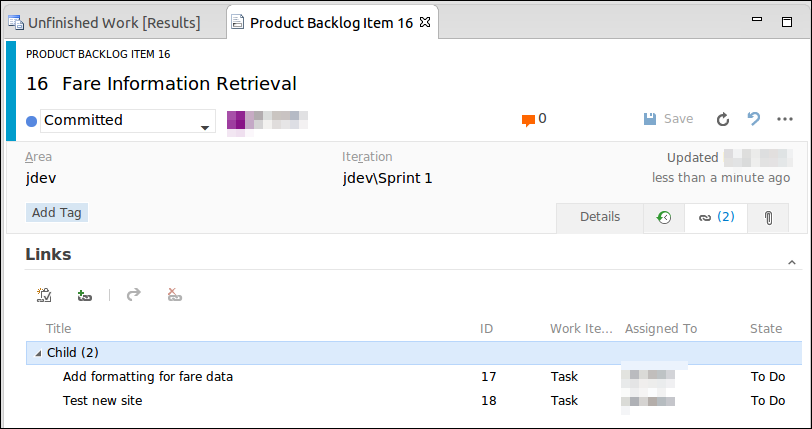

1.  When done, close the PBI tab.

1.  Next, rerun the **Unfinished Work** query.

    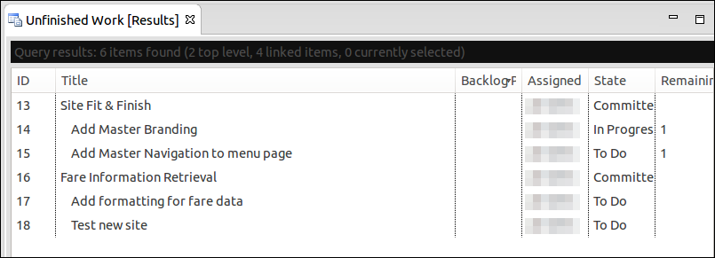

1.  Close the **Unfinished Work** query tab.

    > Let’s have a look at what’s already installed in the VM.

1.  If necessary, start Firefox. If it’s already running, switch to it and open a new tab.

1.  The application is a Java application using JSP pages hosted in Tomcat that reads data from a MySQL database

1.  On a fresh tab, navigate to <http://localhost:8080/myshuttledev/>.

    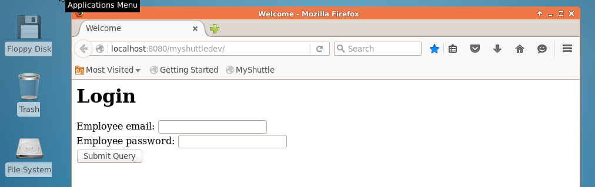

1.  In the **Employee email** field, enter **barney**.

1.  In the **Employee password** field, enter **barneypassword**.

1.  Click **Submit query** and Firefox will take you to the Dashboard page.

    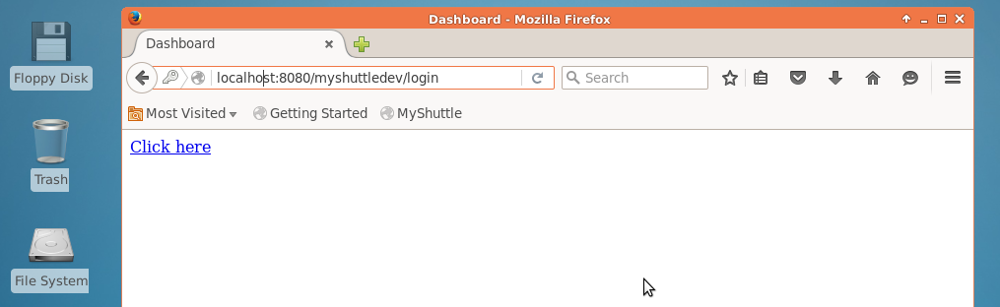

1.  Click the **Click here** link.

1.  The last page displays all of the logged in users fares.

    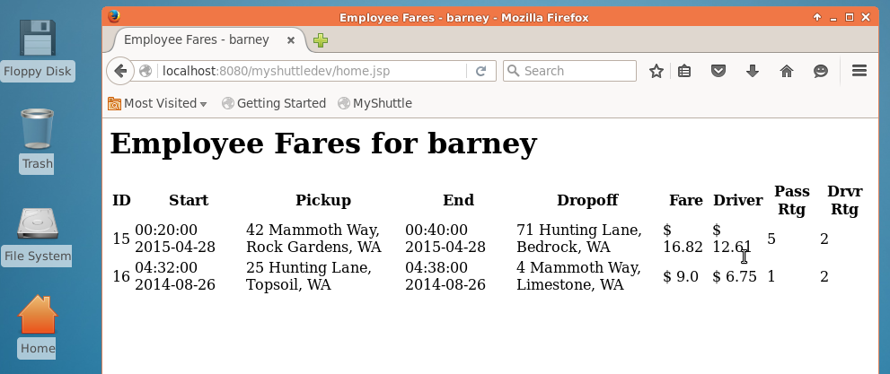

    > <pre>As you can see, there’s some work to do to get the pages looking more professional. When you’re done, 
    the login page will look like the following.</pre>

    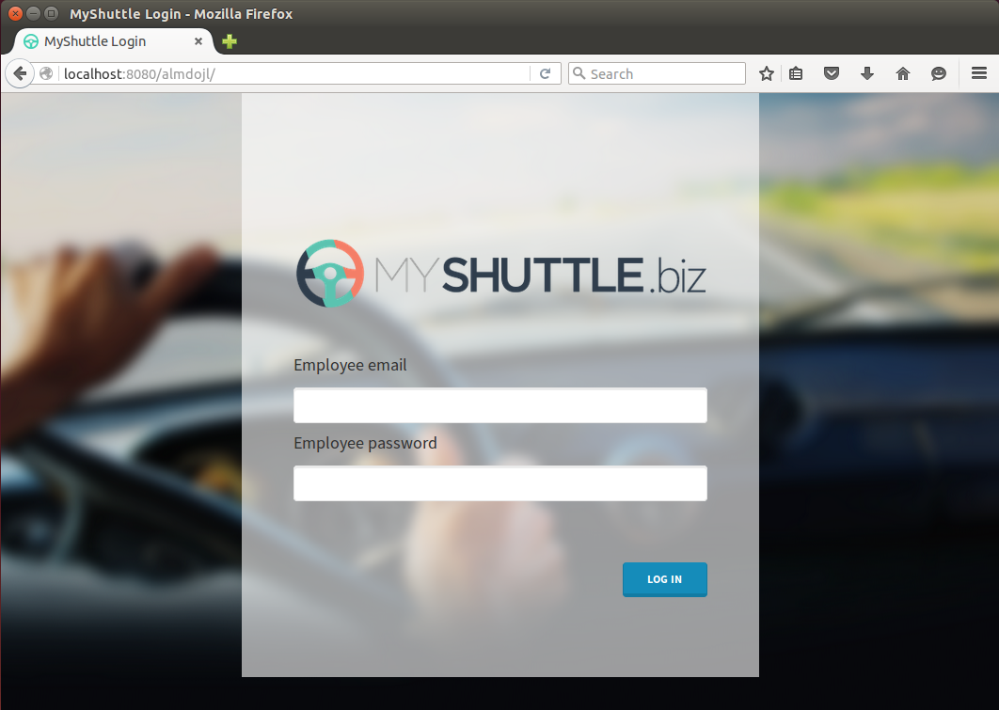

## Commiting Changes

1.  Switch to Eclipse and change to the Java EE perspective.

1.  Right-click on the **jdev/src/main/webapp** project node and select
    **Import**.

1.  Select **File System** under **General** and click **Next**.

    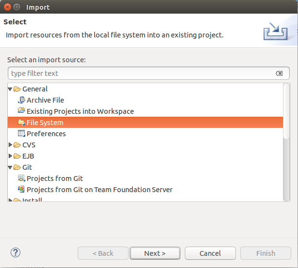

1.  Click the **Browse** button. Access your home folder and open the
    **myshuttle.extras** folder and then the **webapp** folder and
    click OK. In this folder you’ll find CSS, images, and updated JSP
    pages to give you the previous displayed images.

1.  Place check marks next to the **App** and **Content** folder but
    don’t import files from the **webapp** folder itself. You will see
    a ***–*** sign next to the webapp folder if the contents
    are deselected.

    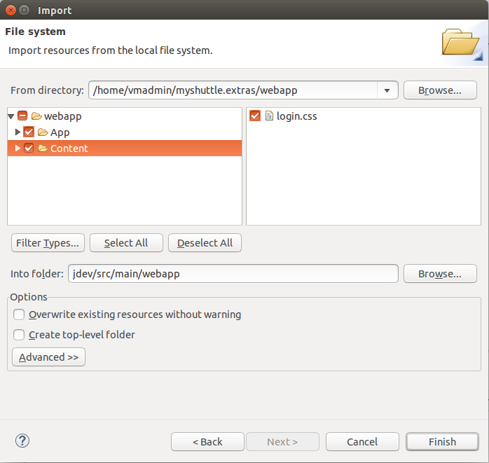

1.  Click **Finish**.

1.  Now, right-click on the **jdev** root and select **Team | Commit**.

1.  In the **Commit Changes** dialog, enter a commit message like **Add
    new branding files** followed by \#123 where 123 is the Work Item ID
    for your *Add master branding* Task. If you don’t remember the Work
    Item ID, switch over to your open web browser and take a look at the
    Task Board.

1.  In the Files section click the
     button to
    select all the files.

1.  Now click **Commit**.

    > You’re going to save your changes locally but not push to VSTS
    quite yet. You’re now going to add the necessary CSS references and
    styling HTML to your existing files. Since the focus of this lab is
    not on web programming, you’re just going to do some quick copy &
    and paste operations.

1.  In the **Project Explorer**, locate and open (by double-clicking
    on it) the **index.jsp** file in **src/main/webapp**. Here you see
    the clean, not styled version.

1.  Now select **File | Open File**.

1.  Navigate to your **Home** folder, then open **myshuttle.extras** and
    then **webapp**.

1.  Select the **index.jsp** file and click **OK**.

    

    > You now have two versions of the file open.

1.  Select all of the code (**Ctrl+A**) in **index.jsp**
    that you just opened and copy the contents (**Ctrl+C**).

1.  Switch to the first **index.jsp** file, select all and paste
    (**Ctrl+V**) the new
    content over the existing content.

1.  If it all copied OK, save the changes (**File | Save**).

1.  Now, right-click on the **jdev** root and select **Team | Commit**.

1.  In the **Commit Changes** dialog, enter a commit message like
    **Update index.jsp with new branding** followed by \#123 where 123
    is the Work Item ID for your *Add master branding* Task. If you
    don’t remember the Work Item ID, switch over to your open web
    browser and take a look at the Task Board.

1.  In the Files section click the
     button to
    select all the files if necessary.

1.  Now click **Commit**.

1.  Close the two tabs in for **index.jsp**.

    > At this point you’ve made a couple of local commits, but haven’t
    pushed up to VSTS.

1.  Right-click on the **jdev** root and select **Team | Push to
    Upstream**.

1. Once the push is done, click **OK** to close the dialog.

    > <pre>At this point you could go manually run a build. Or you could change
    the build so that it runs whenever a push is done</pre>

1. Switch to your web browser and access a tab that is connected to your Team Project.

1. Select the **Build** hub.

1. Locate your existing **Manual Build** and open the context menu and
    select **Clone** to create a copy of your build definition.

    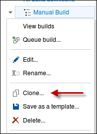

1.  Once it’s cloned, switch to the **Triggers** section.

    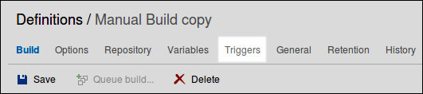

1.  Place a check next to **Continuous integration (CI)**.

    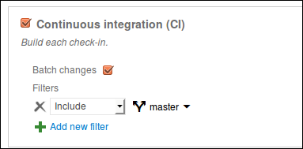

1.  Now click **Save** and name your build as **CI Build** and add a **Comment**
    like **Continuous integration cloned from Manual Build** and click
    **OK**.

    > Now the next time your push, a build will run. Return to Eclipse.

    > You now need to repeat the editing process for the **dashboard.jsp**
    and **home.jsp** files.

1.  Open  **dashboard.jsp** file from the Project Explorer. Then open the same file
    from the file system. Copy and paste the code and then commit
    locally with comment  **Update dashboard.jsp with master
    branding** followed by \#123  *where 123
    is the Work Item ID for your Add master branding Task*  (making sure to reference your Task work item for
    traceability)

    > Repeat above step for **home.jsp** file and commit the changes locally with comment **Update home.jsp with master
    branding** followed by \#123.

1.  Once you’ve updated and committed both files, **Push your changes** and
    check to see if your CI build runs. If you look at your build report
    you’ll see all the local commits that you batched and pushed as well
    as your associated work item.

    > Now at this point you’ve completed the first Task.

1.  Access the Task Board and drag & drop the **Add master branding
    task** to the **Done** column.

    > You’ll note that you have a couple extra tasks. It turns out because
    you “cheated” the development process, two of the Tasks on the board
    are already done. Since you still want traceability, you can
    associate the commits after that fact.

1.  Drag and drop both **Add master navigation to menu page** and **Add
    formatting for fare data** from the **To do** column to the **In
    Progress** column.

1.  Open the **Add master navigation to menu page** work item.

1.  Click the **Links** tab
    .

1.  Click the **Existing Item** 
     under **Add Link** drop down menu.

1.  In the **Add Link …** dialog, change the **Link type** to **Commit**.

    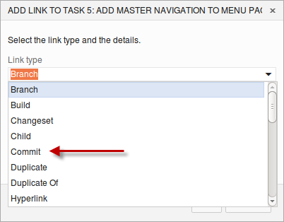

1.  Then click the 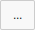 button to
    look up a Commit.

1.  In the **Find Commits** dialog, you can filter based on
    many parameters. Click on Author filter option and select your name then click on **Apply filter** button.

1.  One of the top commits should be **Update dashboard.jsp with master
    branding**. Locate it and place mark next to it and then click
    **OK**.

    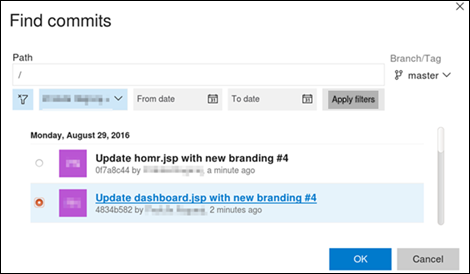

1.  In the Comment field enter **Update dashboard.jsp with master branding**.

1.  Click **OK** again in the **Add Link …** dialog.

1.  Change the **State** of the Task to **Done** and then click **Save & Close**.

1.  Repeat the process for your other Task, **Add formatting for fare data**. You want to associate the commit **Update home.jsp with master branding**.

1.  Once you’ve done that, drag and drop the **Add formatting for fare data** Task to **Done** on your VSTS Task Board.

    > You’ve now got your web site updated but haven’t seen it run yet.

