# BRANCHING, MERGING AND PULL REQUEST WITH GIT

In this exercise, we will see how we can create branches for Git repositories, create pull requests and also configure continuous integrations.

## Setting up continuous integration

Having seen how to run a build with unit tests and code coverage, let’s change our build definition to a continuous integration build.

1.  Go to the **Build** hub, click on Explorer link and select **Manual Build** the build definition we created earlier

1. Right-select or click on the down arrow before the build definition and select **Clone**

    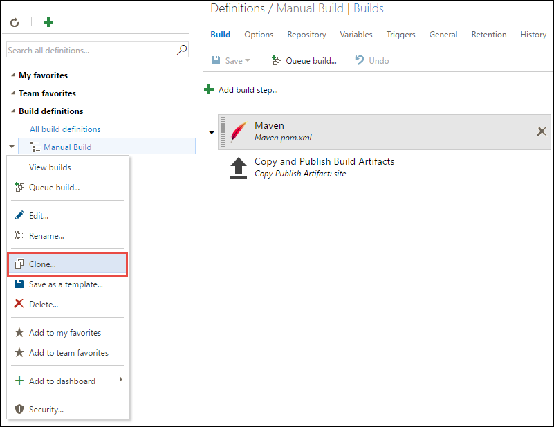

1. Select the cloned build definition and select **Triggers**. Check the **Continuous Integration (CI)** check box. That’s it! – we have
    changed our build to trigger everytime there is a change pushed to the code repository.

    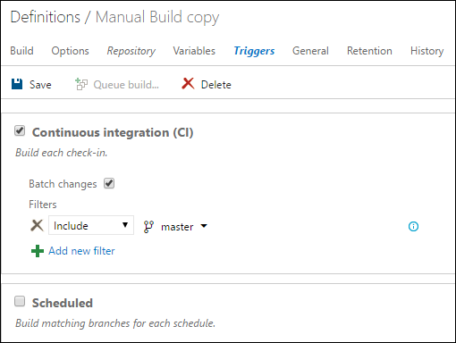

1. Click Save to save the build definition. You may want to provide a different name to the build – say **Myshuttle.CI**

    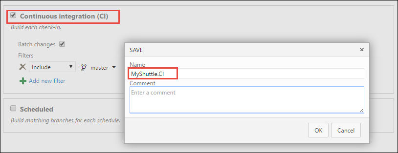

    > Before we test this build run, let’s see how to isolate our code changes with branching and collaborate on the changes with pull requests.

## Creating a new branch

There are multiple entry points to creating branches in VSTS and TFS – from the work item editor, boards, or from the code hub. Here we will try branching from the work item editor.

1.  In your VSTS account, open the work item **Site Fit & Finish.**

1.  Click the **Actions (…)** menu and select **New Branch**

    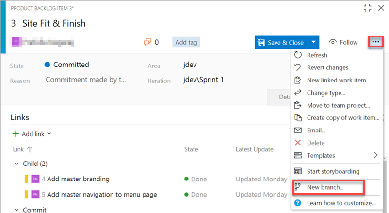

1.  In the **New Branch** dialog, enter **addmasterbranding** for the
    branch name and select the **Add Master Branding** task from the
    **Work items to link** drop-down

    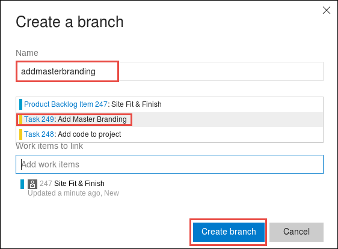

1.  Return back to Eclipse. Select **Git** and open the **Jdev** repo
    
     

1.  This should open the **Git repositories** window. Right-select the
    **Jdev** repository and choose **Pull** to pull the changes from the
    server.  Click **OK** when **Pull Result for jdev** window pops up.

    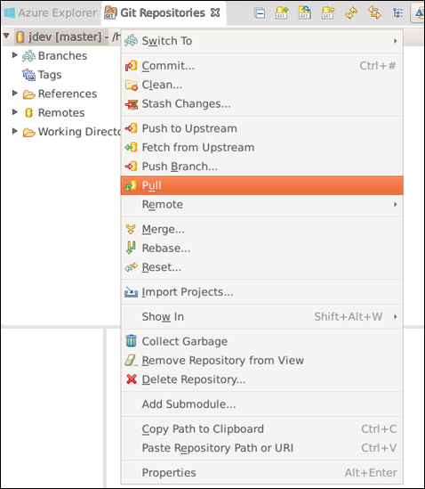

1.  You will notice the branch we just created listed under **Branches |
    Remote Tracking**
    
    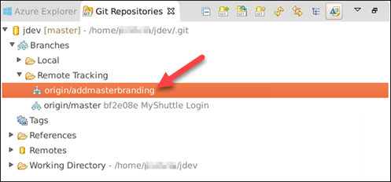

1.  Right-click the **origin/addmasterbranding** branch and select
    **Checkout**

    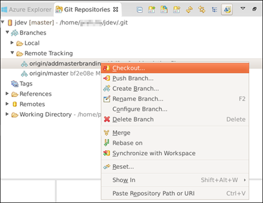

1.  When you checkout, you will prompted to create a new local branch.

1.  Select **Checkout as New Local Branch**, then click **Finish** in the **Create Branch** window.

    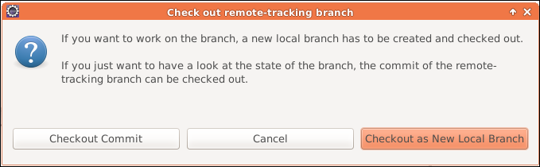

1.  You will now notice the project in the project explorer tagged with the branch name.

    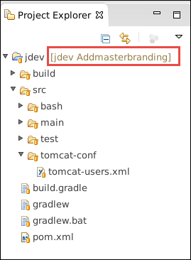

1.  Right-click on the **jdev/src/main/webapp** project node and select **Import**.

    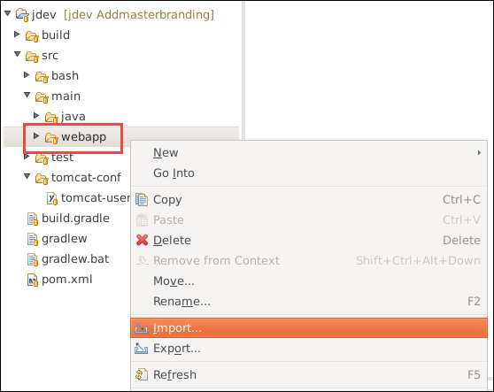

1. Select **File System** under **General** and click **Next**.

    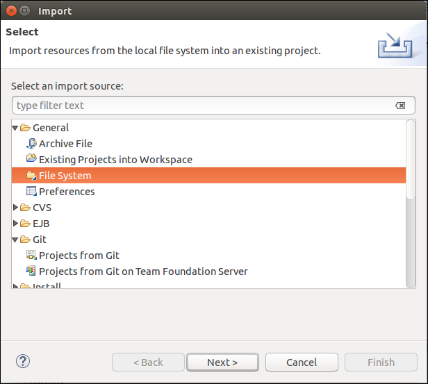

1.  Click the **Browse** button. Access your home folder and open the
    **myshuttle.extras** folder and then the **webapp** folder and
    click OK. In this folder you’ll find CSS, images, and updated JSP
    pages to give you the previous displayed images.

1.  Select the **webapp** folder and click **Finish.** You will be warned about overwrite to the JSP files. You can ignore the warnings and select to overwrite.

    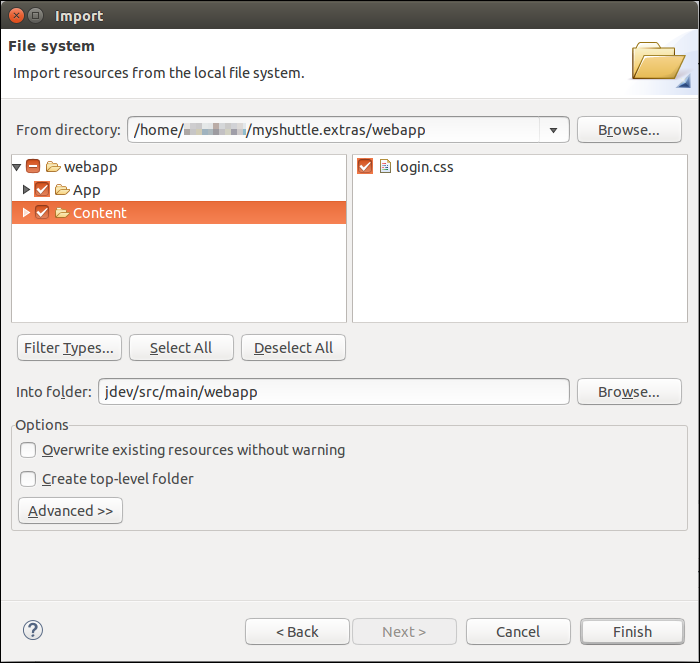

1.  Now, right-click on the **jdev** root and select **Team | Commit**.

    Enter a comment **Adding master branding** followed by \#123 (#123 is work item Id of *Add master branding* task) then select **Commit and Push**. This will commit the
    changes to the ***addmasterbranding*** branch. Then click OK.

1.  Now return back to the browser and check the **Code** hub if the commits have been successful.

## Using pull requests for code review

Pull request is a great way for developers to get team review and collaborate on code changes. When a developer changes a code in a topic branch, he or she can create a pull request to get feedback from the
team before merging the code into the master branch. It can also be enforced through branch policies. Anyone participating in the pull request can see the code changed in the branch, leave comments, and give
an approval if they're satisfied with the changes.

1.  Select the branch ***addmasterbranding*** branch and click on **Pull Request**

    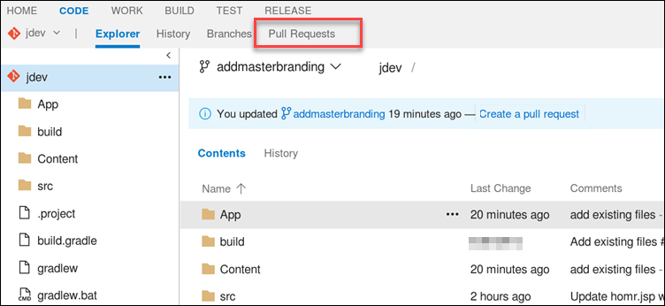

1.  This should take you to the Pull Request tab. 

1.  Now click on  , here you can specify the
    name, description and the reviewers for the pull request. Reviewers
    can be either individuals or groups  
    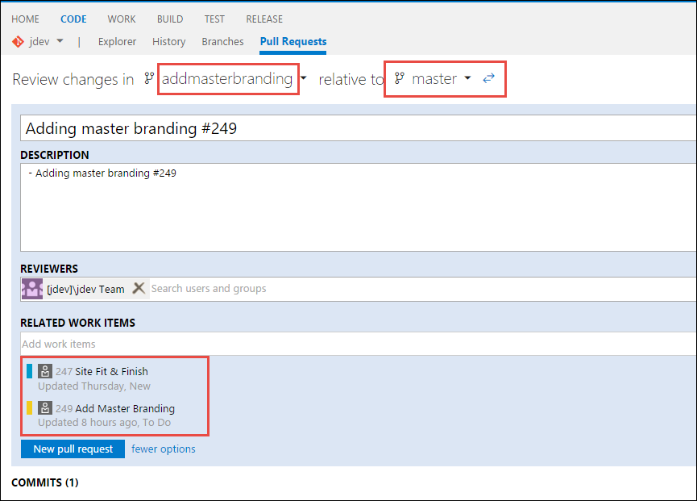

    > Pull requests will automatically link in work items when a commits
    in the branch or the entire branch are linked to a work item. You
    can also manually link work items into the pull request in the
    **Related Work Items** field when you finish creating the
    pull request. Typing in a number or work item title text into the
    work item field will search the work items and return a list that
    you can quickly pick from to add to the pull request. You can add
    any number of work items to a pull request in this way.

1.  Click **New pull request** to create it.

1.  The left navigation panel shows by default the files changed in the
    pull request along with the comments reviewers have associated with
    those file changes.

1.  Select the **Files** link to show all of the file changes that has
    been made. You will notice how many files were
    changed (added/changed/removed) from the top summary tab just below
    the Files link

    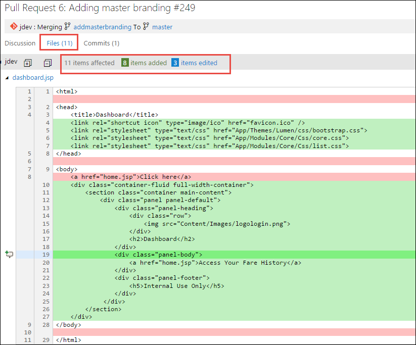

1.  You can add comments to the pull request as both author and as a
    reviewer of the pull request. Comments can be associated with a
    specific code change or at a general discussion level of the
    pull request. You can reply to comments and mention others using
    *@username* or discuss work items using *\#workitem* in
    your remarks.

    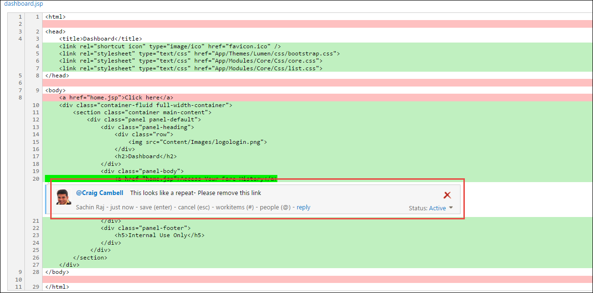

    > You can mark comments that are made in response to a reviewer feedback
    as:

    > -   ***Active***: Comment is still under review or active discussion.
    > -   ***Resolved***: The issue brought up in this comment has been addressed.
    > -   ***Won't Fix***: The suggestion in the comment is noted and is actionable, but no changes will be made in this pull request.
    > -   ***Closed***: The remark is no longer a pending action item for the pull request. 
    
    > Usually closed comments are for items that turned out to not have any actions after the finishing the discussion

1.  When the pull request owner and the reviewers are satisfied that the
    pull request is ready to merge, you can do it from the web browser
    by clicking on the **Complete pull request** button.

    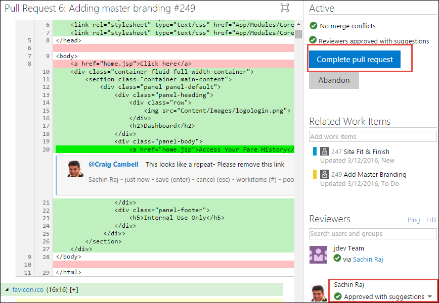

    > Completing the pull request will merge the changes in the topic
    branch into the main branch. If you have no further use for the
    topic branch, you can choose to delete it when you complete the
    pull request. Deleting the branch is safe because all of its changes
    are now included in the main branch.

    > You can also abandon pull requests if the development in the topic
    branch needs more work before reviewing again. The abandoned pull
    request will still be viewable in the web interface and linked in from
    any associated work items. You can reactivate the pull request at any
    time using the Reactivate button in the pull request.
