# RELEASING YOUR APPLICATION

A big pain for any development team is getting changes made on a
developer’s workstation deployed to a dev, test, or even production
environment. Release Management makes it easy to take the results of a
successful Team Build and deploy them to one or more environments.

Release Management is a service in Visual Studio Team Services and Team
Foundation Server (update 2 and later) that helps you automate the
deployment and testing of your software in multiple environments. Using
Release Management, you can either fully automate the delivery of your
software all the way to production, or set up semi-automated processes
with approvals and on-demand deployments. It is an essential element of
DevOps that helps your team continuously deliver software to your
customers at a faster pace and with lower risk.

Before you start to write your release definition, you will need to
install the **Tomcat** extension. When you install the extension, it
adds a Build/Release task for deploying a WAR file to Apache Tomcat
Server.

## Adding Tomcat Extension

1.  From your Team Services account, go to the **marketplace**

    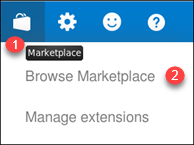 
   
    > or go to <https://marketplace.visualstudio.com/#VSTS>

1.  In the search box type **Apache Tomcat** then click search button   
      
    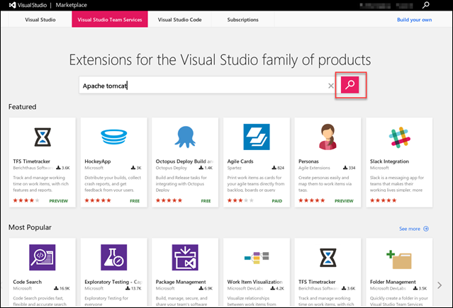 
    
1.  Select the extension titled **Apache Tomcat Deployment**   
      
    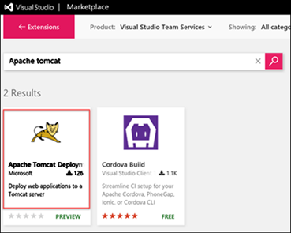

1.  Select **Install** on the Extension home page  
      
    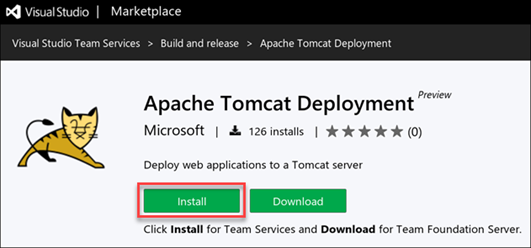

1.  In the resulting page, click the Account field to select the account name where you want to install the extension  

    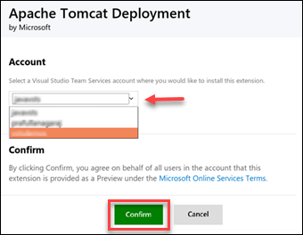

1.  Select **Confirm**. Once the extension is installed, you can close the page and navigate back to your VSTS project

## Creating a new release definition

1.  In VSTS, access the **Build** Hub of your Team Project. Select the **Manual Build** and queue a new build.

    > `If you want to skip the tests, you can specify -Dmaven.test.skip=true in the `**Options**` parameter of `**Maven**` build task`
    
    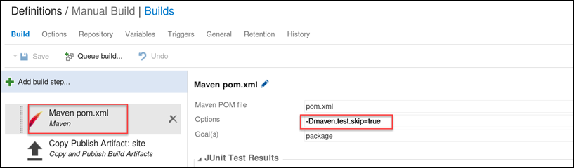

1.  When the build is complete, ensure that the build has generated and
    published the WAR file. You can verify this by select the build
    and then selecting the **Artifacts** tab. Click the **Explore**
    link next to the folder **Site**. Expand the folder and you should
    see **MyShuttleDev.war**

    

    > We are now ready to release the WAR file to the Tomcat server
    running on the VM. To begin this, select the **Release** hub.

1.  Click the **+New Definition** button to start creating a Release Definition.

    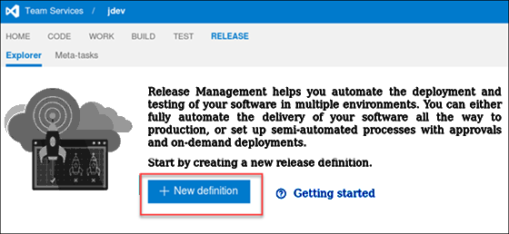

1.  Choose the **Empty** definition and click **Next**.

    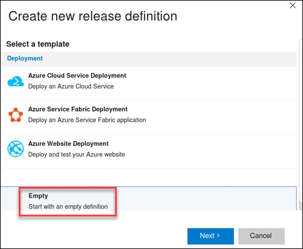

1.  In the **Create new release definition** wizard select **Manual Build** as source definition and **Default** agent queue for         Queue, then click on **Create** button.

    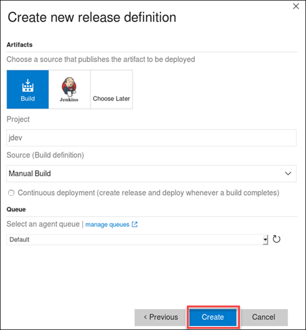

1.  Click on   icon and change the name to **MyShuttle Release.**

    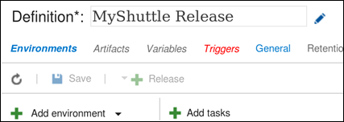

1.  Click **Add Tasks** and choose **Deploy to** **Apache Tomcat** task from the group and click **Add**.

    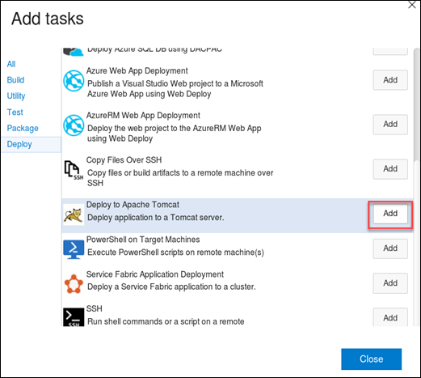

1.  Click **Close**.

1.  Edit the **Tomcat** task parameters to match the following settings:
    
    | **Setting**           | **Value**                                                             |
    |-----------------------|-----------------------------------------------------------------------|
    | Tomcat Server URL     | http://localhost:8080                                                 |
    | Username              | vmadmin                                                               |
    | Password              | $(VM\_PWD)                                                            |
    | WAR File              | $(System.DefaultWorkingDirectory)/Manual Build/site/myshuttledev.war |
    | Application Context   | /myshuttledev                                                         |
    | Tomcat Server Version | 7 or above                                                            |
    
    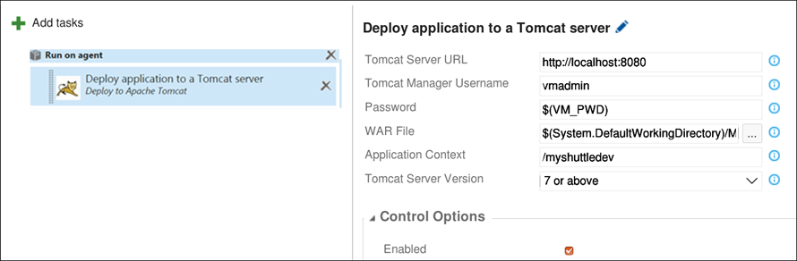

1.  Let’s define the variable we used in the task. Select **Configuration** and enter **VM\_PWD** as the name for the
    variable and **P2ssw0rd** (Enter valid password if password been updated by you) as the value. Select the little lock icon next to the value field to hide the variable so that it is not displayed as plain text.

    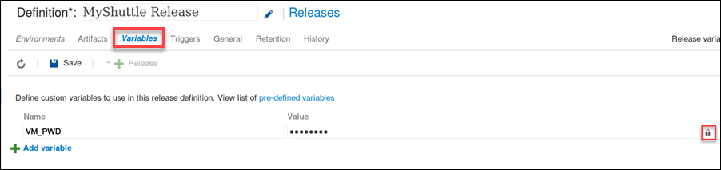

1.  Now, let’s go back to the **Tasks** tab of **Environment1**. Click the **Run on Agent** [agent phase](https://www.visualstudio.com/en-us/docs/release/author-release-definition/understanding-tasks#task-phases-and-manual-intervention).

   At the right side change the **Deployment queue** to **Default** pool (that has the local build agent running on the VM) as the default queue

    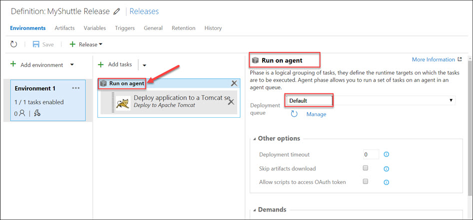

    > `You may also assign approvers for post and pre deployment to the environments but since we are deploying to a development environment,we will assume that no approval is required and leave it as automated.`

##  Triggering a release

You can specify how deployment should be triggered for each environment.
For example, you can set up a linear pipeline where a release is
deployed first to the **Dev** environment, then to the **QA**
environment and finally, if the deployment to **QA** succeeds, to the
**Prod** environment. Alternatively, you can set up a release process
where a build is deployed to a number of **QA** environments in parallel
as soon as it completes, but the release to the **Prod** environment
must always be deployed manually by selecting a successful release and
promoting it.

1.  Select the **Environment1** and click the ellipsis button and select **Deployment Conditions**.

    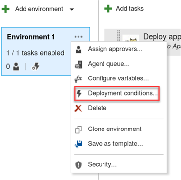

1.  Select **After release creation** for **Triggers** and click **OK** to close the dialog

    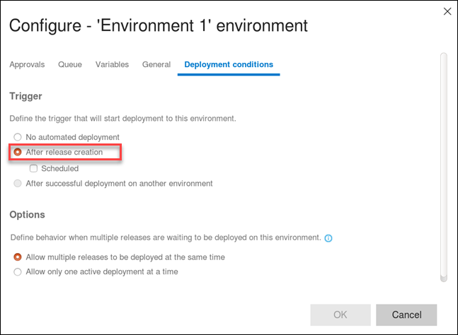

1.  Select the **Save** button to save the new release definition.

1.  Select **Release** and **Create Release**

    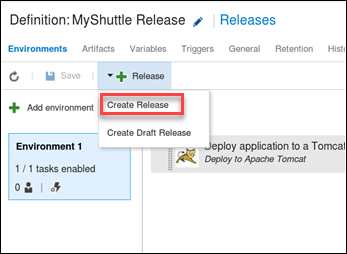

1.  Select the latest build from the Artifacts Version dropdown and
    select **Create**

    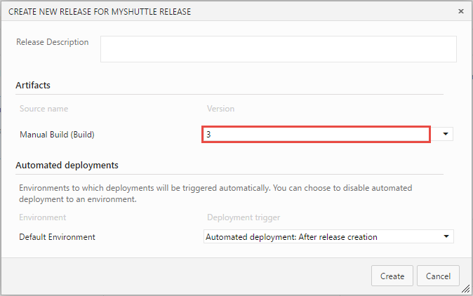

    > Wait for the release to be completed. When the release is
    successful, we should have the latest version of the application
    with a new UI look running on tomcat. Open Firefox in the VM and
    navigate to the page **http://localhost:8080/myshuttledev**

    
