# RUNNING UI TEST WITH SELENIUM

One of the great things about using automated builds and deployment tools is that you can deploy and then run test from your build. In order to perform this exercise, you&#39;ll need to install a local copy of the Microsoft Cross Platform Build agent. This is covered in the previous exercise.

## Running Selenium in a Build Pipeline

1.  On your VSTS Task Board, drag and drop **Test New Site** to **In Progress** (created in Exercise 5- Working with TEE)

    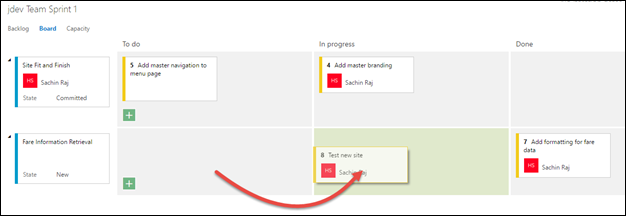

1.  In Eclipse, select the **Project Explorer**. If you are still referring to the topic ( **Addmasterbranding** ) branch created in Exercise 7, do a **Pull** to pull the changes from the remote branch

    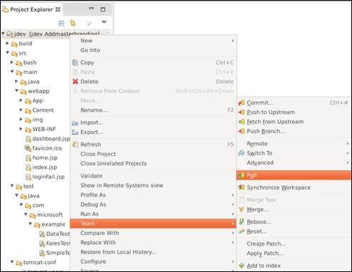

1.  Then switch to the master branch again by using the Switch to command

    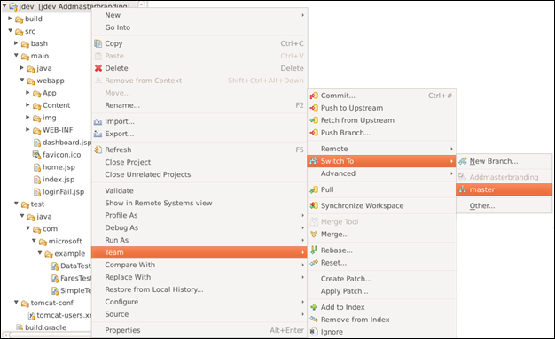

1.  Expand the project folder tree under **jdev** until you can see the contents of the example folder holding the project&#39;s tests (jdev\src\test\java\com\microsoft\example)

    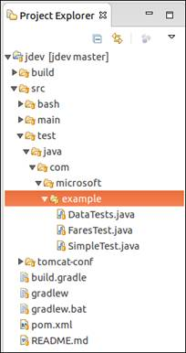

    > Currently there are tests that run during Team Build via JUnit. You&#39;re going to add tests that use the Selenium web test framework to test the User Interface.

1.  Right-click on the **example** folder and select **Import**

    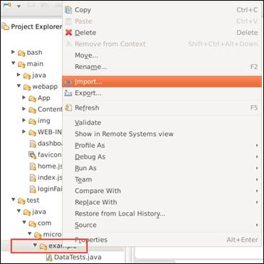

1.  Select **File System**

    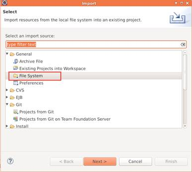

1.  Select the **myshutle.UITest** folder and select the UITest.java file

    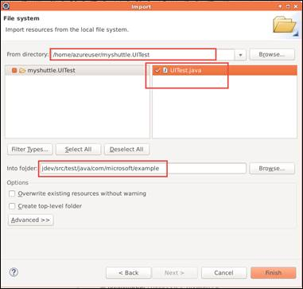

1.  Click **Finish**  to import the file.

1.  Open the **pom.xml** file and change to the **Source** tab.

    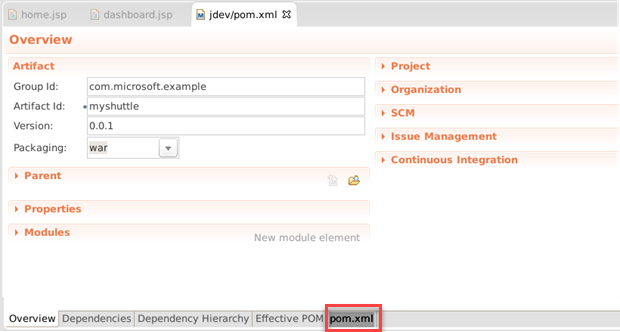
    
1.  Add the following XML to load the Selenium driver as a new **dependency** within the _existing_ **dependencies** element.

    ```xml
    <dependency>
        <groupId>org.seleniumhq.selenium></groupId>
    <artifactId>selenium-firefox-driver></artifactId>
    <version>2.53.1</version>
    </dependency>
    ``` 
        
    

1.  Save your changes. Commit and Push your changes to VSTS.

    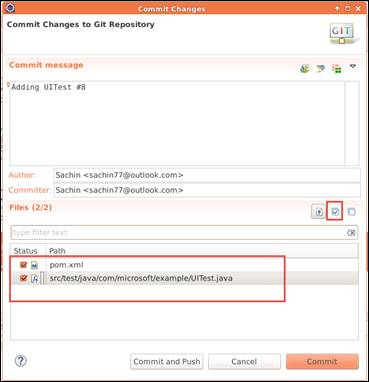

1.  Access your browser and switch to the **Build** hub. Clone your existing **Manual Build** definition like before.

    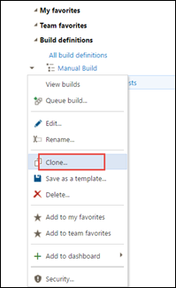

1.  For the existing **Maven** build task, add the following text to the **Options**  **-Dtest=UITest**

    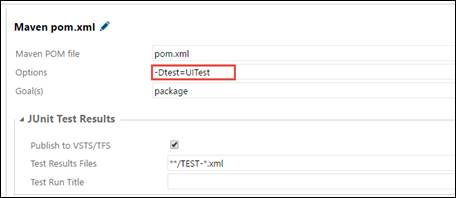

1.  Click the **Save** button. Change the name to **Manual Build with UI Tests**. Add a comment *Change to run Selenium tests* and **Save**.

    

1.  Queue a build but this time choose the queue which is associated with the local agent.

1.  Click OK and wait for the build to run. Don&#39;t do anything while the build is running. If all goes well, you will see instances of the Firefox web browser &quot;pop open&quot; while the build runs.

1.  If you leave your main instance of Firefox running, you&#39;ll see the build bar turn green and you&#39;ll see the build is complete.

    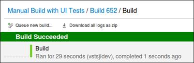

    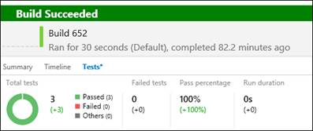

## Running Selenium in a Release Pipeline

You are most likely to run automated tests in a deployment pipeline – to run regressions when a new version of application is deployed. In this exercise, we will see how you can include Selenium tests in a release pipeline

1.  Select the build definition **Manual Build** you have just saved in the previous exercise and click **Edit**

1.  Add an another **Copy and Publish Artifact** task and set the properties as shown below

    | **Property** | **Value** |
    | --- | --- |
    | Copy Root | $(Build.SourcesDirectory)/ |
    | Contents | pom.xml |
                | src/test/java/com/microsoft/example/UITest.java|
    | Artifact Name | site |
    | Artifact Type | Server |

    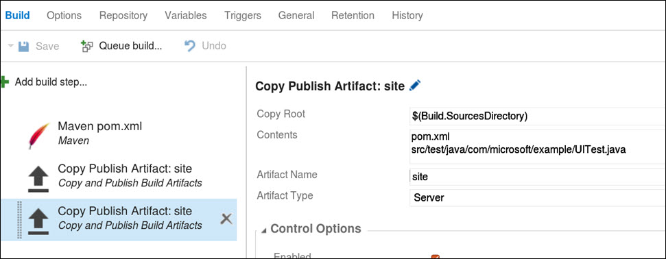

1.  Click on **General** tab change the **Default Agent Queue** to **Default** if its showing **Hosted**

1.  **Save** the build definition and queue the build

1.  When the build is successful, make sure the artifacts (pom.xml and UITest.Java) are copied to the artifacts folder

    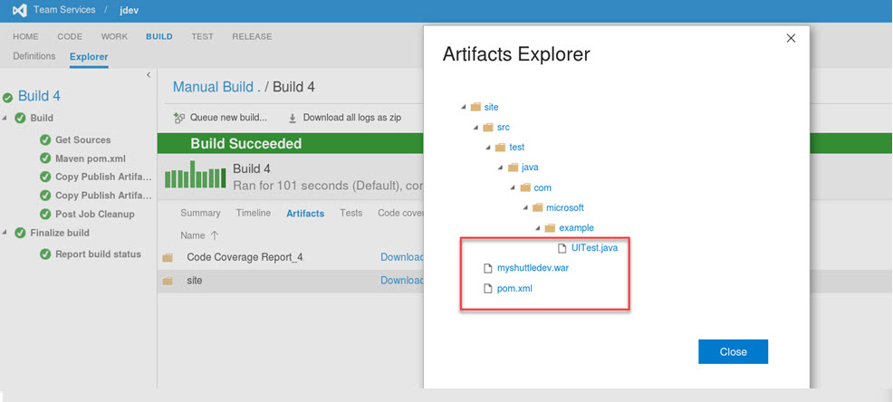

1.  Now, select the **release** hub and open the **MyShuttle Release** release definition in edit mode.

1.  Select the **Artifacts** tab and make sure it is linked to the build definition **Manual Build** that you modified above. If it is not, please remove the existing link and add the correct Build artifact.

1.  Select **Add Task** and add **Maven –** 

    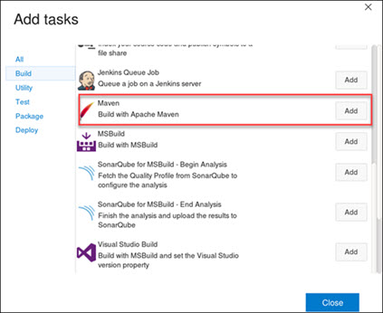

1.  Set the properties for Maven task as follows,

    | **Property** | **Value** |
    | --- | --- |
    | Maven POM File | $(System.DefaultWorkingDirectory)/Manual Build/site/pom.xml |
    | Options | -Dmaven.test=UITest |
    | Goals | test |
    

    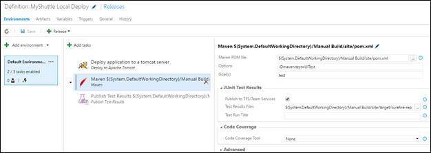

1.  Save the Release definition and start a new release.

1.  Now, the release pipeline deploys the latest version of the application and running regression test using Selenium.

    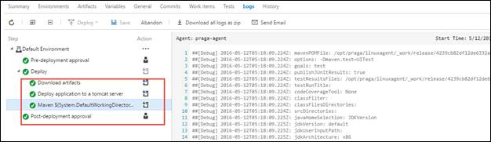

1.  When the release is complete, you will notice that the tests were executed during the deployment and the test results are published in the **Tests** tab

    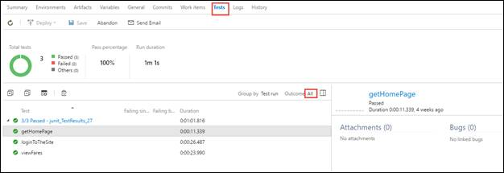

