# APPLICATION INSIGHTS

Application Insights is an extensible analytics service that monitors your live application. It helps you detect and diagnose performance issues, and understand what users actually do with your app. It&#39;s designed for developers, to help you continuously improve the performance and usability of your app. You can find more about Application Insights at [https://azure.microsoft.com/en-us/documentation/articles/app-insights-overview/](https://azure.microsoft.com/en-us/documentation/articles/app-insights-overview/)

In this exercise, you will learn how to configure Application Insights to monitor your web application that you have just released.

## Creating a new Application Insights resource:

1.  From your VM, start Firefox and login to your [Azure portal](https://portal.azure.com/)

1.  Create a new Application Insights  resource  

    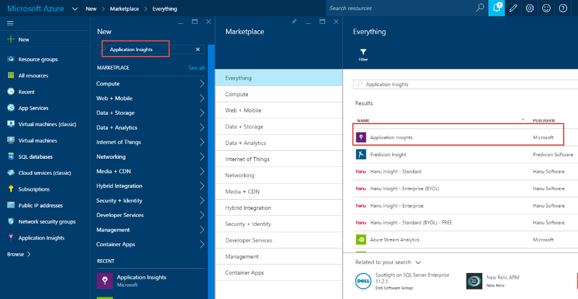
 
1.  Select the **Create** button

1.  Enter a name for the Application Insights resource. Let&#39;s say we name this **myshuttle-vstsjltomcat**. Select **Java web application** for **Application Type**.

    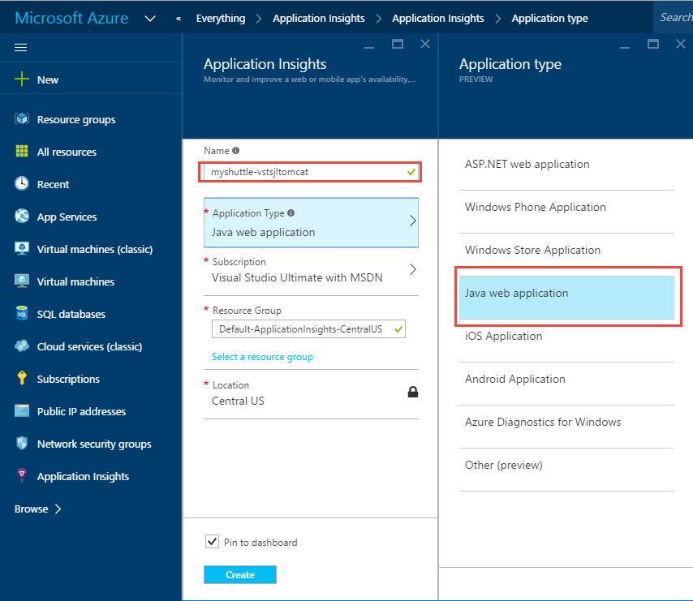

1.  Select the **Create** button for Azure to start provisioning the resource. This should be ready in a minute or two. Once it is provisioned, open it and select the **Settings and Diagnostics** link and choose **Properties**. Copy the **Instrumentation Key** in the properties window. We will need this later

    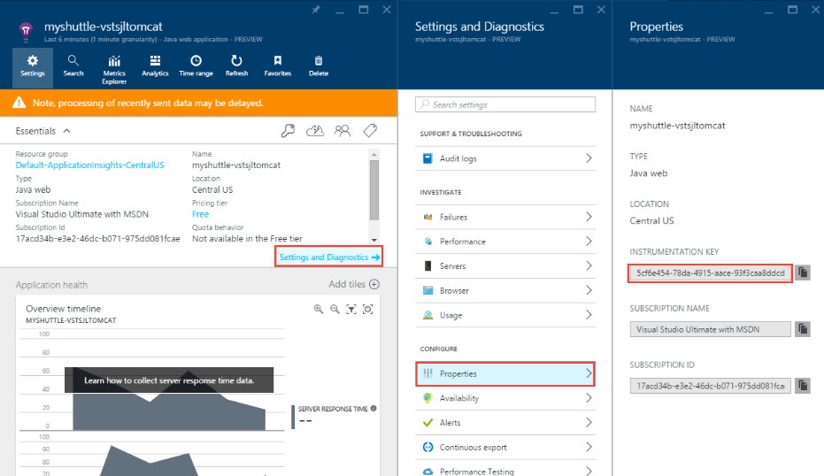

## Downloading the AI Binaries

1.  You will need the Application Insights binaries to be copied to your machine. Open a new tab in your browser and navigate to  [http://aka.ms/ailab](http://aka.ms/ailab)

1.  Download the **Application Insights – Java SDK.zip** fileto your local machine. When prompted to save, choose **Open with Archive Manager.** You can ignore the other two files.

    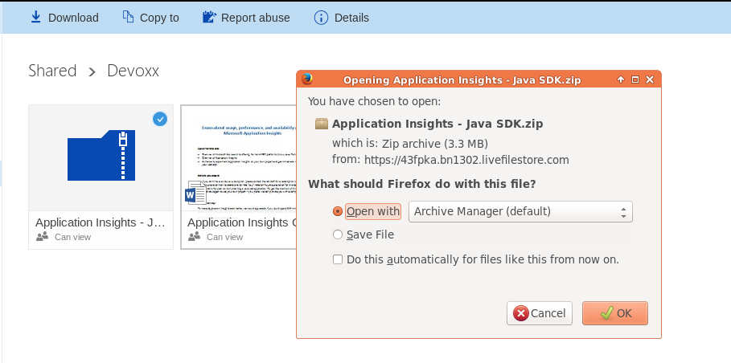

1.  Select **Extract** and in the location dialog, select **Create Folder**  and create a folder with the name **AI SDK**

    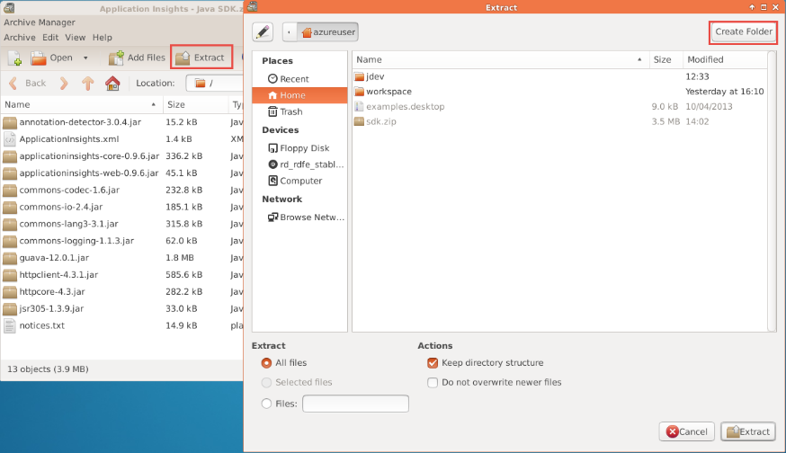

1.  Select **Extract** to complete extracting. Once the Extraction is completed, select **Show the Files** option or just simply quit and use the **File Manager** to go to your home folder.

    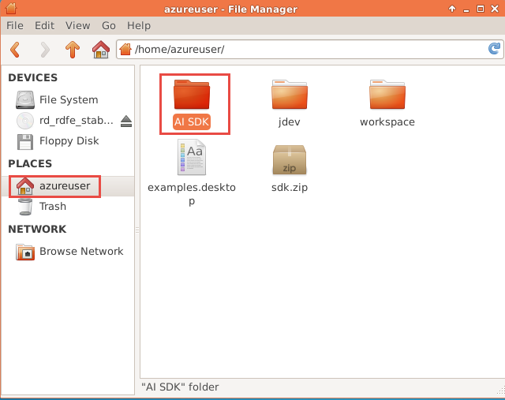

1.  Open the **AI SDK** folder and you will see a number of JAR files downloaded. Right-click the **Application Insights.xml** file and select **Open with – Open with &quot;gedit&quot;** option

    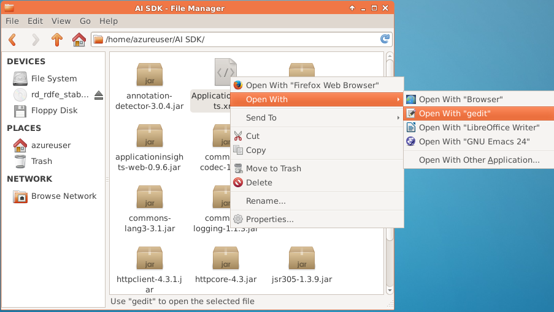

1.  This will open the file in gedit. Look for the &lt;InstrumentationKey&gt; tag. Copy the AI Instrumentation key selected in step 5 and paste it between the tags

    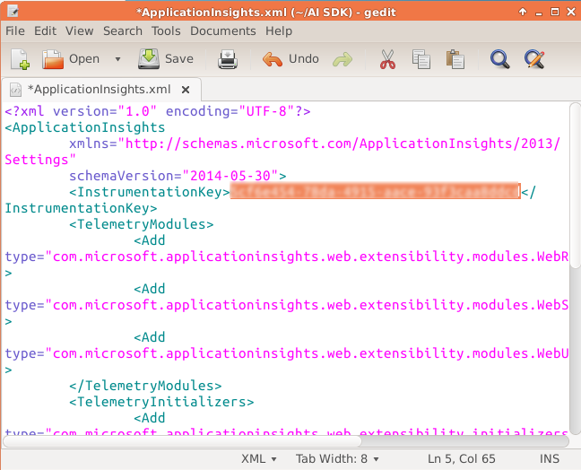

1.  Save the file and quit Gedit

## Configuring Tomcat

1.  Now, open a terminal window and enter the following commands  

    ```shell
    sudo cp /<your home directory>/AI\ SDK/*.* /var/lib/tomcat7/webapps/myshuttledev/WEB-INF/lib
    ```

    > **Note:** You can use CTRL+TAB to auto complete paths
    
1.  We need to add HTTP filter to our web.xml. Use the following command to edit the file

    ```shell
    sudo gedit /var/lib/tomcat7/webapps/myshuttledev/WEB-INF/web.xml
    ```

1.  Copy the following lines provided below. You may want to open this link in Firefox within the VM (to copy and paste)  

    ```xml
    <filter>
    <filter-name>ApplicationInsightsWebFilter</filter-name>
        <filter-class>
            com.microsoft.applicationinsights.web.internal.WebRequestTrackingFilter
    </filter-11class>  
    </filter>
    <filter-mapping>
        <filter-name>ApplicationInsightsWebFilter</filter-name>  
        <url-pattern>/*</url-pattern>`  
        </filter-mapping>
    ```

1.  Save the file.

1.  Now AI Is configured. We simply need to restart the Tomcat server for AI to take effect. Use the following command to restart the Tomcat server  

    ```shell
    sudo service tomcat7 restart
    ``` 

1.  Once tomcat is restarted, go to your web application – [http://localhost:8080/myshuttledev](http://localhost:8080/myshuttledev) and generate some traffic by logging in and accessing the fares history page.

    In a few minutes, you will see HTTP request data appearing on the overview blade of the Application Insights resource page  
    
    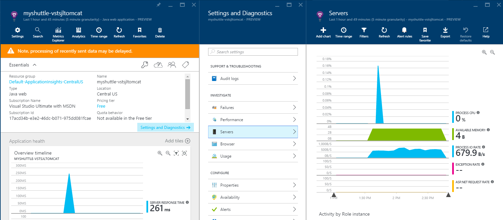

## Understanding application usage

Application Insights can also help you understand how your customers are using your web app, what geographies they&#39;re coming from, how much time they spend in your site and more. This can be easily done by adding a Javascript snippet to the web pages that you want to track.

1.  From the AI resource on the Azure portal, select **Quickstart** iconto open the **Getting Started** page and then select the &quot; **Get code to monitor my web pages**&quot; link. This will open an another blade with the Javascript code that you need to add to your webpages. Copy the code

    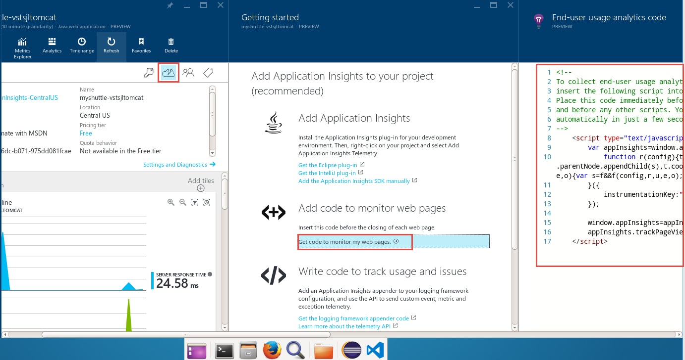
 
1.  From a terminal window, type the following command

    ```shell
    sudo gedit /var/lib/tomcat7/webapps/myshuttledev/index.jsp
    ``` 

1.  Paste the code within the &lt;head&gt; &lt;/head&gt; tags as shown below:  

    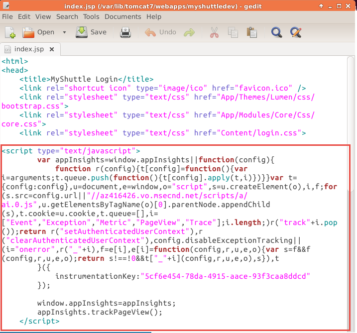 

1.  Restart the tomcat server as specified in step 5 of **Configuring Tomcat section**.  

1.  Login to the web application and navigate the pages to generate some traffic  

1.  In a couple of minutes, you will start to see the pages usage statistics on the AI resource page  

    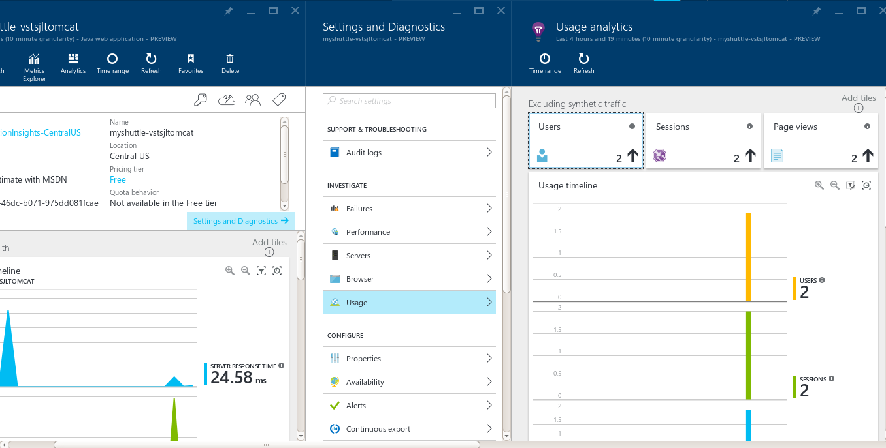 

    > To find out more on other features on Application Insights including setting up availability, custom events and metrics, check out the product documentation pages on - [https://azure.microsoft.com/en-us/documentation/services/application-insights/](https://azure.microsoft.com/en-us/documentation/services/application-insights/)
